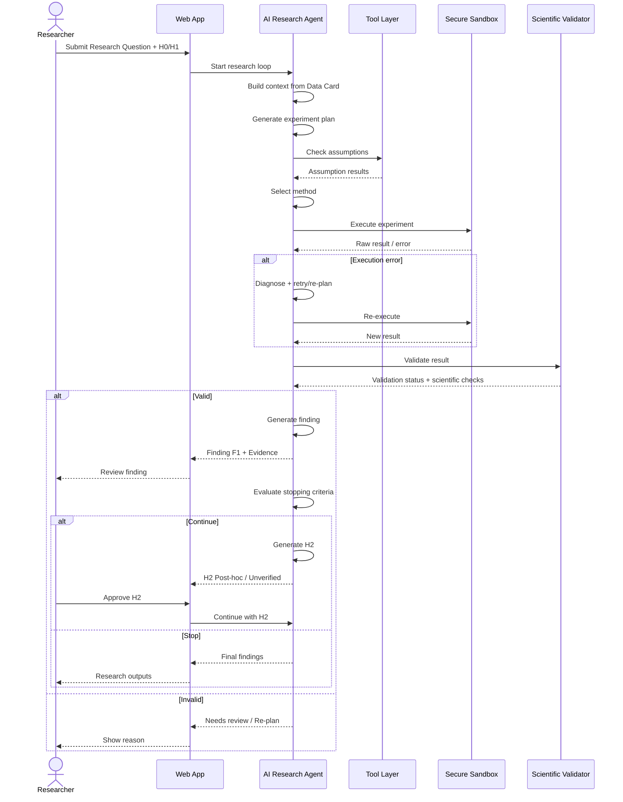

# Use Case Specification
## AI Research Experimentation Platform

**Document Type:** Use Case Specification  
**Project:** AI Research Experimentation Platform  
**Version:** 0.1 Draft  
**Status:** Draft for Review  
**Based on:** BRD Final v1.0 + PRD v0.1  
**Date:** 2026-09-19  

---

# 1. Purpose

Tài liệu này mô tả các use case chính của AI Research Experimentation Platform ở mức actor → goal → system behavior.

Use case tập trung vào cách các actor tương tác với hệ thống để hoàn thành research workflow:

```text
Research Question
→ Hypothesis
→ Dataset Understanding
→ Experiment Planning
→ Method Selection
→ Experiment Execution
→ Scientific Validation
→ Finding
→ Hypothesis Refinement
→ Next Experiment
→ Stopping Criteria
→ Final Research Outputs
```

---

# 2. Actors

## ACT-01 — Researcher / Data Analyst

Actor chính của hệ thống.

### Goals

- upload và hiểu dataset;
- khai báo research question;
- định nghĩa H0/H1;
- review experiment plan;
- chạy experiment;
- review finding;
- approve/refine hypothesis;
- xem provenance/trace;
- tạo research report.

---

## ACT-02 — Project Manager

### Goals

- tạo/quản lý project;
- quản lý members;
- theo dõi research progress;
- review experiment/finding history;
- quản lý project-level outputs.

---

## ACT-03 — Reviewer / Stakeholder

### Goals

- xem findings;
- xem figure/table/report;
- xem supporting evidence;
- review methodology và trace;
- cung cấp feedback nếu được cấp quyền.

---

## ACT-04 — System Administrator

### Goals

- quản lý user/role;
- quản lý model configuration;
- xem logs;
- theo dõi cost/usage;
- theo dõi system health;
- quản lý benchmark/evaluation configuration.

---

## ACT-05 — AI Research Agent

Secondary system actor / internal logical actor.

### Responsibilities

- build context;
- generate experiment plan;
- generate candidate methods;
- check assumptions;
- select method;
- execute tools;
- retry/re-plan;
- validate result;
- generate finding;
- refine hypothesis;
- evaluate stopping criteria.

---

## ACT-06 — Secure Execution Sandbox

External/internal execution environment used by the Agent.

### Responsibilities

- execute code/query;
- enforce CPU/RAM/time/network limits;
- isolate project/session;
- return execution output/error.

---

# 3. High-Level Use Case Diagram

```mermaid
flowchart LR

    R[Researcher]
    PM[Project Manager]
    RV[Reviewer]
    AD[System Administrator]

    subgraph SYS["AI Research Experimentation Platform"]
        UC01((Authenticate))
        UC02((Manage Research Project))
        UC03((Manage Project Members))
        UC04((Upload Dataset))
        UC05((Review Profiling & Data Card))
        UC06((Review Data Quality & Cleaning))
        UC07((Define Research Question))
        UC08((Define Initial H0 / H1))
        UC09((Generate Experiment Plan))
        UC10((Review Method & Assumptions))
        UC11((Run Experiment))
        UC12((Review Scientific Validation))
        UC13((Review Research Finding))
        UC14((Refine / Approve Next Hypothesis))
        UC15((Review Dependency / Conflict))
        UC16((Stop / Continue Research Loop))
        UC17((Generate Research Outputs))
        UC18((View Provenance & Trace))
        UC19((Run Benchmark / Evaluation))
        UC20((Manage System Configuration))
    end

    R --> UC01
    R --> UC04
    R --> UC05
    R --> UC06
    R --> UC07
    R --> UC08
    R --> UC09
    R --> UC10
    R --> UC11
    R --> UC12
    R --> UC13
    R --> UC14
    R --> UC15
    R --> UC16
    R --> UC17
    R --> UC18
    R --> UC19

    PM --> UC01
    PM --> UC02
    PM --> UC03
    PM --> UC13
    PM --> UC15
    PM --> UC17
    PM --> UC18
    PM --> UC19

    RV --> UC01
    RV --> UC13
    RV --> UC17
    RV --> UC18

    AD --> UC01
    AD --> UC20
    AD --> UC19
```



---

# 4. Use Case Summary

| ID | Use Case | Primary Actor | Priority |
|---|---|---|---|
| UC-01 | Authenticate | All users | P0 |
| UC-02 | Create / Manage Research Project | Researcher / Project Manager | P0 |
| UC-03 | Manage Project Members | Project Manager | P0 |
| UC-04 | Upload & Validate Dataset | Researcher | P0 |
| UC-05 | Review Profiling & Data Card | Researcher | P0 |
| UC-06 | Review Data Quality, Cleaning & Versioning | Researcher | P0 |
| UC-07 | Define Research Question & Context | Researcher | P0 |
| UC-08 | Define / Confirm Initial H0 & H1 | Researcher | P0 |
| UC-09 | Generate Experiment Plan | Researcher + AI Agent | P0 |
| UC-10 | Review Candidate Method & Assumption Checks | Researcher + AI Agent | P0 |
| UC-11 | Execute Experiment | Researcher + AI Agent | P0 |
| UC-12 | Validate Experiment Result | AI Agent / Researcher | P0 |
| UC-13 | Review Research Finding | Researcher / Reviewer | P0 |
| UC-14 | Generate / Review Next Hypothesis | Researcher + AI Agent | P1 |
| UC-15 | Review Dependency & Conflicting Evidence | Researcher | P1 |
| UC-16 | Continue or Stop Research Loop | Researcher + AI Agent | P1 |
| UC-17 | Generate Figures, Tables & Research Report | Researcher | P1 |
| UC-18 | View Provenance, Evidence & Execution Trace | Researcher / Reviewer | P0 |
| UC-19 | Run Benchmark & Evaluation | Researcher / Project Manager / Admin | P1 |
| UC-20 | Manage Models, Logs, Cost & System Configuration | Admin | P1 |

---

# 5. UC-01 — Authenticate

## Goal

Cho phép user đăng nhập và truy cập đúng phạm vi quyền.

## Primary Actor

All users.

## Preconditions

- user có account hợp lệ;
- account không bị disable.

## Trigger

User mở platform và chọn đăng nhập.

## Main Flow

1. User nhập credential.
2. System xác thực.
3. System tạo session/token.
4. System tải role và project memberships.
5. System chuyển user vào workspace phù hợp.

## Alternative Flows

### A1 — Invalid Credential

1. Authentication thất bại.
2. System hiển thị lỗi.
3. Không tạo session.

### A2 — Account Disabled

1. Credential đúng.
2. Account bị disable.
3. System từ chối truy cập.

## Postconditions

- user có authenticated session;
- permissions được áp dụng server-side.

## Acceptance Criteria

- invalid session không truy cập được API protected;
- role/project scope được enforce ở backend;
- login failure không làm lộ sensitive information.

---

# 6. UC-02 — Create / Manage Research Project

## Goal

Tạo workspace cho một research initiative.

## Primary Actor

Researcher / Project Manager.

## Preconditions

- user đã login;
- user có quyền create project.

## Trigger

User chọn `Create Project`.

## Main Flow

1. User nhập:
   - project name;
   - description;
   - research domain;
   - optional objective/tags.
2. System validate input.
3. System tạo Project.
4. User được gán Owner/Project Manager.
5. System mở Project Dashboard.

## Alternative Flows

### A1 — Missing Required Fields

System không tạo project và highlight field lỗi.

## Postconditions

Project tồn tại với status `Draft`.

## Included Data

```text
Project
├── Members
├── Datasets
├── Research Questions
├── Hypotheses
├── Experiments
├── Findings
├── Figures / Tables
└── Reports
```

---

# 7. UC-03 — Manage Project Members

## Goal

Quản lý thành viên và quyền trong project.

## Primary Actor

Project Manager.

## Preconditions

- project tồn tại;
- actor có `Manage Members`.

## Main Flow

1. Project Manager mở `Members`.
2. Chọn add member.
3. Chọn user.
4. Chọn project role.
5. System lưu membership.
6. Permission có hiệu lực.

## Alternative Flows

### A1 — Member Already Exists

System yêu cầu update role thay vì tạo duplicate membership.

### A2 — Actor Lacks Permission

System trả access denied.

## Postconditions

Membership và role được lưu và audit.

---

# 8. UC-04 — Upload & Validate Dataset

## Goal

Đưa dataset nghiên cứu vào system và đảm bảo file đủ điều kiện xử lý.

## Primary Actor

Researcher.

## Preconditions

- actor có quyền upload;
- project tồn tại.

## Trigger

User chọn `Upload Dataset`.

## Main Flow

1. User chọn CSV/XLSX.
2. System upload file.
3. System lưu immutable original.
4. System tạo dataset ID.
5. System tạo `Dataset Version v1`.
6. System validate:
   - readability;
   - encoding;
   - schema/header;
   - duplicate column names;
   - empty dataset;
   - file size;
   - supported types.
7. Validation pass.
8. System enqueue profiling.
9. Dataset status chuyển sang `Validating/Profiled`.

## Alternative Flows

### A1 — Unsupported File

System từ chối và hiển thị supported formats.

### A2 — Invalid Dataset

System lưu failure metadata nhưng dataset không được dùng cho experiment.

### A3 — Upload Interrupted

Không tạo usable dataset version.

## Postconditions

- raw dataset được giữ nguyên;
- usable dataset có version cụ thể;
- profiling job bắt đầu.

---

# 9. UC-05 — Review Profiling & Data Card

## Goal

Giúp researcher và agent hiểu dataset trước khi phân tích.

## Primary Actor

Researcher.

## Preconditions

- dataset validation thành công;
- profiling hoàn tất.

## Main Flow

1. User mở dataset detail.
2. System hiển thị:
   - row/column count;
   - variable types;
   - missing values;
   - duplicates;
   - cardinality;
   - descriptive statistics;
   - distribution hints;
   - outlier candidates;
   - sample values;
   - possible identifiers;
   - quality warnings.
3. System hiển thị Data Card.
4. User review warnings.
5. User có thể bổ sung domain meaning cho variables.

## Alternative Flows

### A1 — Profiling Failed

System hiển thị reason và cho phép retry.

### A2 — Ambiguous Type

System flag variable và cho user override type/meaning.

## Postconditions

- Data Card gắn với exact dataset version;
- agent có compact dataset context.

---

# 10. UC-06 — Review Data Quality, Cleaning & Versioning

## Goal

Xử lý data-quality issue mà không tự động phá dữ liệu nghiên cứu.

## Primary Actor

Researcher.

## Preconditions

- Data Card tồn tại.

## Main Flow

1. Agent/system phát hiện issue.
2. Issue được classify:
   - Confirmed Data Issue;
   - Potential Anomaly;
   - Needs User Confirmation;
   - Needs Domain Clarification.
3. System hiển thị cleaning proposal.
4. Proposal bao gồm:
   - transformation;
   - rationale;
   - affected rows/columns;
   - potential information loss;
   - risk.
5. Researcher chọn:
   - Approve;
   - Reject;
   - Modify;
   - Ask Agent.
6. Nếu approve, system thực thi transformation.
7. System tạo Dataset Version mới.
8. Data Card mới được regenerate.

## Alternative Flows

### A1 — Risky Transformation Not Approved

Transformation không được chạy.

### A2 — User Rejects

Issue giữ nguyên với decision log.

### A3 — Transformation Fails

Không tạo completed version; failure được log.

## Postconditions

- raw dataset không bị ghi đè;
- transformation lineage được lưu.

---

# 11. UC-07 — Define Research Question & Context

## Goal

Xác định vấn đề nghiên cứu để agent biết mục tiêu phân tích.

## Primary Actor

Researcher.

## Preconditions

- project tồn tại;
- có ít nhất một dataset ready.

## Main Flow

1. Researcher tạo Research Question.
2. Nhập:
   - question text;
   - goal;
   - domain context;
   - expected variables;
   - constraints;
   - optional prior knowledge.
3. System validate.
4. Research Question trở thành active question.
5. Agent sử dụng context cho hypothesis/plan.

## Alternative Flows

### A1 — Variable Meaning Ambiguous

Agent yêu cầu clarification.

### A2 — Question Implies Unsupported Causality

System warning:
`Current data/design may only support association, not causal inference.`

## Postconditions

Active Research Question tồn tại.

---

# 12. UC-08 — Define / Confirm Initial H0 & H1

## Goal

Tạo hypothesis ban đầu cho experiment.

## Primary Actor

Researcher.

## Preconditions

- active research question tồn tại.

## Main Flow

1. Researcher nhập H0 và H1.
2. Hoặc yêu cầu AI đề xuất draft.
3. Nếu AI đề xuất, researcher review.
4. Researcher confirm.
5. System lưu hypothesis:
   - `Origin = Initial / Confirmatory`;
   - `Status = Unverified`.
6. Hypothesis link với Research Question.

## Alternative Flows

### A1 — Hypothesis Not Testable

Agent giải thích lý do và đề xuất rewrite.

### A2 — Hypothesis Requires Missing Variables

System flag insufficient data.

## Postconditions

Initial hypothesis sẵn sàng cho experiment planning.

---

# 13. UC-09 — Generate Experiment Plan

## Goal

Chuyển research context thành plan có thể thực thi.

## Primary Actor

Researcher.

## Supporting Actor

AI Research Agent.

## Preconditions

- active dataset version;
- research question;
- active hypothesis.

## Main Flow

1. Researcher chọn `Generate Experiment Plan`.
2. Agent build context:
   - Research Question;
   - Hypothesis;
   - Data Card;
   - domain context;
   - previous findings/experiments.
3. Agent tạo structured plan:
   - objective;
   - variables;
   - candidate methods;
   - assumptions to check;
   - proposed steps;
   - expected outputs;
   - risks;
   - testing family;
   - success/stop conditions.
4. System hiển thị plan.
5. Researcher review.
6. Researcher chọn:
   - Accept;
   - Request Revision;
   - Cancel.

## Alternative Flows

### A1 — Insufficient Context

Agent sử dụng `ask_user`.

### A2 — No Valid Experiment Possible

Plan status = `Needs Review / Not Feasible`.

## Postconditions

Experiment Plan ở trạng thái `Ready` hoặc `Needs Review`.

---

# 14. UC-10 — Review Candidate Method & Assumption Checks

## Goal

Chọn phương pháp phù hợp dựa trên dữ liệu và scientific assumptions.

## Primary Actor

Researcher + AI Research Agent.

## Preconditions

Experiment Plan tồn tại.

## Main Flow

1. Agent tạo candidate methods.
2. Với mỗi method, system xác định required assumptions.
3. Agent/tool chạy assumption checks.
4. Mỗi check trả:
   - Pass;
   - Fail;
   - Warning;
   - Not Applicable.
5. Agent so sánh candidates.
6. Agent chọn method phù hợp nhất hoặc đề xuất branching.
7. System hiển thị:
   - selected method;
   - reason;
   - rejected alternatives;
   - assumption results.
8. Researcher review.

## Alternative Flows

### A1 — Preferred Method Fails Assumption

Agent chọn alternative method.

### A2 — Multiple Valid Methods

Agent đề xuất limited branching.

### A3 — No Valid Method

Researcher được yêu cầu sửa research question/data/context.

## Postconditions

Method Selection record được lưu.

---

# 15. UC-11 — Execute Experiment

## Goal

Thực thi experiment an toàn và tạo raw result.

## Primary Actor

Researcher.

## Supporting Actors

AI Research Agent, Secure Execution Sandbox.

## Preconditions

- Experiment Plan ready;
- method selected;
- required approvals complete.

## Main Flow

1. Researcher chọn `Run Experiment`.
2. Agent gửi execution request tới Tool Router.
3. Tool Router chọn tool.
4. Code/query chạy trong Secure Sandbox.
5. Sandbox trả:
   - output;
   - error;
   - runtime/resource metadata.
6. Agent observe result.
7. Nếu success, experiment chuyển `Validating`.
8. Execution Trace được lưu.

## Alternative Flows

### A1 — Syntax/Runtime Error

1. Agent diagnose.
2. Agent retry hoặc re-plan.
3. Retry count phải trong limit.

### A2 — Timeout

Sandbox terminate run.
Experiment = Failed hoặc Needs Review.

### A3 — User Cancels

Sandbox terminate.
Experiment = Cancelled.

### A4 — Security Violation

Execution bị block và log.

## Postconditions

Experiment có raw execution result hoặc explicit failure.

---

# 16. UC-12 — Validate Experiment Result

## Goal

Đảm bảo raw result đủ scientific validity trước khi tạo finding.

## Primary Actor

AI Research Agent.

## Supporting Actor

Researcher.

## Preconditions

Execution thành công.

## Main Flow

1. Validator kiểm tra execution consistency.
2. Re-check relevant assumptions.
3. Check multiple-testing context.
4. Calculate/report effect size nếu applicable.
5. Calculate/report confidence interval nếu applicable.
6. Check data leakage nếu predictive workflow.
7. Check stability/replication nếu required.
8. Check interpretation strength.
9. Check causal language.
10. Assign Validation Status:
    - Passed;
    - Passed with Warnings;
    - Needs Review;
    - Failed.
11. Researcher review nếu required.

## Alternative Flows

### A1 — Validation Failed

Không tạo validated finding.
Agent có thể re-plan.

### A2 — Severe Assumption Violation

Human review required.

### A3 — Possible Causal Overclaim

System rewrite/flag conclusion.

## Postconditions

Validation Record tồn tại.

---

# 17. UC-13 — Review Research Finding

## Goal

Chuyển validated experiment result thành research finding có evidence.

## Primary Actor

Researcher / Reviewer.

## Preconditions

Experiment validation pass hoặc pass with warnings.

## Main Flow

1. Agent tạo Finding Candidate.
2. Finding chứa:
   - statement;
   - hypothesis;
   - experiment;
   - dataset version;
   - evidence;
   - statistical result;
   - effect size/CI;
   - uncertainty;
   - warnings.
3. System kiểm tra provenance completeness.
4. Researcher review.
5. Finding được mark:
   - Validated;
   - Inconclusive;
   - Needs Review;
   - Rejected;
   - Conflicting Evidence.

## Alternative Flows

### A1 — Missing Evidence

Finding không thể mark `Validated`.

### A2 — Unsupported Interpretation

System yêu cầu sửa statement.

## Postconditions

Finding được lưu và link về experiment/hypothesis.

---

# 18. UC-14 — Generate / Review Next Hypothesis

## Goal

Tiếp tục research loop từ finding mới.

## Primary Actor

Researcher + AI Research Agent.

## Preconditions

Có validated/inconclusive finding phù hợp để refine.

## Main Flow

1. Agent phân tích Finding F(n).
2. Agent đề xuất H(n+1).
3. H(n+1) chứa:
   - statement;
   - rationale;
   - parent finding;
   - proposed variables;
   - testability;
   - suggested experiment.
4. System gắn:
   - `Origin = Post-hoc / Exploratory`;
   - `Created By = Agent`;
   - `Status = Unverified`.
5. Researcher review.
6. Researcher:
   - Approve;
   - Modify;
   - Reject;
   - Stop Research.
7. Nếu approve, H(n+1) trở thành active hypothesis.
8. System quay lại UC-09.

## Alternative Flows

### A1 — New Hypothesis Not Testable

Agent đề xuất alternative hypothesis hoặc stop.

### A2 — User Rejects

Branch kết thúc.

## Postconditions

Next hypothesis được tạo có origin/parent rõ ràng.

---

# 19. UC-15 — Review Dependency & Conflicting Evidence

## Goal

Đảm bảo research chain không che giấu dependency hoặc evidence trái chiều.

## Primary Actor

Researcher.

## Preconditions

Có nhiều experiments/findings hoặc downstream hypothesis.

## Main Flow

1. User mở Dependency Graph.
2. System hiển thị:

```text
RQ
↓
H1
↓
E1
↓
F1
↓
H2
↓
E2
↓
F2
```

3. User xem dependency edge.
4. Nếu finding upstream bị invalidated, system xác định descendants.
5. Descendants được mark `Needs Re-validation`.
6. Nếu evidence trái chiều:
   - system giữ tất cả results;
   - mark `Conflicting Evidence`;
   - agent đề xuất next action.

## Alternative Flows

### A1 — User Chooses Re-run

New experiment/run được tạo, history cũ giữ nguyên.

### A2 — Conflict Cannot Be Resolved

Final output phải giữ limitation/conflict.

## Postconditions

Dependency và conflict status được cập nhật, không mất history.

---

# 20. UC-16 — Continue or Stop Research Loop

## Goal

Quyết định có tiếp tục sinh experiment/hypothesis mới hay kết thúc.

## Primary Actor

Researcher + AI Research Agent.

## Preconditions

Có finding mới.

## Main Flow

1. Agent evaluate stopping criteria:
   - question sufficiently answered;
   - no meaningful new hypothesis;
   - evidence converged;
   - max experiment count;
   - time/cost/step budget;
   - repeated inconclusive result.
2. Agent đề xuất:
   - Continue;
   - Stop.
3. System hiển thị reason.
4. Researcher có thể confirm hoặc override.
5. Nếu Continue:
   - system sang UC-14.
6. Nếu Stop:
   - research loop status = Completed;
   - system sang UC-17.

## Alternative Flows

### A1 — Manual Stop

Researcher dừng bất kỳ lúc nào.
Artifacts hiện tại vẫn được giữ.

### A2 — Budget Exceeded

System stop tự động và yêu cầu explicit override nếu policy cho phép.

## Postconditions

Research loop có explicit stop reason hoặc next hypothesis.

---

# 21. UC-17 — Generate Figures, Tables & Research Report

## Goal

Tạo research outputs từ validated evidence.

## Primary Actor

Researcher.

## Preconditions

- có ít nhất một finding;
- research loop có thể đã completed hoặc report ở dạng draft.

## Main Flow

1. User chọn output type:
   - Figure;
   - Table;
   - Methodology Summary;
   - Research Report.
2. System lấy validated findings và actual experiment metadata.
3. Agent/tool tạo output.
4. Output lưu source linkage.
5. User review.
6. User export/save.

## Research Report Suggested Sections

```text
Research Question
Hypotheses
Dataset & Preparation
Methodology
Experiments
Statistical Results
Research Findings
Figures / Tables
Conflicting Evidence
Limitations
Conclusion
Reproducibility Information
```

## Alternative Flows

### A1 — Preliminary Finding

System chỉ include nếu explicitly labeled.

### A2 — Known Conflict

Conflict phải được trình bày, không được silent omit.

## Postconditions

Output được lưu trong project và có provenance.

---

# 22. UC-18 — View Provenance, Evidence & Execution Trace

## Goal

Cho user kiểm chứng finding và agent actions.

## Primary Actor

Researcher / Reviewer.

## Preconditions

Có finding hoặc experiment.

## Main Flow

1. User chọn `View Evidence`.
2. System hiển thị provenance chain:

```text
Finding
↓
Statistical Result
↓
Experiment
↓
Execution
↓
Code / Query
↓
Dataset Version
↓
Dataset Lineage
```

3. User mở Execution Trace.
4. System hiển thị từng step:
   - planner step;
   - tool;
   - input ref;
   - code/query;
   - raw output;
   - error;
   - retry;
   - latency;
   - token/cost metadata nếu có.
5. User quay lại finding/report.

## Alternative Flows

### A1 — Broken Provenance

Finding bị flag và không được `Validated`.

## Postconditions

Không thay đổi dữ liệu; chỉ review/audit.

---

# 23. UC-19 — Run Benchmark & Evaluation

## Goal

Đánh giá AI Research Agent bằng benchmark và metrics.

## Primary Actor

Researcher / Project Manager / Admin.

## Preconditions

- benchmark tasks đã cấu hình;
- agent configuration tồn tại.

## Main Flow

1. User chọn benchmark/task set.
2. Chọn agent configuration.
3. Chọn số lần chạy N.
4. System chạy benchmark.
5. Mỗi run lưu:
   - output;
   - trace;
   - metrics;
   - cost;
   - latency.
6. System aggregate.
7. Dashboard hiển thị:
   - task success;
   - correctness;
   - method-selection accuracy;
   - assumption-check accuracy;
   - retry count;
   - experiment count;
   - provenance coverage;
   - unsupported claim rate;
   - human intervention;
   - reproducibility coverage.
8. User có thể so sánh configurations.

## Ablation Examples

```text
Full Agent
No Planner
No Profiling
No Assumption Checking
No Retry
No Validator
No Hypothesis Refinement
Single-Pass Agent
Text-to-Code Baseline
```

## Postconditions

Evaluation result được lưu và có raw run references.

---

# 24. UC-20 — Manage Models, Logs, Cost & System Configuration

## Goal

Vận hành hệ thống.

## Primary Actor

System Administrator.

## Main Flow

1. Admin mở Admin Console.
2. Admin quản lý:
   - users;
   - roles;
   - model configuration;
   - system logs;
   - tool failures;
   - sandbox failures;
   - usage;
   - token/cost;
   - benchmark config.
3. System validate changes.
4. Config changes được audit.

## Alternative Flows

### A1 — Invalid Model Configuration

System reject và giữ config hiện tại.

## Postconditions

Operational config được cập nhật có audit trail.

---

# 25. Core Research Loop — Detailed Sequence



---

# 26. Use Case Dependency Map

```text
UC-01 Authenticate
    ↓
UC-02 Project
    ↓
UC-04 Upload Dataset
    ↓
UC-05 Profiling / Data Card
    ↓
UC-06 Cleaning / Versioning
    ↓
UC-07 Research Question
    ↓
UC-08 H0 / H1
    ↓
UC-09 Experiment Plan
    ↓
UC-10 Method + Assumptions
    ↓
UC-11 Execute
    ↓
UC-12 Validate
    ↓
UC-13 Finding
    ↓
UC-16 Stop?
    ├── NO → UC-14 Next Hypothesis
    │          ↓
    │        UC-09 ...
    │
    └── YES → UC-17 Research Outputs
```

Supporting use cases:

```text
UC-15 Dependency / Conflict
UC-18 Provenance / Trace
UC-19 Evaluation
UC-20 Admin
```

---

# 27. Key Include / Extend Relationships

## Includes

```text
UC-04 Upload Dataset
  <<include>> Dataset Validation

UC-09 Generate Experiment Plan
  <<include>> Build Research Context

UC-10 Method Selection
  <<include>> Assumption Checking

UC-11 Execute Experiment
  <<include>> Secure Sandbox Execution
  <<include>> Execution Trace

UC-13 Review Finding
  <<include>> Provenance Check

UC-17 Generate Report
  <<include>> Validated Finding Selection
```

## Extends

```text
UC-06 Cleaning
  <<extend>> Human Approval
  when transformation is risky

UC-11 Execute Experiment
  <<extend>> Retry / Re-plan
  when execution fails

UC-12 Validate Result
  <<extend>> Multiple-Testing Correction
  when multiple related tests exist

UC-12 Validate Result
  <<extend>> Leakage Check
  for predictive/ML workflow

UC-13 Review Finding
  <<extend>> Conflict Handling
  when evidence contradicts prior evidence

UC-13 Review Finding
  <<extend>> Hypothesis Refinement
  when another testable question is justified
```

---

# 28. Business Rules Affecting Use Cases

| Rule | Affected Use Cases |
|---|---|
| Raw dataset cannot be overwritten | UC-04, UC-06 |
| Risky cleaning requires approval | UC-06 |
| Anomaly does not automatically mean error | UC-05, UC-06 |
| Hypothesis is not fact | UC-08, UC-14 |
| Post-hoc hypothesis must be labeled | UC-14 |
| Association ≠ causation | UC-12, UC-13, UC-17 |
| Method selection must be justified | UC-10 |
| Finding must have evidence | UC-13, UC-17 |
| Multiple testing must be accounted for | UC-12 |
| Conflicting evidence must be preserved | UC-15, UC-17 |
| Upstream invalidation propagates | UC-15 |
| Official experiment requires reproducibility snapshot | UC-12, UC-17 |
| Research loop must have stopping criteria | UC-16 |

---

# 29. Suggested MVP Use Cases

For the first working demo, implement in this order:

```text
UC-01 Authenticate
↓
UC-02 Project
↓
UC-04 Upload Dataset
↓
UC-05 Profiling / Data Card
↓
UC-07 Research Question
↓
UC-08 H0/H1
↓
UC-09 Experiment Plan
↓
UC-10 Method + Assumptions
↓
UC-11 Execute
↓
UC-12 Validate
↓
UC-13 Finding
↓
UC-18 Provenance / Trace
```

Then Research Loop v2:

```text
UC-14 Next Hypothesis
↓
UC-15 Dependency / Conflict
↓
UC-16 Stopping Criteria
↓
UC-17 Research Outputs
```

Then evaluation:

```text
UC-19 Benchmark / Ablation
```

---

# 30. Canonical Demo Use Case

## Scenario

Dataset sinh viên gồm:

```text
student_id
score
ai_usage_rate
study_hours
attendance
major
...
```

## Research Question

> Is AI usage associated with student academic performance?

## Initial Hypotheses

```text
H0:
There is no statistically meaningful association between AI usage rate and student score.

H1:
There is a statistically meaningful association between AI usage rate and student score.
```

## Flow

```text
Researcher uploads dataset
↓
System profiles dataset
↓
Researcher enters RQ + H0/H1
↓
Agent proposes E1
↓
Agent checks assumptions
↓
Agent selects Pearson / Spearman / Regression as appropriate
↓
E1 executes
↓
Validator checks result
↓
F1 created with effect size + CI + evidence
↓
Agent proposes H2:
"Does the association remain after controlling for study_hours?"
↓
H2 = Post-hoc / Unverified
↓
Researcher approves
↓
E2 runs
↓
F2 created
↓
Stopping criteria evaluated
↓
Final findings/report
```

This scenario should demonstrate:

- method selection;
- assumption checking;
- scientific validation;
- no unsupported causal claim;
- H1→E1→F1→H2→E2 lineage;
- evidence/provenance;
- reproducibility.

---

# 31. Use Case Acceptance at System Level

Use-case layer is considered covered when:

1. Each P0 use case has a defined actor, trigger, precondition, flow and postcondition.
2. All high-risk alternate flows are covered.
3. Use cases map to PRD modules.
4. Research loop can be demonstrated end-to-end.
5. Agent actions that change scientific state are traceable.
6. Every official finding can be traced to experiment and dataset version.
7. Human approval points are explicit.
8. Failure/retry/re-plan paths are defined.
9. The loop has explicit stop conditions.
10. Evaluation can be performed independently from normal research projects.

---

# 32. Next Artifacts

```text
Use Case Specification
↓
Use Case Diagram (UML)
↓
Activity Diagram
↓
Sequence Diagrams
↓
System Architecture
↓
Database ERD
↓
API Contract
↓
UI Wireframes
↓
Test Cases
```

---

# 33. Document Change Log

| Version | Date | Change |
|---|---|---|
| 0.1 | 2026-09-19 | Initial Use Case Specification derived from BRD v1.0 and PRD v0.1 |
