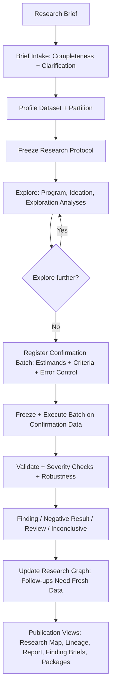
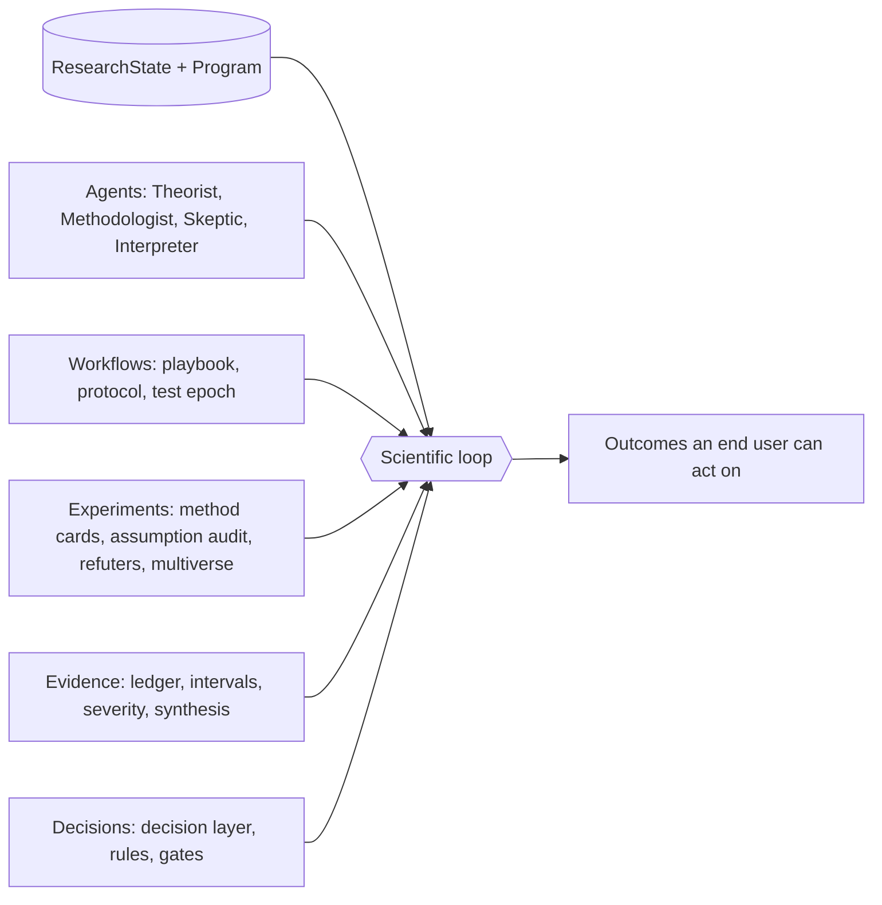
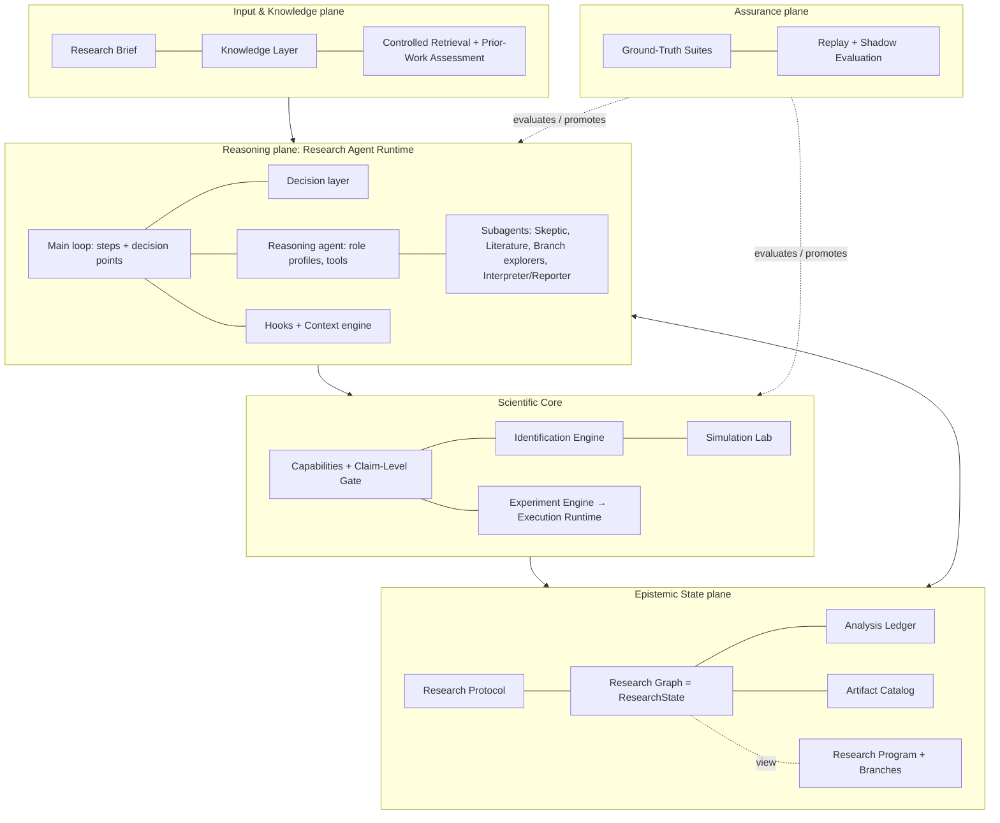
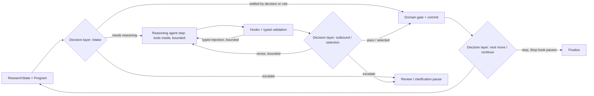
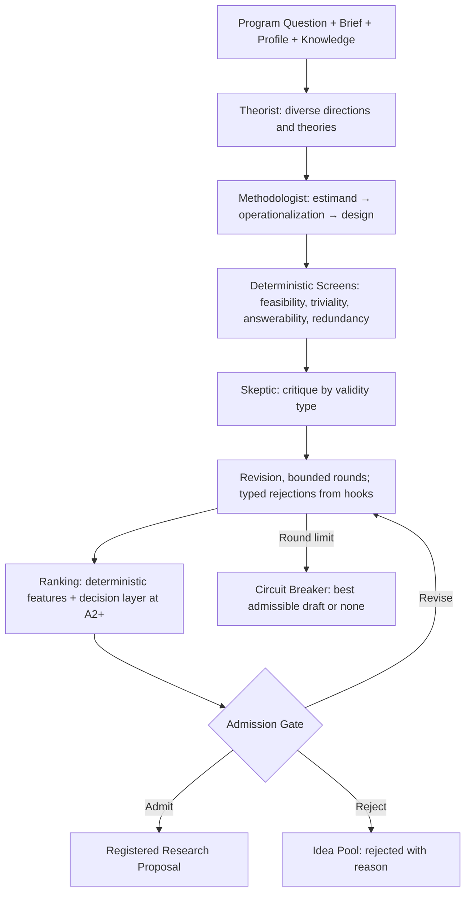
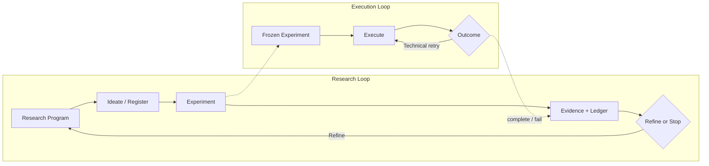

# Popper Target Architecture

This document defines the target responsibilities, boundaries, and invariants of Popper. The scientific procedures behind them (how ideas are formed, tested, challenged, and reported) are specified in [`research-methodology.md`](research-methodology.md). The order in which this target is reached, starting from a thin AI-first MVP (roadmap Track A), is described in [`roadmap.md`](roadmap.md).

## 1. Purpose

Popper is an **AI-first research-agent core** that turns a **Research Brief** (a required bounded dataset plus the research question, context, and prior knowledge that frame it, §4.1) into a linked chain of typed **research artifacts** (plans, ideas, experiments, evidence, and claims), each claim stated with the type and evidential status its design supports (§10.4). The Research Report is one of several **publication views** rendered from that chain (§8.4, §15.7). It is a **research-specific agent harness**, not a free-form chatbot, generic workflow engine, paper generator, or monolithic AI application.

The end user is the researcher, not the report. A run explores a bounded research space in branches, judges every candidate claim through the Scientific Core, and leaves a navigable record: a research map of what was explored, pruned, and tested; outcomes ordered for attention but never ranked into evidence; and a lineage from every outcome back to the brief (§7.6, §15.7, §17.2). Research that continues on fresh data spans several runs linked as a campaign (§16.1), and each run keeps its own protocol, test epoch, and ledger. In short: **explore broadly within budget, judge rigorously, trace every consequential research step**: every analysis, selection, branch operation, decision, and artifact that can shape an outcome.

The architecture keeps five concerns separate: research-design reasoning (the reasoning agent) and fast decisions (the decision layer) produce research decisions; scientific computation and validation establish facts; controlled runtime execution runs registered work; and **epistemic accounting** constrains both decisions and computation. Epistemic accounting records what the system has looked at, what it has tested, and on which data. Without it, an agent's search process can manufacture findings even when every individual step is valid.

Canonical lifecycle:

Popper does not own end-user authentication, organization/project management, billing, frontend UI, notifications, collaboration, or publication workflow. It does authenticate its calling services (§19).
Concrete frameworks, schemas, providers, deployment topology, and release sequencing are outside this conceptual architecture.

---

## 2. Architectural Drivers

| Driver | Architectural consequence |
|---|---|
| **AI-first intelligence** | Models are the primary path for semantic work; deterministic code is its fallback and the sole authority for facts. |
| **Research-design reasoning** | The value of AI lies in design decisions (which question, which estimand, which variables, which threats, which next move); that reasoning gets roles, structured memory, and measured value. |
| **Research runtime, not chat** | One main loop advances a durable run step by step over ResearchState; a reasoning agent produces each step, a decision layer decides at typed decision points, and deterministic hooks and gates authorize (§7). Investment goes into this runtime. |
| **Rich research intent** | A run starts from a Research Brief, not a one-line objective; missing context is visible, never silently assumed. |
| **Claim-level honesty** | Every claim states its type (descriptive to causal) and evidential status (hypothesis-generating to confirmatory), and never exceeds what its design supports. |
| **Scientific integrity** | Model output and domain knowledge alone never establish scientific fact. |
| **Search-process integrity** | Every look at data is counted, and the deciding test is fixed before its data are read; flexible search cannot masquerade as a single test. |
| **Severe testing** | A claim is kept only after it survived checks that would probably have exposed it if it were wrong. |
| **Controlled, bounded autonomy** | AI may propose and judge within capabilities, policies, budgets, autonomy levels, and stopping rules; hooks and commit tools control transitions and side effects. |
| **Artifact-centered output** | Every stage leaves typed, addressable artifacts that callers can consume while a run proceeds; reports are views over them, and every statement traces to an artifact. |
| **Durability and reproducibility** | Research progress is independent of process lifetime; official experiments preserve identity, recorded model outputs, and environment identity. |
| **Modularity and provider independence** | Reasoning, judgment, knowledge, scientific logic, execution, persistence, and telemetry evolve independently; providers never become research-domain dependencies. |
| **Measurability** | Scientific quality, reasoning value, AI behavior, and runtime reliability are measured separately, with ground truth. |
| **Proportional infrastructure** | Runtime topology follows measured workload, not anticipated scale. |

### 2.1 Non-goals

Popper is not a generic agent framework, unrestricted autonomous scientist, provider-specific runtime, unbounded tree-search engine, workflow-definition language, systematic-review engine (prior-work assessment is bounded to the run's questions and is context, §4.3), or manuscript writer (publications are views rendered from artifacts, §15.7). It does not run interventions or wet-lab experiments, does not analyse raw unstructured data (only caller-derived features), and does not replace scientific validation with model judgment. One run has one main agent loop; subagents and parallel branches run under it and arrive only through the measured, gated rules of §7.5 and §9.6.

---

## 3. Core Architectural Philosophy

| Intelligence primitive | Output contract | Primary role |
|---|---|---|
| **Deterministic Computation** | Exact, reproducible value | Calculate, validate, account, identify, enforce invariants |
| **Decision layer** (Jev) | Closed option set + calibrated probability + abstain | Decide at four typed decision points in one bounded call: intake, select, outbound check, next move (§9.3) |
| **Reasoning agent** (Popper agent runtime: main loop and subagents) | Typed step output from reasoning with tool use, requiring validation | Plan, theorize, design, critique, interpret, report; propose options and next moves |

> **Compute with code. Reason with the agent. Decide with the decision layer. Enforce invariants in hooks, not prompts. Try to break every claim before keeping it. Claim no higher than the design. Only commit tools change state.**

Principles:

1. **AI-first, code as fallback and authority.** Semantic work runs through a model first. When a model is unavailable, invalid, unconsented, or not yet earned, an equivalent deterministic path produces the same typed output. Facts, gates, identification, and accounting are always deterministic: code is their authority, not their fallback.
2. **State over conversation.** ResearchState is canonical; transcripts are contextual only.
3. **Decision points over hard-coded workflows.** The run advances through typed decisions over options the agent proposes; capabilities are tools, and hooks enforce generic invariants on every call.
4. **Typed boundaries.** AI outputs that affect state or side effects cross validated structured boundaries.
5. **The agent reasons and proposes; the decision layer chooses at decision points; code validates; hooks and domain gates authorize; only commit tools change state.**
6. **Retry is not research.** Technical retry and scientific refinement are distinct.
7. **Intelligence is replaceable.** The reasoning agent, role profiles, and the decision layer are output contracts, not vendors. Role profiles are the architectural unit; running one as a subagent is an execution mode, adopted by measurement (§7.5).
8. **Evaluation calibrates autonomy.** Autonomy is granted by explicit level only where measurements support it.
9. **Every look counts.** Every analysis executed against data is recorded in the ledger; every interval that can decide an outcome is charged to the look budget.
10. **Explore, then confirm once.** Exploration informs but never decides; the confirmation batch, its primary analyses, and its success/falsification criteria are fixed before its data are read.
11. **Falsification first.** The default stance toward a candidate claim is to attempt to break it.
12. **Uncertainty decides; negative results are results.** Sufficiency is decided on selection-adjusted intervals, never on point estimates, and a well-tested absence of a meaningful effect is a first-class outcome.
13. **Estimand before method.** What is estimated, in which population, is fixed before how.
14. **Knowledge narrows; evidence decides.** Domain knowledge, literature, and caller beliefs may add screens, threats, and limitations; only evidence from registered experiments supports a claim.
15. **Artifacts are the product; reports are views.** Every step leaves a typed artifact, and every published statement resolves to one.

### 3.1 Positioning against existing systems

Popper inherits the research workflow of conventional platforms and upgrades it with an agent runtime held to falsification discipline. Each part below exists because an existing approach showed what works and where it stops:

| Approach | Example | What Popper inherits | Where it stops, and what Popper adds |
|---|---|---|---|
| **Linear LLM workflow** | The platform BRD/PRD state machine; notebook and chat data-analysis assistants | Phase order, human approval points, decision audit | One LLM call per state cannot explore in several steps, repair its output, or go back when a result is unclear. Popper keeps the order as the playbook floor and runs each step as an agent step inside it (§7.1) |
| **Multi-agent ideation** | Google AI co-scientist (supervisor with generation, reflection, ranking, evolution, meta-review agents) | Role separation, reflection before ranking | It proposes but does not test on data. Popper keeps roles as profiles (§7.6), makes reflection an independent Skeptic (§7.5), and replaces tournament ranking with the *select* decision point over deterministically screened options |
| **Autonomous tree search** | Sakana AI Scientist v2, Agent Laboratory | Experiment manager over branches, staged exploration | Generated code and unbounded search make results hard to trust and costly. Popper runs only registered capabilities (§7.2), charges every analysis to a ledger (§15.4), and explores branches only within budget (§7.5) |
| **Agentic sequential falsification** | POPPER (Huang et al., ICML 2025): an experiment-design agent with self-critique, an execution agent, p-values aggregated into sequential e-values with Type-I error control | Falsification as the default stance, falsification experiments on measurable implications, sequential e-values | It validates a given hypothesis without a decision layer, a claim-level model, or user-facing outcomes. Popper adds hypothesis generation, the decision layer, explore/confirm partitions, claim levels, and Findings, Negative Results, and Inconclusive outcomes as the product (§15) |
| **General agent harness** | Claude Code, Claude Agent SDK | Tool contracts, deterministic hooks, managed context, subagents for isolation | A conversational, general-purpose loop. Popper is a durable research job advanced by typed steps and decision points (§7) |

What no single system above combines, and Popper does: **one agent loop over a workflow floor, a structured decision layer with `on`/`shadow`/`off` modes, deterministic statistics and outcomes, and outputs an end user can act on** (an outcome with effect size, interval, claim level, limitations, suggested next steps, and a trace of how it was reached).

### 3.2 Primitives and the Scientist

The three intelligence primitives above are units of ability; none of them does research on its own.

- The **reasoning agent** is the primitive for deep reasoning: it reasons and acts in iterations over state, tools, and feedback, within the authority it is granted. The **decision layer** is the primitive for closed choices, and **deterministic computation** for exact values.
- **Scientific mechanisms** are the procedures that turn reasoning into verifiable artifacts: estimand and operationalization, assumption audit, registration, experiment, refutation, error control, and sufficiency. Their artifacts are hypotheses, experiments, evidence, and outcomes.
- The **Scientist** is neither an agent nor a module. It is a system-level capability that emerges when the **scientific loop** (conjecture, design, test, attempt to refute, assess, next move) combines agents, workflows, decisions, and mechanisms over ResearchState, with people joining asynchronously through clarification and review. The Scientist continuously decides **which evidence to seek next**; **which claims the evidence supports, and at what level**, is computed once, by rules frozen before the data are read (§15.5), and is never a decision of the loop.
- **Workflows, the decision layer, and gates are the discipline and choice of the Scientist, not a fence around it.** The workflow keeps the order and is the fallback floor (a run at A0 is still science); the decision layer chooses among valid options; gates ensure that no step widens what the evidence allows. Together they make the process disciplined, traceable, and hard to fool itself with. Its purpose is conclusions an end user can use and check.

Each property expected of a scientist needs several components at once, so no component can supply it alone:

| Property of the Scientist | Agents | Workflows | Experiments | Evidence | Decisions |
|---|---|---|---|---|---|
| **Chooses a fitting method** | Methodologist proposes estimand and method | Method frozen before confirmation | Method card and assumption audit (methodology §4.5) | Audit results on the exploration partition | Admission accepts only capabilities with a method card |
| **Tries to break its claims** | Skeptic critiques; Theorist states implications | Critique before selection | Refuters and negative controls (methodology §6.1) | Pass or fail of each check | *Next move*: critique again or go on |
| **Does not search its way to significance** | Proposes within the protocol | Explore, then confirm once | Look budget | Ledger | *Select* within the budget |
| **Is robust to analytic choices** | Registers the defensible alternatives | Registered before the epoch | Required multiverse (methodology §7) | Agreement fraction | Never selects among specifications |
| **Claims no more than the design allows** | Interpreter explains | Slot-based report | Not applicable | Claim level, limitations, self-consistency (methodology §8.5) | *Outbound check* |

Consequences:

1. **Engine and behaviour.** The agent runtime (§7) is the engine; the Scientist is the behaviour of the system running on it. The runtime has to show that it runs and beats a bare LLM; the Scientist has to show that its conclusions are correct and deep.
2. **Depth comes from the combination.** A strong agent without deep experiments yields shallow conclusions; deep experiments with a wrong estimand answer the wrong question; without evidence and a ledger any result may be a searched one. The reasoning agent may only choose capabilities whose method card meets the bar (methodology §4.5), so the Scientist is never deeper in reasoning than in testing.
3. **Evaluation at both levels** (§18): each primitive against its own metric (reasoning roles on analysis decisions and planted-signal recall, the decision layer against its rules, computation on reference values and interval coverage), and the Scientist end to end on false-finding rate, power, detection of planted confounding and assumption violations, and agreement with expert analyses.

The Scientific Core (§10) supplies the Experiments and Evidence components; it is a part of the Scientist, not the Scientist.

### 3.3 Functional components

The Scientist's parts are grouped into seven functional components. Each is a named view over sections of this document, not a separate service, and each serves one or more components of the scientific loop (§3.2):

| Component | Does | Loop component | Sections |
|---|---|---|---|
| **Data Cleaning & Profiling** | Validates and profiles the snapshot, proposes cleaning steps as typed proposals, and checks answerability. The platform approves and versions cleaning; Popper runs only on approved snapshots | Evidence (inputs) | §10.2, §17.1 (methodology) |
| **Visualization** | Charts of the dataset, exploration results, experiment results, and evidence. Registered chart capabilities for evidence and views; a sandboxed Python notebook for exploration only | Evidence, Workflows | §15.8 |
| **Hypothesis Manager** | The hypothesis space: create, refine, prune, deduplicate by canonical key, and track relations (`refines`, `contradicts`, `replicates`), with a method candidate space per domain pack (software engineering first: robust and rank-based methods, Cliff's δ margins, mandatory size adjustment; methodology §13.2) | Agents, Decisions | §7.6, §11; methodology §2, §13.2 |
| **Experiment Manager** | The test space: which method tests a hypothesis (method cards), assumption audit, implication tests, execution, and results that become evidence. It manages methods and experiments for registered hypotheses; it is not a tree search (the platform BRD removed its tree-search Experiment Manager in v1.8) | Experiments | §13, §14; methodology §4.5, §6.1 |
| **Research Graph** | Links hypotheses, experiments, evidence, assumptions, datasets, and their relations; keeps the trace of the whole run | State | §8 |
| **Dataset + Idea Exploration** | Combines data, domain packs, and prior work to find problems and gaps and to generate candidate hypotheses | Agents, Workflows | §4.2, §7.1, §11 |
| **Novelty Check** | Relates candidate hypotheses to prior work: replication, extension, contradiction, or gap, with provenance and sources. Reference level only: no `novel` label, and it never blocks the loop (BR-65) | Agents, Evidence | §4.3 |

---

## 4. System Context and Boundary

| External party | Sends to Popper | Receives from Popper |
|---|---|---|
| Calling service | Authenticated Research Brief, commands, review decisions, endorsements | Clarification requests, artifacts and their relations during the run, publication views |
| Dataset source / knowledge sources | Dataset snapshot or reference; domain packs, references, retrieval results (context only) | Concept-only search requests (§4.3) |
| Reasoning and decision model providers | Typed step outputs with tool calls; typed decisions with probabilities | Assembled step contexts and tool contracts; typed decision questions |
| Execution environment | Execution results and artifacts | Frozen experiments |
| Human review | Decisions through the calling service | Review requests |
| Durable stores / telemetry backend | State, events, ledger, artifacts | State, events, ledger, artifacts; traces, metrics, logs |

Popper owns research lifecycle, ResearchState, research protocol, ideation, AI orchestration, experiment semantics, scientific validation, evidence, epistemic accounting, refinement/stopping, provenance, reproducibility metadata, research artifacts and publication views, and evaluation signals. External systems own end-user identity, projects, UI, billing, collaboration, notifications, dataset catalogs, and publication.

**Data egress boundary.** External providers receive only allowlisted projections (§8.2). Sending data-derived content outside Popper requires per-run consent. Without consent, an equivalent deterministic or local path runs, or the step is skipped with a recorded reason.

### 4.1 Research Brief

A real study starts from more than a sentence: a question, why it matters, what is already believed, how the data were collected, and what would settle it. The **Research Brief** is the run's input contract. The dataset is its only required data source and the research question its only required text. The optional fields are background, intended use (with the smallest effect that would matter, which may raise δ_F), study context, prior exposure to the dataset, data dictionary, variables and their roles, declared hypotheses, prior knowledge, domain pack, target claim level, scope and constraints, resolution criteria, run settings, and consent; methodology §11 specifies each field and its consumers. An absent field is recorded as a **gap** that limits what the run can do or claim.

1. **Intake before data.** A brief missing a required field is rejected at the request. A valid brief is assessed for completeness, ambiguity, and scope fit before any data value is read; intake may read the column header only. The decision layer answers the intake decision point (its deterministic checklist when the class is `off`, §9.3); the reasoning agent may draft clarifying questions. The run proceeds with gaps recorded, or pauses durably in `awaiting_clarification` for a bounded number of rounds; at the deadline it proceeds with the gaps recorded. Clarifications append brief versions; the brief is frozen into the Research Protocol (§8.3).
2. **Scope is restated, never widened.** A requested claim type or evidential status above what the run may reach is restated to the reachable one (§10.4); the restatement is recorded and shown on every outcome. Claim templates (§15.6) enforce the level whether or not intake detected the request.
3. **Context, not evidence.** Background, prior knowledge, and declared beliefs shape reasoning and are cited as context stated by the caller; they never support, strengthen, or replace a result.
4. **Untrusted text.** Brief text is bounded, marked, and never treated as instructions (§8.2), and it is projected only through allowlisted fields.

### 4.2 Research Knowledge Layer

Reasoning improves when it knows more than the dataset. The Knowledge Layer brings three kinds of versioned knowledge behind a port:

| Source | Content | Consumers |
|---|---|---|
| **Domain Pack** | Construct ontology (concept → measures, weak proxies), confounder and bias catalog, margin conventions (δ_F, δ_N), coding and derived-variable rules, reporting guideline, sensitive attributes | Theorist, Methodologist, Skeptic, screens, publication views |
| **Literature context** | Caller-supplied references and controlled retrieval (§4.3) | PI, Theorist, Skeptic, Interpreter, Literature subagent |
| **Method lessons** | Reviewed, data-free lessons from earlier runs (for example a column known to be derived from another) | Methodologist, Skeptic, screens |

A `general` pack is always present; domain packs, software engineering first, are added through one schema (methodology §13). Rules:

1. **Narrow only.** Knowledge may add screens, critique items, limitations, and egress restrictions, and may make a Finding or a Negative Result harder to reach (§15.5), never easier; it never relaxes a gate or counts as evidence.
2. **Verified references.** A citation enters context only if it resolves deterministically; unresolved references are dropped with a reason. Knowledge never supports a novelty claim; relation to prior work is assessed within stated coverage (§4.3).
3. **Prior exposure and versions.** A reference flagged, by the caller, the pack, or a deterministic dataset-identifier match, as reporting results on the same dataset is prior exposure: every step whose projection contains it produces origin `post_test` (§10.3). Every outcome records the pack and lesson versions its context used; a defective version is traced by reverse provenance (§17.2).

### 4.3 Prior-work assessment

Before the run invests looks in a question, theory, or hypothesis, Popper can relate it to existing knowledge. Deciding **what to look for** is reasoning; **retrieving it** is a controlled capability (methodology §13.4):

1. **Typed search intent.** The PI, Theorist, or Skeptic profile may emit a **prior-work request** for a Research Graph node: concepts and synonyms, comparison dimensions (question, theory, population, operationalization, data, design, method), and bounds. Requests carry concepts, never data values or statistics, and follow the egress boundary. A request is a recorded selection step (§9.7), so its test epoch carries to whatever it motivates (§10.3).
2. **Retrieval is a tool.** Only the `retrieve` tool, dispatched by the runtime to registered, versioned sources behind the Knowledge port, searches; no role has provider-side browsing. Queries, results, and cost draw on a search budget, and every call records source, version, date, query, and ranked results. Retrieved text is untrusted (§8.2) and enters context only after its reference resolves (§4.2).
3. **Assessment, not verdict.** The Literature subagent (or the main loop until it is earned, §7.5) produces a typed **Prior-Work Assessment** artifact: nearest related works and their relation, a comparison per dimension (same, different, unclear), the open gap, a contribution type (replication, extension, new combination, new population, new operationalization, new design or method, unclear), and a **coverage record** of what was and was not searched. There is no `novel` label. The deterministic fallback compares caller-supplied references only, and its coverage says so.
4. **Context only.** The assessment is not evidence, never raises a claim level, and never admits or rejects a proposal. It feeds the Skeptic's critique and next-move selection (§7.6) as a feature whose weight is versioned policy and whose effect on the confirmation batch is reported; replication is not penalized by default.
5. **Coverage-scoped publication.** The prior-work view (§15.7) states what is already known, what differs here, and why it may matter; priority language ("first", "no prior study") appears only as a coverage-scoped template, never as model text.

Search organization, sources, agentic depth, citation chasing, reranking, and the Literature subagent's depth (§7.5) remain open design choices, each bound by these rules.

---

## 5. Architecture Overview

The target is organized in five planes. Arrows show the direction of use; only commit tools write state.

The reasoning agent carries the research-design reasoning and proposes options; the decision layer chooses at each decision point; hooks decide what each call may do; commit tools alone change state. Every scientific side effect is a registered tool call that returns a Typed Outcome. The runtime's hooks and commit path are small and stable; tools, knowledge, and models evolve around them.

---

## 6. Core Building Blocks and Authority

| Building block | Responsibility | Authority boundary |
|---|---|---|
| **Research Brief** | Dataset, question, context, prior knowledge, criteria | Research intent and declared context; never evidence |
| **Knowledge Layer** | Domain packs, literature context, controlled retrieval, prior-work assessment, method lessons | Context that may only narrow |
| **Research Runtime** | Main loop, decision points, tool dispatch, hooks, context engine, subagents, budgets, autonomy levels, commit, durability, recovery, traces (§7) | When work may happen and what is committed, not scientific truth |
| **Reasoning agent and role profiles** | Research-design reasoning in typed steps; options and next moves (§7.1, §7.6) | Main semantic responsibility; proposal authority only, through tools |
| **Decision Layer** | Typed decisions at four decision points: intake, select, outbound check, next move (including stop) | Bounded decision; may narrow, never widen (§9.3) |
| **Research Protocol** | Frozen run-level plan and its deviations | What was planned before data were tested |
| **Research Graph (ResearchState)** | Canonical epistemic record as a typed graph | What is asked, tested, known, and uncertain |
| **Analysis Ledger** | Append-only record of every executed analysis | How many looks, on which partition |
| **Dataset Profile** | Deterministic description of data structure and risks | Data facts used by authorization |
| **Capability Registry / Intelligence Router** | Map actions to capabilities and protocols; route by output contract and model tier | Available behavior and routing, not research meaning or authority |
| **Scientific Core** | Methods, estimands, claim levels, identification, simulation, validation, severity, robustness, error control, synthesis | Scientific correctness |
| **Decision / Policy Layer; Refinement & Stopping** | Combines facts, judgment, ledger, and policy; further research or termination | Research transitions and continuation semantics |
| **Experiment Engine / Execution Runtime** | Freezes registered proposals; executes them under limits | Experiment identity; execution only |
| **Validation & Evidence** | Turns results into validated evidence | Validity and sufficiency |
| **Human Review Boundary** | Durable pause/resume within an authority matrix; endorsement of causal assumptions | Bounded external authority |
| **Artifact Catalog / Publication Views** | Typed artifact envelopes, lifecycle, visibility; views rendered from artifacts, including the research map, portfolio, and outcome lineage (§8.4, §15.7) | Records and renders; orders for attention; adds no claim |
| **Provenance & Reproducibility** | Lineage, finding lifecycle, reproduction context | Scientific history |
| **Evaluation & Assurance** | Ground-truth suites, value metrics, replay and shadow evaluation | Observes and promotes; never source of truth |

**Authority summary.** The Research Brief states intent; knowledge narrows; the reasoning agent reasons, proposes, and critiques; the decision layer decides at decision points and can only narrow; the Scientific Core establishes facts, identification, and claim levels and tries to break results; the Analysis Ledger counts every look; Domain Gates authorize research decisions; hooks and commit tools authorize lifecycle and side effects; humans decide within the review authority matrix; ResearchState records durable epistemic progression.

---

## 7. Research Agent Runtime

The harness is a **research runtime built around one main loop**. It is not a conversational agent: there is no chat, no user turn per step, and no transcript that carries the run. A run is an autonomous, durable job that starts from a Research Brief, advances **research step by research step over ResearchState**, and involves people only asynchronously, through clarification and review requests that pause it. The loop borrows proven harness mechanics (tools with contracts, deterministic hooks, managed context, subagents for isolation; §7.9), but its unit of progress is a typed research step, and the choices that move the run are explicit **decision points**.

Three kinds of intelligence meet in each step, with separate authority:

| Layer | Provider role | Does | Never does |
|---|---|---|---|
| **Reasoning agent** | Popper agent runtime driving a reasoning model with tool use, behind the provider port | Reads its projection, uses tools, and produces the step's typed output: plans, candidates, designs, critiques, interpretations, candidate next moves | Choose among consequential options on its own, change state, or state facts |
| **Decision layer** | Fast structured decision model (Jev) | Decides at four typed decision points (intake, select, outbound check, next move), with calibrated probability and abstention (§9.3) | Widen what validation allows, compute facts, admit a failing proposal, or create an outcome |
| **Deterministic core** | Code | Computes facts, validates, enforces hooks and gates, commits | Reason about research meaning |

Investment goes into the runtime that connects them:

| Component | Owns | Section |
|---|---|---|
| **Main loop** | One per run; advances the run step by step from brief to publication views | §7.1 |
| **Decision points** | Where the decision layer decides, with the rule fallback and escalation path | §7.1, §9.3 |
| **Tool layer** | Every action the reasoning agent can take, with contracts written for the model | §7.2 |
| **Hooks** | Deterministic invariants before and after every tool call, commit, and stop | §7.3 |
| **Context engine** | What enters each step's context, memory, context manifests | §7.4 |
| **Subagents** | Secondary loops for isolation or parallel work, under the main loop | §7.5 |
| **Durability** | Commit, checkpoint, pause/resume, recovery, budgets | §7.7, §7.8 |
| **Trace** | Every model call, decision, tool call, hook decision, and cost, for replay and evaluation | §9.7, §18 |

The runtime owns loop control, decision points, tool dispatch, hooks, context assembly, budgets, pause/resume, recovery, checkpointing, and traces. It does **not** own method-specific rules, formulas, evidence semantics, or research interpretation; those belong to the Scientific Core and are reached through tools.

### 7.1 The main loop

1. **One main loop per run.** The loop is owned by the runtime, not by a model conversation. Each iteration takes the current ResearchState and Program, runs one research step, and commits its result. The PI role profile (§7.6) frames the steps that plan and propose next moves; only the main loop commits (§7.2).
2. **A step is typed.** Each step has a kind (plan, explore, ideate, design, critique, register, confirm, interpret, report) with an input projection, an output contract, and a budget. Inside a step the reasoning agent may call tools several times (an inner tool loop bounded by the step budget); the step ends with one typed output, never with free prose.
3. **Decision points move the run.** The run advances through typed decisions, each answered by the decision layer within its authority (§9.3), by its deterministic rule when the layer is `off`, abstains, or falls below threshold, and by escalation when neither may decide:

| Decision point | Question | Options |
|---|---|---|
| **Intake** | Is the brief complete, in scope, answerable with these columns; does it use causal wording? | proceed, restate, clarify |
| **Select** | Which candidate directions, hypotheses, or proposals go forward? | select, reject, defer (an abstention escalates; escalation is never an option to choose) |
| **Outbound check** | Is this output in scope, relevant to the brief, plausible, within claim language? | pass, revise (an abstention escalates) |
| **Next move** | After a step or result: explore further, try an alternative, critique again, replicate on fresh data, move to the next phase, or stop? | an option the reasoning agent proposed and the phase allows; stop only where the Stop hook and hard stops allow (§16.2) and the autonomy level permits a decision-layer stop (§9.6) |

The decision layer is used **only where a closed choice changes the research**, which is what a structured decision model is built for. Two choices that could be decision points are deliberately not: **model tier** is configuration (§9.2), and **escalation** is deterministic triggers (§16.3) plus any decision-layer abstention or below-threshold answer, so escalation never depends on a model saying yes. Every point runs in one of three modes, `on`, `shadow`, or `off` (rule), fixed per run (§9.3).

4. **The agent proposes, the decision layer chooses, code authorizes.** The reasoning agent generates the options (candidates with rationale, next moves with reasons); the decision layer picks among options that deterministic validation already permits; hooks and gates decide whether the choice may take effect. Official categories (Finding, Negative Result, Inconclusive) are never a decision point: they are computed (§15.5).
5. **Rejections come back to the step.** A hook, gate, or outbound check that refuses an output returns a typed reason (`rule`, `field`, `reason`, `allowed_options`) to the same step for a bounded number of repairs; then the step ends with the best valid output or a safe stop.
6. **Fallback drives the same loop.** At A0, or without model routes, a deterministic **playbook** (the capability's step order from its method card, methodology §4.5, with the role fallbacks of methodology §14.1) and the decision rules run the same steps through the same hooks. Admission, gates, and commits are identical on every path.
7. **The workflow is the floor, the agent loop is the upgrade.** The playbook is the phase order a conventional research workflow uses (the platform PRD's state machine: plan, explore, hypothesize, critique, select, confirm, assess, report), and it stays the default order and the fallback. The agent loop adds what a linear workflow of single LLM calls cannot do: multi-step exploration with tools inside a step, repair on typed rejection, independent critique before selection, and **going back** (another exploration round, an alternative method, a new critique) when the next move calls for it, all within budgets, the look budget, and the test epoch. Phases still change only through commit tools, and the forbidden transitions of the state machine are hooks (§7.3), so the upgrade never removes a guarantee the workflow had.

### 7.2 Tools

Every action the agent can take is a registered tool. The tool set is the agent's whole interface to data, knowledge, the Scientific Core, and the caller.

| Class | Examples | Behavior in the loop |
|---|---|---|
| **Read** | `read_graph`, `read_profile`, `read_artifact`, `retrieve`, `read_ledger` | Run immediately; draw on budget; no state change |
| **Analyse** | `explore_analysis`, `simulate`, `screen_proposal`, `check_answerability` | Run registered capabilities on permitted partitions; every call is a ledger entry, never a look |
| **Propose** | `write_note`, `record_direction`, `record_hypothesis`, `draft_proposal`, `record_critique` | Create draft artifacts and Program entries; no official effect |
| **Commit** | `freeze_protocol`, `admit_proposal`, `register_batch`, `run_confirmation`, `assess_outcome`, `request_review`, `ask_user`, `finalize` | Pass every applicable hook and gate, then commit atomically; irreversible |
| **Delegate** | `delegate` | Start a subagent loop (§7.5) and receive its typed result |

**Tool contracts (agent–computer interface).** Each tool declares, and versions together: a name and description written for the model, a typed input schema with one or two examples, its output shape (bounded, paginated, and referencing artifacts by id instead of inlining them), its typed errors with repair hints, its cost class, and the phases in which it is enabled. Tool descriptions are evaluated like prompts (§18.1). Tools that compute return facts; tools that judge return typed judgments (§9.3); no tool returns free text that later becomes a claim.

**No generated code.** Analyses run only through registered capabilities with typed parameters. No generated code, shell command, or unrestricted import runs, in exploration or confirmation. The one exception is the **exploration notebook** for visualization (§15.8): sandboxed Python on the exploration partition, whose output is a figure for the agent and the user, never a result, evidence, or view content; every execution is a ledger entry.

### 7.3 Hooks and invariants

Hooks are **deterministic** code at fixed points of the loop. They enforce the invariants that must hold whatever the model does; a model output never changes whether a hook fires or what it decides.

| Hook point | Enforces |
|---|---|
| **SessionStart** | Session role and phase; allowed tools; test-epoch side of the session (§7.4) |
| **PreToolUse** | Tool enabled in this phase and autonomy level; budget and egress consent; partition access (no exploration tool on confirmation or sealed data); no branch operation after the test epoch; commit preconditions below |
| **PostToolUse** | Ledger entry for every analysis; origin assignment from the context manifest; untrusted marking and length bounds on returned content; trace entry |
| **PreCompact** | What compaction must keep (open commitments, unresolved rejections, Program pointers) and the manifest of what was dropped |
| **Stop** | The agent may not end while a registered batch lacks outcomes, a review is pending, or brief items are unaddressed without a recorded reason; hard stops (§16.2) end the run regardless |

Generic invariants, enforced by PreToolUse and the commit path for every capability:

- no deciding analysis without a proposal registered in the confirmation batch and a frozen experiment; an exploration analysis needs a typed exploration request (methodology §5.2) and is frozen and ledgered the same way;
- no outcome assessment without validation and the registered severity checks;
- no Finding or Negative Result without a passing sufficiency gate and claim-level gate, and none outside the confirmation batch;
- every analysis produces a ledger entry, including exploration analyses and failures;
- hypothesis origin is assigned by the runtime from context manifests, never by a model;
- every side effect is preceded by budget and autonomy checks;
- no search of external knowledge outside the `retrieve` tool;
- no AI output directly causes a material side effect: proposal → typed validation → hooks and domain gates → commit.

Review triggers (§16.3) are hook rules too: when one fires, the hook converts the next commit into `request_review` and the run pauses durably.

### 7.4 Context engine

Model context is **assembled by the runtime** from ResearchState and the session's own history, never inherited from provider memory.

1. **Continuous within a work session.** A work session is the reasoning agent's context for one role over a sequence of steps (for example the exploration of one branch); it is not a conversation. It keeps context across those steps, so reasoning keeps its thread. The session's initial context is a role projection (§8.2); the agent pulls more just in time through Read tools rather than having everything preloaded.
2. **Compaction, not truncation.** When a session nears its context budget, the runtime replaces old tool results with artifact references and a summary written by the agent, under the PreCompact hook. Nothing is lost from state: every tool result is already an artifact.
3. **Structured memory.** The **Research Program** (§7.6) is the agent's working notes: plan, open questions, branch status, rationale. The agent reads and writes it through tools; it survives compaction, session change, and crash. Program text written by a model is re-projected as untrusted.
4. **Cache-stable layout.** Context is ordered from most to least stable: role instructions and tool contracts, then the frozen brief and protocol, then the Program summary, then the session's recent steps. Stable prefixes keep prompt caching effective as runs grow.
5. **Context manifest.** Every model call records the categories and source partitions of everything in its context, including content pulled in by tools earlier in the session (§9.7). Origin (§10.3) is derived from the union of manifests of the steps that generated and selected a hypothesis.
6. **Sessions end at the test epoch.** No session crosses the test epoch. `run_confirmation` closes every open session; interpretation and reporting run in **new sessions**, whose outputs are `post_test` by construction. This keeps the epoch boundary checkable even with continuous context.

### 7.5 Subagents

A subagent is a **secondary loop** on the same runtime: its own context, role profile, tool set, and budget, started by the main loop through `delegate` and returning one typed artifact. It exists for two reasons only: **context isolation** (independent judgment, or keeping bulky material out of the main context) and **parallel work**.

| Subagent | Why a separate loop | Tools |
|---|---|---|
| **Skeptic** | Critique independent of the author's reasoning; it sees the proposal, never the PI's rationale | Read, `record_critique` |
| **Literature** | Keeps search results out of the main context; returns a Prior-Work Assessment (§4.3) | `retrieve`, Read |
| **Branch explorer** | Explores one branch of the Program in parallel within its share of the exploration budget | Read, Analyse, Propose |
| **Interpreter / Reporter** | Post-test sessions (§7.4) that interpret validated results and draft view narrative | Read, Propose (slot-based text only) |

Rules that keep one main loop:

1. **One main loop, one committer.** Subagents never call commit tools. They return typed artifacts; the main loop decides what to commit, and the runtime serializes commits.
2. **Depth one.** Subagents do not delegate further.
3. **Communication through state.** Subagents receive a projection and return artifacts; there is no private channel between loops, and every artifact carries its producing loop and manifest.
4. **Budget from the parent.** A subagent's budget is granted by the main loop out of the run's budgets; next-move selection (§7.6), not the subagent, sets a branch explorer's exploration share, and no loop allocates budget or looks to itself.
5. **One ledger, one epoch.** Every loop's analyses enter the run's ledger; the test epoch is run-wide.
6. **Earned by measurement.** The single-loop agent is the baseline. A subagent type is enabled only when it beats that baseline at equal budget on the ground-truth suites (§18.1); until then its role profile runs inside the main loop. Parallel branch explorers are enabled only at A2 (§9.6).

The subagent types follow precedents: the Skeptic plays the role of POPPER's self-critique and co-scientist's reflection agent, but runs blind to the author's rationale; the Branch explorer plays the role of AI Scientist v2's tree-search branches, but inside the exploration budget and ledger; the Literature subagent follows the orchestrator-worker pattern of multi-agent research systems, whose token cost is why each type must be earned (rule 6).

Procedures for debate, branch agents, and cross-run agents are in methodology §14.5.

### 7.6 Role profiles and the Research Program

A **role profile** is a versioned set of instructions, a projection allowlist, a tool set, and an output contract. The main loop switches profile by phase; a subagent runs exactly one. Profiles are not separate agents unless run as subagents (§7.5).

| Profile | Typed output | Test epoch | Default runner |
|---|---|---|---|
| **PI** | Research Program: question tree, priorities, planned look allocation, conditions that would change the plan; next moves; program updates from exploration | Before, then after | Main loop |
| **Theorist** | Directions and theories with observable implications (§11.6) | Before | Main loop |
| **Methodologist** | Estimand, operationalization, primary analysis, robustness specification, severity checks, proposed causal assumptions | Before | Main loop |
| **Skeptic** | Critique organized by validity type; negative-control suggestions | Before | Subagent once earned |
| **Interpreter** | Interpretation and synthesis of validated results | After | New session |
| **Reporter** | Explanations and publication-view narrative | After; slot-based numbers | New session |

Whatever is created after the test epoch has origin `post_test` and can be tested only on fresh data (§10.3). Each profile has a deterministic fallback of the same contract (methodology §14) and its own value metric (§18). High-stakes outputs (estimand, operationalization, critique) may be sampled several times; code measures agreement on the typed fields, and disagreement routes to the Skeptic or to review.

**Research Program.** The Program is a view of the Research Graph (§8) and the run's living research map: the question tree derived from the brief, each question's type, target claim level, and estimand sketch, the branches under each question and their status, the evidence map of each question, **brief coverage** (brief items no branch addresses yet), budget spent and remaining per class and branch, the plan rationale, and the planned look allocation. Before the test epoch it holds exploration results only. Brief coverage is counted deterministically from recorded links between brief items and questions: declared questions and hypotheses link by construction, any other link is a model judgment labelled as such.

**Research branches.** A branch is the trajectory under one question-tree node: question → theory or direction → hypothesis → exploration analyses and their results → critique → refined hypothesis → registered proposal → outcome. It is a view over existing nodes and relations, and its status (`active`, `pruned` with reason, `in_batch`, `resolved` with outcome category, `follow_up`) is derived deterministically from its source events, never stored or set directly. Before the test epoch the agent may expand, refine, fork, or prune branches on exploration results; each operation is a recorded selection step (§9.7), and every analysis it needs is a ledgered exploration analysis. After the epoch the PreToolUse hook rejects every branch operation: a branch can only be interpreted to its outcome or add follow-ups for fresh data (§16.1; methodology §15.5). A pruned branch stays in the graph with its reason. Branching is bounded by the exploration budget, round limits, and the diversity floor (§11.3), so it never becomes unbounded search (§2.1).

**Next-move selection.** The reasoning agent proposes candidate moves with rationale; the runtime computes their deterministic features; the decision layer selects at the *next move* point, and at A0–A1 the deterministic score selects while the layer runs in `shadow` for this class. The one decision that spends the guarantee, **which proposals enter the confirmation batch**, is checked, not left to preference: `register_batch` requires, for every proposal, deterministic features computed by the runtime (precision margin, answerability and reachable claim level, §10.5; look cost; brief priority; question-tree coverage; redundancy; prior-work contribution type with its coverage, §4.3), rejects zero-value moves (unanswerable or imprecise), enforces the look budget, the protocol's allocation, and the diversity floor, and records the agent's ranking with its rationale and the decision layer's *select* answer. From A2, the decision layer's relevance and plausibility scores may influence the order (§9.6). This **search ranking** is scheduling priority, never evidence, and is distinct from the portfolio order shown to the researcher (§15.7).

### 7.7 Budgets

Three budget classes bound a run, and none is exchanged for another:

| Class | Bounds | Adaptivity |
|---|---|---|
| **Exploration budget** | Exploration analyses (ledger entries, never looks) and the branch operations they support | Total frozen with the protocol (§8.3); its allocation across branches follows next-move selection; raising the total is a deviation |
| **Look budget** | Inferential looks of the confirmation batch | Cap frozen with the protocol; allocation fixed at batch registration; never extended after the test epoch (§15.4) |
| **Resource budget** | Money, model calls and tokens, steps per session, sessions and subagents, retrieval searches (§4.3), simulations, retries, wall time | Runtime limits (§19); exhaustion ends work safely and never changes what an outcome may claim |

Adaptivity belongs to exploration, where it costs no guarantee; the look budget is where the guarantee is spent, so it never adapts to tested data.

### 7.8 Durability and recovery

Every commit tool commits transition, events, and ledger entries atomically (§17.1) and checkpoints the run. Pauses (`awaiting_clarification`, `awaiting_review`) are durable: the loop stops, and resumes in a new session built from committed state and the Program when the answer arrives. After a crash the run resumes from the last commit; uncommitted tool results are re-derivable from their artifacts or discarded. **Technical retry** (a failed tool execution) is handled inside the tool and never becomes a new experiment or look; **scientific refinement** is new work chosen by the agent (§14).

### 7.9 References

The Popper agent runtime is the project's own; general agent harnesses such as Claude Code and the Claude Agent SDK are references to learn from, not components. It follows published practice for agent harnesses: [Building effective agents](https://www.anthropic.com/engineering/building-effective-agents) (simple, composable loops; workflows only where steps are fixed), [Effective context engineering for AI agents](https://www.anthropic.com/engineering/effective-context-engineering-for-ai-agents) (just-in-time context, compaction, structured notes, subagents for isolation), [Writing effective tools for agents](https://www.anthropic.com/engineering/writing-tools-for-agents) (tool contracts and errors written for the model), [Effective harnesses for long-running agents](https://www.anthropic.com/engineering/effective-harnesses-for-long-running-agents) (progress notes and resumable state across sessions), [How we built our multi-agent research system](https://www.anthropic.com/engineering/multi-agent-research-system) (orchestrator with subagents, and its token cost), and the [Claude Agent SDK](https://docs.claude.com/en/api/agent-sdk/overview) (agent loop, tools, hooks, permissions, subagents). Research-agent systems it learns from are compared in §3.1: [POPPER: Automated Hypothesis Validation with Agentic Sequential Falsifications](https://arxiv.org/abs/2502.09858), [Google AI co-scientist](https://research.google/blog/accelerating-scientific-breakthroughs-with-an-ai-co-scientist/), [The AI Scientist-v2](https://arxiv.org/abs/2504.08066), and [Agent Laboratory](https://arxiv.org/abs/2501.04227). Popper departs from a general, conversational harness where research requires it: the run is a durable job advanced by typed steps and decision points rather than a chat, commits are irreversible and gated, origin is tracked through context manifests, and sessions never cross the test epoch.

### 7.10 Mapping to the platform BRD and PRD

Popper is the AI core of the AI Research Experimentation Platform. The platform's BRD and PRD up to [BRD v1.8](AI-Research-Experimentation-Platform-BRD-v1.8-DRAFT.md) and [PRD v1.7](AI-Research-Experimentation-Platform-PRD-v1.7-DRAFT.md) described the research loop as a fixed state machine in which LLM calls fill individual steps (PRD, Agent Runtime Product Behavior); BRD v1.9 and PRD v1.8 (same files) keep that state machine as the workflow floor. Popper keeps every requirement's intent but runs the LLM work as **typed steps of one main loop, decided at decision points and wrapped in harness layers**, so no step is a bare LLM call whose output takes effect directly. The BRD's Structured Decision Gate (TypeSafe/Jev as candidate) is the decision layer (§9.3):

| Harness layer | Wraps the model with | Section |
|---|---|---|
| **H1 Context** | Assembled projection, Research Program memory, compaction, context manifest | §7.4 |
| **H2 Tools** | Typed tool contracts; analyses only through registered capabilities | §7.2 |
| **H3 Hooks** | Deterministic pre/post/stop checks; typed rejections back to the agent | §7.3 |
| **H4 Commit and gates** | Irreversible transitions through commit tools, domain gates, and the Scientific Core | §7.2, §12, §15 |
| **H5 Trace and evaluation** | Recorded model and tool calls, replay, ablation | §9.7, §18 |

Requirement mapping (the LLM-driven steps of the BRD/PRD first, then the controls around them):

| BRD / PRD requirement | LLM work in the BRD/PRD | In Popper | Layers |
|---|---|---|---|
| PRD Agent Runtime state machine | Fixed order of states, LLM per state | The state machine is the playbook floor; the main loop chooses moves within it; phases change only through commit tools; forbidden transitions become hooks | H2–H4 |
| BR-21 limited experiment branching | Compare several methods for one question | Triangulation (methodology §6.1) and the registered multiverse (methodology §7): several methods and specifications per estimand, reported, never selected from | H2, H4 |
| BR-56 Research State construction | Rebuilt before each iteration | ResearchState + Research Program as agent memory; context assembled per session | H1 |
| BR-57 candidate generation; BR-64 idea record and reflection | Generate candidates, one reflection round | Theorist profile writes directions through Propose tools; reflection is the Skeptic's critique; `admit_proposal` requires the idea record and a resolved critique | H2–H4 |
| BR-58 Hypothesis Selection Gate; BR-78 tied candidates | Separate decision model ranks and selects; ties branch in parallel | The agent proposes and ranks with rationale; the decision layer answers the *select* point (Jev); `register_batch` checks deterministic features, look budget, allocation, and diversity; several proposals may enter one batch, so ties need no parallel branches | Decision layer, H3–H5 |
| BR-17 planning; BR-18/20 method generation and selection | Planner and method choice by LLM | Methodologist profile drafts estimand-first proposals; screens and answerability tools reject unsuitable methods; admission gate is deterministic | H2–H4 |
| BR-19 assumption checking; BR-24 validation; BR-50 effect size and CI | Partly LLM-interpreted | Deterministic Scientific Core tools only | H2, H4 |
| BR-22/23 execution and self-correction; PRD `run_python`, `run_sql` | LLM-written code, retry on error | Registered capabilities with typed parameters; technical retry inside the tool; no generated code | H2 |
| BR-59 Evidence Sufficiency Gate (six outcomes) | Decision model chooses the outcome | Sufficiency is deterministic on adjusted intervals (Finding, Negative Result, Inconclusive; §15.5). `NEED_MORE_EVIDENCE`, `TRY_ALTERNATIVE_METHOD`, `REPLICATE` are options at the *next move* decision point (Jev): exploration before the test epoch, follow-ups for fresh data after it. `NEED_HUMAN_REVIEW` is escalation: deterministic triggers plus decision-layer abstention | Decision layer, H3, H4 |
| BR-60 refinement loop; PP-11 retry ≠ refinement | Routed by the gate | Refinement is the agent's next move; retry stays inside tools; both traced separately | H2, H5 |
| BR-61 confidence-based escalation | Model confidence below a threshold | Deterministic review triggers always apply (§16.3); decision-layer abstention or low confidence adds escalation, never removes it (§9.3) | Decision layer, H3 |
| BR-48 origin; BR-49 multiple testing; BR-47 leakage | Labels on hypotheses; correction after the fact | Origin from context manifests and the test epoch; ledger and look budget; exploration/confirmation partitions | H1, H3, H4 |
| BR-62 decision audit; BR-34/35 provenance and trace | Decision records per gate | Every model call, tool call, hook decision, and commit recorded; provenance derived from artifacts | H5 |
| BR-30 stopping criteria | LLM or rule decides | *Next move* decision point (stop is one option); Stop hook and hard stops (§16.2); early stop by the decision layer only at A4 | Decision layer, H3 |
| BR-32 visualization; BR-38 figures and tables | Charts produced by the platform | Registered chart capabilities for evidence and views; exploration notebook for exploration only (§15.8) | H2, H5 |
| Data cleaning (BR R-05) | Cleaning with human approval and versioning | Popper validates, profiles, and proposes; the platform approves and versions; outcome-relevant cleaning choices are multiverse specifications (§10.2) | H2, H4 |
| BR-65 novelty assessment | LLM novelty score | Literature subagent returns a coverage-scoped Prior-Work Assessment; no `novel` label (§4.3) | H1, H2 |
| BR-26/41 findings and report; BR-74/75 manuscript and review | LLM writes text with numbers | Claims rendered from templates; Reporter session writes slot-based narrative; integrity audit before `publishable` (§15.6–§15.7) | H2–H4 |
| BR-63 gate evaluation; PRD RQ2 ablations | Structured gate vs LLM-only decision | Ablations switch layers, tools, or subagents off; baselines are the bare loop (H3–H4 off) and the single-loop agent; equal budget (§18.1) | H5 |
| PRD Agent Rules 1–16 | Instructions in prompts | Hook rules and commit preconditions, tested against an adversarial agent | H3, H4 |
| PRD Human-in-the-Loop policy; BR-10 approval | Platform pauses the flow | `ask_user` and `request_review` pause the run durably; the platform renders and returns the decision | H3, H4 |

The platform owns authentication, projects, dataset upload, cleaning approval and versioning, UI, and notifications (§1, §4); Popper receives dataset snapshots and returns artifacts, questions, and views.

**BRD/PRD changes** (applied in BRD v1.9 as BR-59/60/61/78/79/80/81 and PRD v1.8 as Modules AD/AE/AF/AI/AJ/L, pending supervisor sign-off): replace the linear single-path non-goal with "agent-directed within budgets and invariants"; make BR-59's finding decision deterministic; make deterministic triggers the floor of escalation, with decision-layer confidence only adding to it (BR-61); reword BR-78 from parallel branches to "tied candidates may enter one confirmation batch within the look budget"; replace `run_python`/`run_sql` with registered capabilities (no generated code, §7.2); add an exploration/confirmation split requirement; allow a bounded branch tree in the Research Program (§7.6) in place of the PRD's non-goal on tree search, which the MVP does not depend on.

---

## 8. ResearchState, Research Graph, and Context Management

ResearchState is the canonical **epistemic record**, represented as a typed **Research Graph**. Hypotheses in it are unverified by default.

- **Nodes:** brief versions, questions, constructs, variables, estimands, theories, hypotheses, prior-work assessments, proposals, critiques, experiments, results, evidence, outcomes, limitations, review decisions.
- **Relations:** decomposes, operationalizes, implies, tests, supports, contradicts, replicates, refines, depends-on, supersedes.
- **Also held:** dataset snapshot, profile, partitions, test epoch, Analysis Ledger summary, Research Protocol and deviations, budgets, autonomy level, decision-layer modes, termination state.

The Research Program (§7.6) and provenance (§17.2) are views of this graph, not separate stores; every node that represents a work product is backed by an immutable artifact (§8.4). The graph is committed atomically with events and ledger entries (§17.1) and excludes provider objects, process handles, transport/session state, full transcripts, and operational trace payloads.

### 8.1 State separation

**Research State** is the epistemic record and its progression; **Run State** is the agent-run lifecycle, including `awaiting_clarification` and `awaiting_review`; **Execution State** is the technical state of one experiment attempt. An execution-attempt failure does not imply a hypothesis failure or an invalid run.

### 8.2 Context projection and untrusted content

Model context is projected from ResearchState, never accumulated from conversation. Projections obey:

1. **Allowlist.** Only fields declared for the task and role enter context.
2. **Test epoch.** The epoch begins at the first confirmation-batch analysis run by `run_confirmation` on tested data (the confirmation partition, or the full snapshot when no split exists); structural profiling and partition hashing are not reads for this purpose. Before it, context may contain the Research Brief, knowledge, metadata, structural profile facts, and exploration results with their ledger entries. After it, everything any role, agent, reviewer, or caller command creates is post-test (§10.3). No tested-data result can shape what is tested on those data, because the confirmation batch is frozen before they are read.
3. **Untrusted marking.** Dataset-derived strings, Research Brief text, knowledge text, and re-projected model output are length-bounded, character-restricted, and marked as data. None ever carries instructions.

### 8.3 Research Protocol

The **Research Protocol** is the run-level registration that precedes every per-hypothesis registration (§11.4). After intake and profiling, and before any tested data are read, `freeze_protocol` freezes and hashes: the brief version and its restatement, the initial question tree, target claim types and statuses, exploration budget, look budget and error-control scheme, stopping rules and resolution criteria, split, domain pack and policy versions, and the autonomy level and decision-layer modes. The confirmation batch is appended as a registration event, and every other change (a new question, a reallocation, a follow-up) as a **deviation** event with reason and test epoch. The protocol is published as a preregistration view (§15.7) and is mandatory for confirmatory status (§10.4).

### 8.4 Research artifacts

A run's output is its **artifact chain**, not a single report. Every step leaves an immutable, content-addressed artifact; the Research Graph holds status and relations, and the artifact holds content.

| Tier | Artifacts |
|---|---|
| Input | Brief versions, snapshot identity and version, profile, cleaning proposals and approvals, data dictionary, knowledge context, retrieval records |
| Plan | Research Protocol, Program snapshots, deviations |
| Idea | Prior-work assessments, directions, theories, critiques, rankings, proposals, rejected ideas with reasons |
| Experiment | Registered proposal, frozen experiment, simulation reports, execution records, raw results |
| Evidence | Assumption audits, validation, severity checks, implication tests, robustness, evidence, synthesis, figures |
| Claim | Outcomes with claim level; claim–evidence map |
| Publication | Views rendered from the tiers above (§15.7) |

Every artifact carries one **envelope**: type and schema version, tier, producer (component, role, model or fallback path, versions), typed input links, partition and test epoch, origin where applicable, lifecycle state (`draft`, `registered`, `final`, `superseded`, `retracted`), and visibility. **Visibility** is assigned deterministically: `internal`, `caller` (readable through the API), or `publishable` (may leave the caller's control after the integrity audit of §15.7). Visibility never overrides the test epoch, and data-bearing artifacts follow egress and retention rules (§19). The calling service can list artifacts, read them, and follow their relations while a run proceeds, and can respond with commands (for example a seed idea or a comment on the Program) that enter as brief versions or protocol deviations, never as edits to an existing artifact; after the test epoch they are post-test.

---

## 9. AI Intelligence Architecture

### 9.1 Output contracts

The architecture decouples **which output contract a task needs** from **which provider implements it**.

| Output contract | Where it runs | Deterministic fallback | Default tasks |
|---|---|---|---|
| Open structured proposal | Reasoning agent steps (§7.1) and subagents, framed by role profiles | Playbook and profile fallbacks (methodology §14) | Planning, prior-work requests and assessment, theorizing, estimand and design, critique, clarifying questions, interpretation, explanation |
| Closed-option decision with abstain | Decision layer at decision points (§9.3) | Deterministic rule per decision class | Intake, selection, outbound checks, next move (including stop) |
| Exact value / invariant | Deterministic (authority; no model path) | — | Statistics, profiling, screens, identification, simulation, validation, checks, accounting, gates, hooks |

### 9.2 Model routing

Each step kind, subagent, and decision class names a model in configuration (for example a deep reasoning model for design steps, a faster one for the Literature subagent, and the structured decision model for decision points). Tier is chosen by configuration per step kind, never by a decision point, so cost optimisation never competes with research decisions. Providers sit behind one port; a tier change never changes a contract, a tool, a hook, or a gate. The routing table is configuration; the contracts and the loop structure are architecture.

### 9.3 Decision layer

The decision layer is a fast **structured decision model** that answers the decision points of the main loop (§7.1). Given a minimal projection and typed questions, it returns typed answers (a label from a supplied option set, a rubric score, or yes/no), each with a calibrated probability, in one call and without generated prose; abstention is native or derived in code from the decision's threshold. It sits where a general harness places pre-model, post-model, and pre-tool hooks, but unlike hooks it judges meaning, so it is bounded by these rules (decision classes are specified in methodology §14):

1. **Narrow, never widen.** The layer may select among permitted options, reorder, block, send back, or escalate. It never admits a proposal, passes a gate, skips a registered check, creates or changes an official outcome, or authorizes a side effect that deterministic validation would refuse. A blocked or unselected proposal stays in the idea pool with its reason. Results-side decisions are measured for different effects on Findings, Negative Results, and Inconclusive outcomes, so narrowing cannot become selective reporting.
2. **Choose, don't generate.** Options come from the reasoning agent or the protocol; the layer only chooses among them. It never writes a hypothesis, a design, or text.
3. **Judge, don't compute.** Questions never ask for counts, arithmetic, numeric or date comparisons, or justifications; those are computed and passed in as features, and composite judgments are split into atomic questions combined by code.
4. **Minimal projection.** Each decision class projects only the fields it needs, because irrelevant or adversarial context shifts answers; under rule 1 such a shift can never widen what the run may do.
5. **Threshold or fall back.** Thresholds are policy settings scaled to the cost of a wrong decision and calibrated per pinned model version; below threshold or on abstention, the deterministic rule decides, then escalation. Deterministic review triggers (§16.3) apply whatever the layer answers; low confidence adds escalation, never removes it.
6. **Not evidence.** Its probability is decision confidence, not statistical probability, and never enters evidence, sufficiency, or claim level.
7. **Recorded.** Every decision is recorded with question set, options, projection manifest, answers, probabilities, the rule's answer, and model version (§9.7), and counts as a selection step for origin (§10.3).

**Mode switch.** Each run fixes a mode per decision class: `off` (the rule decides; no call), `shadow` (called and recorded beside the rule; the rule decides), or `on` (the layer decides within these rules). `off` is always available and is the active fallback when the provider is unavailable, unconsented, or demoted. A class is enabled `on` only after beating its rule on the ground-truth suites (§18.1); classes that can only narrow (intake flags, outbound checks) may start `on` where policy allows, and the rule's answer is still recorded beside every decision.

### 9.4 Deterministic computation

Deterministic capabilities own statistics, profiling, triviality and feasibility checks, assumption checks, identification, simulation, severity and robustness checks, error control, validation, claim levels, invariant enforcement, ledger accounting, and budgets. When a fact can be computed, it is not estimated by a model.

### 9.5 Fallback

Every model route ends its chain in a deterministic equivalent or a safe stop: equivalent provider (including a local model when egress is not consented), then the deterministic playbook or profile fallback, then human review or a safe stop. Fallback preserves the tool contracts, never bypasses hooks or gates, and is recorded; every proposal and outcome states which path produced it.

### 9.6 Autonomy levels

Autonomy is expressed as **which tools and loops are enabled**, not as a separate control layer.

| Level | Enabled | Entry condition |
|---|---|---|
| **A0** | Deterministic playbook only; no model calls | Always available |
| **A1** | Reasoning agent produces steps; decision layer decides narrow-only classes; deterministic scores select next moves and batches; subagents only where earned (§7.5) | Per-run false-finding rate on null, structured-null, and semantic semi-synthetic data non-inferior to A0 within a pre-declared margin |
| **A2** | Decision layer's *select* and *next move* answers influence the order (§7.6); parallel branch explorers | Non-inferior to A1 on false-accept and false-finding rates, better than a simple baseline, and a pre-declared value metric above its threshold, at equal budget |
| **A3** | More exploration rounds per run | Non-inferior to A2 on per-run false-finding rate, and value metric maintained |
| **A4** | Decision-layer early end of exploration or of the run, through the Stop hook | Non-inferior to A3 on the planted-signal power curve within a pre-declared margin |

Levels and decision modes are one control, not two: each level caps the mode of each decision class (§9.3), and a class runs below its cap until its own evaluation enables it.

| Level | *intake*, *outbound check* | *select* | *next move* |
|---|---|---|---|
| A0 | `off` | `off` | `off` |
| A1 | up to `on` (narrow-only) | up to `shadow` | up to `shadow` |
| A2–A3 | up to `on` | up to `on` | up to `on`, without the stop option |
| A4 | up to `on` | up to `on` | up to `on`, stop included |

Evaluation harnesses (such as the MVP's three arms) run outside these levels: an `on` arm there is an experiment, not an earned level.

**A1 is the default** whenever a model route is available at run creation; otherwise the run starts at A0. The level is **fixed per run** and part of reproduction context; a per-call fallback does not change it, and a policy cap limits fallback proposals per batch. Margins are declared before evaluation; non-inferiority is judged on a confidence interval for the difference between arms, with run counts set by a power calculation at the baseline's measured rate and an absolute error-rate ceiling at or below α (methodology §9.2). Runtime guarantees are verified separately against an adversarial agent that tries to break hooks and gates (§18). Levels above A1 are enabled by recorded evaluation decisions and **demoted** on any trigger: a change of model, model version, prompt, tool contract, role profile, decision class, or domain pack, or a regression on the ground-truth suites. For A1 the same triggers require re-evaluation; a failed re-evaluation disables the model route.

### 9.7 Recorded model outputs and traces

Every model call is recorded as an immutable artifact: loop and session, role profile, context manifest, input hash, output (including tool calls), provider, model version, parameters. The **context manifest** lists the field categories in the context and the source partition of every value, including values pulled in by tool calls earlier in the session. Playbook steps and decision-layer calls record the same manifest, so origin (§10.3) is derivable on every path. Model outputs are **recorded inputs** to research and are never silently re-derived (§17.3). The full **trace** of each loop (model calls, decisions, tool calls with arguments and results, hook decisions, rejections, compactions, token and cost use) is kept for replay and evaluation (§18); it is operational data and never an input to evidence.

---

## 10. Scientific Core

The Scientific Core is the Experiments and Evidence part of the Scientist (§3.2). The Scientific Core decides whether a method applies to the research and data context, which estimand and claim level a design supports, which assumptions and diagnostics matter, how results are validated and challenged, how multiplicity is controlled, how evidence combines, and what limits interpretation. All of these are **versioned policies**, and every output records the versions used. Scientific knowledge lives here and in versioned domain packs, not in prompts, controllers, runtime allowlists, or model instructions. A capability is defined by the **question types** and **data designs** it supports (cross-sectional, clustered, longitudinal, time series, declared multi-table joins), its methods, assumptions, diagnostics, severity checks, robustness specification, and the claim types and statuses it can reach (methodology §12).

### 10.1 Scientific integrity

Integrity preserves: **hypothesis ≠ fact; anomaly ≠ error; association ≠ causation; prediction ≠ explanation; significance ≠ practical importance; decision confidence ≠ evidence; post-hoc ≠ pre-specified; point estimate ≠ sufficient evidence; primary ≠ sensitivity analysis; absence of evidence ≠ evidence of absence; knowledge ≠ evidence.** These are enforced by mechanisms (§10.3–§10.5, §11, §13, §15), not prompt conventions.

### 10.2 Dataset Profile

Before ideation, a deterministic **Dataset Profile** is produced as an immutable artifact: column types, missingness per variable, cardinality, suspected identifiers, duplicates, declared or detected order and group columns, and suspected sentinel codes. Any quantity that relates two variables (near-deterministic flags at a very high threshold, missingness of one variable by another) is computed on the exploration partition only; without a split, only declared derivations are flagged. The caller's **data dictionary** and domain-pack coding rules are merged into it. The profile exposes structural facts only; association statistics used before registration are computed on the exploration partition. Dependence is assessed along declared or detected order and group columns, never physical row order.

**Cleaning.** Popper validates and proposes; the platform approves and versions. Profile findings (sentinel codes, duplicates, impossible values, type mismatches) become typed **cleaning proposals** with a reason and the rows affected. An approved proposal produces a new snapshot version on the platform, and the run starts on it. Cleaning after the split is a protocol deviation, and a cleaning choice that could change an outcome (outlier removal, recoding) is registered as a multiverse specification (methodology §7) instead of applied silently.

### 10.3 Hypothesis origin and data partitions

| Origin | Meaning | Where it may be tested |
|---|---|---|
| `declared` | Supplied in the Research Brief before Popper read the data, by a caller reporting no prior analysis of it | Confirmation batch |
| `generated_blind` | Created before the test epoch from metadata, structural facts, and knowledge only | Confirmation batch |
| `generated_from_exploration` | Created before the test epoch with exploration results in a generating or selecting context | Confirmation batch; requires a split |
| `post_test` | Created after the test epoch by any role, agent, reviewer, or caller command, or with prior exposure to results on this dataset | Only fresh data (a new snapshot or an unread sealed partition); otherwise *hypothesis-generating* |

The **test epoch** begins at the first confirmation-batch analysis run by `run_confirmation` (§8.2). Origin is derived by the runtime from the epoch and the context manifests (§9.7) of every generation and selection step, and is the most data-dependent of them; it is never claimed by a model. Partitions are assigned per row, group, or block by a keyed hash with a deployment secret, so reordering, re-uploading, or adding rows never reshuffles existing ones (methodology §5.3). A **sealed** partition, reserved at protocol freeze and read only by its confirmatory test, supports confirmatory status. Evaluation runs use their own generated datasets and never enter dataset-scope accounting. Below a minimum partition size, splitting is disabled: only `declared` and `generated_blind` hypotheses enter the batch.

### 10.4 Claim levels and estimands

An outcome's **claim level** has two axes, because what kind of claim is made and how strongly it is tested are different questions:

| Claim type | Claim form | Requires |
|---|---|---|
| **Descriptive** | "In this population, X is distributed as…" | Declared population, sampling design and weights |
| **Associational** | "X is associated with Y (given Z)" | Estimand, δ_F and δ_N, look budget, severity checks; declared weights applied |
| **Predictive** | "X predicts Y out of sample with performance P" | Held-out evaluation, baseline, leakage and calibration checks |
| **Causal (conditional)** | "Under stated assumptions, the effect of X on Y is…" | Identification from endorsed assumptions (§10.5), sensitivity analysis, negative controls |

| Evidential status | Meaning | Requires |
|---|---|---|
| **Hypothesis-generating** | Suggested by data it was not independently tested on | Any exploration or post-test result |
| **Held-out** | Tested once in a batch fixed before its data were read | Confirmation batch with family-wise error control |
| **Confirmatory** | Registered in the protocol and tested on fresh or sealed data | Research Protocol, sealed partition or new snapshot, family-wise control at least as strict |

The **claim-level gate** is deterministic and applies to each axis separately: the type is what the capability supports and the executed design achieved; the status is what the protocol, origin, and data permit. Templates combine both axes, and language of a higher type or status never appears. The exploratory association capability reaches associational claims with held-out status; every other type, and confirmatory status, requires an explicit contract change with tests.

Every proposal declares its **estimand** before its method: population and weights, variables and conditioning set, summary measure, handling rules for missing data, exclusions, and outliers, question type, and target claim level (methodology §12.2). The estimand is the key for redundancy, synthesis, and provenance.

### 10.5 Identification and answerability

The **Identification Engine** answers, deterministically, *which questions this data can answer, with which claim type and status*. **Answerability** gives, from question type, data design, variable roles, precision plan, and capability support, the reachable claim level of a question; unanswerable questions are reported, not attempted. **Causal identification** gives, from a causal diagram and variable roles, whether the estimand is identifiable, the valid adjustment sets or design (for example difference-in-differences or regression discontinuity when the data support it), and the diagram's testable implications. The Methodologist may propose a diagram; a causal claim becomes official only when its assumptions are **endorsed** by the researcher or a reviewer through structured elicitation: the endorser answers questions on confounders, edges, and time order before seeing the proposed diagram, the divergence is recorded, and failed testable implications are shown before the decision. A model is never the sole source of a causal assumption. Testable implications run as severity checks; failure lowers the claim type or blocks the claim.

### 10.6 Simulation Lab

The Simulation Lab tests methods before trust is placed in them. **Offline**, it holds the generators for the ground-truth suites (§18) and method-validation studies. **In-run**, before registration, simulations on the dataset's structure (null designs that preserve declared dependence, such as permutation within clusters or blocks, and plasmode designs with known effects) run the primary estimator with bounded replicates and report Monte Carlo error, estimating type I error, coverage, and power for the planned design. Simulations use only the profile and the exploration partition, never tested data, and create ledger entries but no looks, because no real hypothesis is tested. Results are method facts: they may block a method, add a limitation, or change the precision plan, and they may only narrow. Because simulation designs can disadvantage particular estimators, a simulation never selects the "best" method among admissible ones (methodology §18).

---

## 11. Research Ideation

Ideation runs in the explore phase and turns the Research Program into the **confirmation batch**: a small set of registered, testable proposals. It is where an AI scientist most easily goes wrong: plausible but trivial ideas, variables that do not measure the intended concept, narrow exploration around obvious ideas, and success criteria invented after results. Ideation therefore has its own pipeline and admission gate. The pipeline runs per branch of the Program (§7.6): before the batch is chosen, a direction may be critiqued, refined, forked, or pruned on exploration results, and diversity is measured across branches as well as within the batch. The agent drives each generative step through tools and role profiles; profile fallbacks produce proposals of the same contract, so admission is identical on either path (methodology §2).

### 11.1 Operationalization

Every direction maps each **conceptual variable** to dataset columns, states what the column measures and how well (construct validity, using the domain pack's construct ontology), and names the unit of analysis. Operationalization choices are recorded because they are analytic decisions, not neutral translation. A direction that cannot be operationalized with available data is rejected, not approximated silently.

### 11.2 Deterministic screens

Before any model critique, deterministic screens reject proposals that are infeasible, trivial or tautological, redundant with the ledger, imprecise, or unanswerable at the target level; domain packs and method lessons may add screens. A proposal whose look cost exceeds the remaining budget is deferred, not rejected, and recorded as a follow-up candidate for a later run. Screen rules are in methodology §2.4.

### 11.3 Adversarial critique and diversity

The Skeptic critiques each surviving proposal by validity type (statistical conclusion, construct, internal, external; methodology §12.4). The critique is typed; it can lead to revision, rejection, a registered severity check, or an added limitation, and never raises a proposal's standing by itself. Because research agents tend to elaborate locally around obvious ideas, direction diversity is **measured** over canonical keys, constructs, and question types, and a batch below the policy diversity floor triggers another generation round within the round limit.

### 11.4 Research Proposal contract

An admitted proposal contains exactly one testable hypothesis and: origin, motivation, and theory link; **estimand** and operationalization; **primary analysis** and assumptions; direction; Finding threshold δ_F, equivalence margin δ_N, and planning target; **success and falsification criteria** fixed before execution; registered severity checks and bounded robustness specification; target claim level; look cost; and anticipated limitations. Field semantics are in methodology §3.

### 11.5 Admission gate and circuit breaker

The admission gate is deterministic: required fields are present and typed, screens pass, critique items are resolved or recorded, the protocol allocation and budget allow. Revision loops are bounded. After the round limit, a circuit breaker admits the best admissible draft or none; it never admits a proposal that fails the gate. Rejected ideas stay in the idea pool with reasons.

### 11.6 Theory and mechanism

To move from patterns toward explanation, the Theorist may propose a **theory**: constructs, directed relations among them, and a set of **observable implications**, including non-obvious implications and implications that would contradict the theory. Each implication becomes an ordinary proposal and passes every gate. A theory is never an official outcome. Its status (untested, partially consistent, consistent, inconsistent, or mixed, always reported as n of m registered implications; an implication counts as inconsistent only after passing its attenuation checks) is derived deterministically from implications registered before they were tested; a theory proposed after seeing results has origin `post_test`, which prevents post-hoc narrative fitting. Status words never assert a mechanism. Mechanism language in any outcome remains bound by that outcome's claim level.

---

## 12. Domain Decision Gates

A Decision Gate is **not a model call**. It is invoked by a commit tool and combines deterministic facts, decision-layer answers where the autonomy level allows (§9.3), explicit policy, and the Analysis Ledger. Gate categories: brief intake, protocol freeze, proposal admission, batch registration, method authorization, evidence sufficiency, claim level, human escalation, continue/stop. If AI judgment is malformed, unavailable, or below threshold, the gate fails safely through fallback, escalation, rejection, or an inconclusive outcome. Gates are versioned policies; every decision records its gate version.

---

## 13. Experiment Architecture

An Experiment is the immutable execution of one registered proposal or exploration request: the registered proposal, its dataset snapshot and partition, primary method and assumptions, severity and robustness specification, and parameters are frozen together. Once committed, scientific intent does not change. Changing hypothesis, estimand, operationalization, method, partition, or criteria creates new scientific work. Analyses beyond the registered primary are **sensitivity analyses**: reported alongside the primary result, able to weaken a claim, never able to replace the primary result.

---

## 14. Execution Runtime and Two-Loop Model

The Execution Runtime executes a frozen experiment under control: registered-tool dispatch, workload isolation, time/memory/CPU limits, controlled data/network/filesystem access, a scrubbed process environment without worker credentials, cancellation, execution attempts, technical retry, artifact production, and normalized outcomes. It answers **"did the requested work execute?"**, not **"is the result valid or sufficient?"**

**Technical retry** keeps the same experiment: it creates a ledger entry but no new look. **Scientific refinement** creates new work: before the test epoch it is exploration; after it, a follow-up for fresh data (§16.1). A **ledger entry** records any analysis executed against data; an **inferential look** is an interval that can decide an official outcome, and only looks consume the look budget. Severity checks, robustness specifications, and simulations are ledger entries, not looks. The main agent loop (§7.1) drives the research loop; the execution loop runs inside analysis and commit tools. Reasoning and decisions touch data only through projections and create no ledger entry or look; data is analysed only through Analyse and commit tools (§7.2), including exploration analyses, so neither loop can hide an analysis or a look.

---

## 15. Validation, Evidence, and Findings

An execution result passes through scientific validation, severity checks, and a robustness summary to become evidence; evidence is synthesized with related evidence; a sufficiency and claim-level decision then yields a Finding, Negative Result, review, or Inconclusive outcome; valid but insufficient evidence may add a follow-up (§16.1).

### 15.1 Scientific validation

Validation checks result consistency, assumptions, statistical validity, effect and interval, leakage, dependence, and claim-level language constraints. **Execution success**, **scientific validity**, and **evidence sufficiency** stay separate.

### 15.2 Severity checks

Each primary result faces the registered checks that would probably expose it if it were wrong: for a candidate Finding, calibration, negative controls, influence, subgroup reversal, dependence, and for causal claims the diagram's testable implications; for a candidate Negative Result, attenuation checks (restricted range, ceiling/floor, weak measurement, influence). A failed check lowers sufficiency or the claim level or adds a limitation (including a mandatory missing-data limitation above a policy share); it never deletes the result (methodology §6).

### 15.3 Bounded robustness

The proposal registers a small set of defensible analytic alternatives. The Scientific Core runs this bounded multiverse and reports the share of specifications whose sufficiency category matches the primary's. Robustness can only weaken a claim (methodology §7).

### 15.4 Error control and the Analysis Ledger

Multiplicity is a property of the **search**, not of one experiment. The Analysis Ledger records every executed analysis, exploratory or deciding, with proposal, method, partition, and outcome.

- **Exploration (disclosed):** every analysis on the exploration partition is a ledger entry in the disclosure bundle; none is a look, and none decides an official outcome.
- **Run scope (guaranteed):** the confirmation batch is fixed before its data are read, and every deciding interval is adjusted for the m looks registered in it (the look budget L is a cap), which bounds its family-wise error. Nothing is tested again on data already read; follow-ups need fresh data.
- **Dataset scope (reported):** prior looks on the same or near-duplicate snapshot content across the tenant's runs are counted and shown on every outcome; confirmation rows read by an earlier run of the tenant yield hypothesis-generating outcomes.
- **Confirmatory status:** family-wise control over sealed or fresh data, including sequential e-values with fresh data per test, as in agentic sequential falsification (§3.1; methodology §5.4).

### 15.5 Evidence and sufficiency

Evidence preserves links to proposal, estimand, experiment, partition, result, validation, checks, robustness, uncertainty, limitations, and provenance, and may support, contradict, replicate, refine, or depend on other evidence. **Synthesis rules** (methodology §8.2) turn disagreement in direction, or a Finding against a Negative Result, into an inconclusive outcome with a recorded conflict.

Sufficiency is decided on the adjusted interval relative to two margins: the **Finding threshold δ_F** and the **equivalence margin δ_N ≤ δ_F**. The caller sets both within policy bounds in the brief (δ_F ≥ δ_min; δ_N at most min(δ_F, a policy ceiling)); a pack may only raise δ_F or lower δ_N; both freeze with the protocol and never move afterwards (methodology §8.1).

| Interval position | Outcome |
|---|---|
| Entirely beyond δ_F in the registered direction (either direction if two-sided), applicable checks passed | **Finding** (supported; two-sided: with the observed sign) |
| Directional only: entirely beyond δ_F in the opposite direction, applicable checks passed | **Finding** (contradicted) |
| Entirely inside (−δ_N, δ_N), applicable checks passed | **Negative Result** (no practically meaningful effect) |
| Otherwise, or an applicable check failed | **Inconclusive** |

Findings and Negative Results of the confirmation batch are **official outcomes**; *outcome* alone includes Inconclusive. Every outcome carries the claim level decided by §10.4.

### 15.6 Findings and claim faithfulness

An official Finding or Negative Result carries evidence references, estimand, adjusted interval, check and robustness results, look counts, hypothesis origin, partition, claim level, limitations by validity type, policy and knowledge versions, and provenance.

- **Claims are rendered deterministically** from structured fields with templates per claim level, which insert only validated identifiers and column names, never free text from data, knowledge, or models. Model-written text is attached only as labelled explanation.
- **Slot-based numbers:** model-written text, including explanations and publication views, never contains a free numeral; it references artifact fields by slot, and the renderer fills values in declared formats. Any other numeric token outside an identifier must match a recorded value directly or through a declared transformation; otherwise the text is rejected.
- **Lifecycle:** outcomes move `active → superseded | retracted` only through append-only events with reason and references.

### 15.7 Publication views

A publication is a **view** rendered from artifacts, never an independent document (methodology §19):

- the **Research Report** for the run, structured by the reporting guideline of its pack and claim types;
- a **Finding Brief** per official outcome or theory, readable on its own;
- the **preregistration view** of the Research Protocol and its deviations;
- the **prior-work view** per question or theory: what is already known, what differs here, why it may matter, and the search coverage;
- the **analysis package**: frozen specifications, registered tool versions, results, and a deterministically generated script for external reproduction, which Popper itself never executes;
- the **disclosure bundle**: full ledger, rejected ideas, failed attempts, and deviations;
- the **research map view**: the Program's branches with their status, budget use, and pruning reasons, brief coverage, and the evidence map per question, with exploration entries labelled hypothesis-generating;
- the **lineage view** per outcome: the path from the outcome back through evidence, checks, experiment, proposal and critique, hypothesis and its origin, theory, question, protocol and deviations, to the brief version (§17.2);
- the **portfolio view**: outcomes and open branches ordered for the researcher's attention (methodology §19.6).

**Portfolio order** is computed deterministically from recorded fields (outcome category and claim level, adjusted interval relative to δ_F and δ_N, check and robustness results, brief priority, contribution type with its coverage, reproducibility status, follow-up feasibility) through a named **lens**: an ordered list of sort keys over those fields, chosen by the caller, with a versioned default lens. No composite score is computed, shown, or stored; the view names its active lens, and each outcome shows the search breadth under its question. Decision-layer relevance may enter as a labelled sort key only where its decision class is enabled (§9.3). The order is attention, not evidence: it never changes a claim level or enters a claim, never hides or demotes Negative and Inconclusive outcomes out of view, uses no novelty label (§4.3), and shows every estimate with its adjusted interval. It is separate from search ranking (§7.6), which decides where budget goes during the run.

Every statement in a view is typed as **data-derived** (resolves to a result artifact), **knowledge-derived** (resolves to a verified reference), or **interpretation** (labelled explanation), and a claim–evidence map links each statement to its artifacts. Before a view becomes `publishable`, a deterministic **integrity audit** checks that every statement resolves, every number and citation matches, figures match by specification and data hash, no sentence exceeds its claim level, and **statistical disclosure control** passes (no row-level values, no cell or subgroup below a policy minimum size, the pack's sensitive attributes aggregated). Views add no claim, give Negative and Inconclusive outcomes the same standing, and are regenerated, not edited, when an input is superseded or retracted. The research map, lineage, and portfolio views hold rejected ideas, critiques, model text, and exploration history, so they are `caller` by default; only a filtered rendering that passes the audit becomes `publishable`.

### 15.8 Visualization

Figures are views, held to the same rule as text: every figure in evidence or a publication view is rendered by a **registered chart capability** from artifacts, so it can be redrawn exactly and each mark resolves to a result. The chart set follows the capability library: distributions (histogram, box), relations (scatter with fitted line), group comparisons, interval figures (forest plot of adjusted intervals against δ_F and δ_N), specification curves (methodology §7), assumption diagnostics (Q–Q, residuals), and the research map. The reasoning agent chooses the chart and variables; the capability draws it.

The **exploration notebook** lets the agent write Python for figures during exploration only: sandboxed, without network, on the exploration partition, with each execution ledgered. Its figures help the agent and the user look at data; they never become evidence, enter a view, or support a claim. It is not part of the MVP.

---

## 16. Refinement, Stopping, and Human Review

### 16.1 Refinement

Before the test epoch, the agent refines freely on exploration results; each refinement is ledgered exploration. After the confirmation batch, valid but insufficient evidence leads only to a **follow-up**: new registered work with origin `post_test`, recorded as a deviation and carried to a later run on a new snapshot or an unread sealed partition. Nothing is tested again on data already read in this run.

**Research campaign.** Runs that continue one line of research (follow-ups, replications, new snapshots of one dataset lineage) form a **campaign**, derived from their recorded follow-up links and shared dataset lineage. The run stays the scientific unit: one protocol, one test epoch, one ledger, one look budget, one reproduction context. A campaign pools nothing: no looks, no error control, and no evidence. It issues no combined outcome; its views show each run's outcomes side by side at their own claim levels. Synthesis across runs (meta-analysis) needs its own estimand, assumptions, and method, and is outside this design until an explicit contract adds it. It carries each follow-up into a later run as a declared hypothesis linked to its source run and tested only on rows no earlier run has read (methodology §5.2), reports dataset-scope looks across its runs (§15.4), and lets the research map and lineage views (§15.7) span its runs. Earlier outcomes enter a later run as linked records and context, never as evidence for it. Grouping runs into projects or folders remains the calling service's (§1).

### 16.2 Stopping

**Hard stops** are deterministic and gate-owned: resolution criteria met; look, budget, or capability limits reached; every open question unanswerable; review required; policy violation. **Stop recommendations** are model-assisted, allowed only at A4, and may end a run earlier, never extend it. With **resolution criteria** in the protocol, "objective resolved" is checkable. Without them, a run can end *completed within budget* but never *objective resolved*.

### 16.3 Human review

A review requirement pauses the run durably in `awaiting_review`; a decision within the authority matrix resumes it through a validated transition, and at the deadline the affected outcome becomes Inconclusive with `review_timeout`.

| Reviewer may | Reviewer may not |
|---|---|
| Accept a gate-eligible outcome with mandatory limitations | Turn insufficient evidence into sufficient |
| Reject, or end as inconclusive | Raise a claim above its gated level |
| Request a follow-up (new registered work for fresh data) | Edit a frozen experiment, protocol, criteria, or results |
| Add limitations or context; endorse causal assumptions through structured elicitation | Bypass severity checks |

Review is triggered by deterministic, versioned rules (for example a severity-check conflict, a `name_inferred` operationalization behind an official outcome, a synthesis conflict, a causal diagram awaiting endorsement, or an autonomy-level requirement), never at a model's discretion. A rejected outcome remains in ResearchState as `rejected_by_review` with the reason, so review cannot hide negative results. Review decisions are provenance inputs, attributed through the authenticated calling service, and evaluated for rubber-stamping.

---

## 17. Persistence, Provenance, and Reproducibility

### 17.1 Persistence model

| Form | Purpose |
|---|---|
| **ResearchState** | Current Research Graph |
| **Events** | Audit history, protocol deviations, lifecycle reconstruction, evaluation signals |
| **Analysis Ledger** | Every look, for error control and audit |
| **Artifacts** | Immutable, typed artifacts of every tier (§8.4), including recorded model outputs and rendered views |

**Source-of-truth rule.** Committed ResearchState is authoritative. Each transition commits state, events, and ledger entries atomically. Events carry enough to verify the **declared epistemic fields** of state (outcomes, looks, origins, claim levels, lifecycle status). Verification replays events with the reducer version recorded on each event; a mismatch is an integrity failure that blocks the run. **Retention:** artifacts are immutable, but deletion of user data is honored through tombstones: content is removed, identity and hash remain, and dependent outcomes are marked as no longer reproducible.

### 17.2 Scientific provenance

An outcome traces to its evidence; evidence to validation, severity, and robustness results; those to the experiment; the experiment to its registered proposal (estimand, critique), hypothesis (origin, theory), question, Research Protocol, and Research Brief with clarifications, and also to method, policy, and knowledge versions, snapshot, partition, profile, and recorded model outputs. Review decisions and endorsed assumptions attach to the outcome. Provenance answers **why an outcome exists**, in both directions: from an outcome to its sources (the **outcome lineage**, published as the lineage view of §15.7 and spanning a campaign's runs, §16.1), and from a source (policy version, pack version, snapshot, model version) to every dependent outcome (**reverse provenance**). Operational tracing answers **how the software executed**. They are separate models.

### 17.3 Reproducibility

An experiment is **official** when it was frozen from a registered proposal and validated; only official experiments support outcomes. They preserve data identity and partition, method, policy, and knowledge versions, autonomy level, recorded model outputs, and **environment identity** (dependency lock, language runtime, platform). Reproduction creates a new record and has two modes: **replay** uses recorded model outputs and must match exactly under matching environment identity (otherwise labelled `environment_differs`); **re-derivation** re-queries models and reports divergence.

---

## 18. Evaluation and Observability

| Dimension | Concerns |
|---|---|
| **Scientific** | False-finding rate on null and structured-null data, including under an adversarial proposer; power curves on planted signals; interval coverage; metamorphic invariance; claim-level violations |
| **Reasoning value** | Per role: planted signals per look and brief resolution rate (PI); agreement with expert analysis decisions and valid estimands (Methodologist); recall on planted flaws (Skeptic); unmatched numbers and scope violations (Interpreter, Reporter) |
| **Ideation** | Triviality rate, operationalization validity, admission rate, measured diversity; brief coverage, pruning rate, exploration budget per admitted proposal |
| **Search process** | Looks per outcome, protocol deviations, robustness agreement, severity-check failure rate, negative-result share |
| **Brief and knowledge** | Gap and clarification rates; outcomes limited by a gap; pack-added screens and limitations; prior-work recall on a labelled set, contribution-type agreement, false gap statements |
| **Agent runtime** | Per loop and subagent: proposal validity, hook rejection and repair rates, tool-call error rate, steps and tokens per run, decision-layer agreement with its rule, compaction losses, gain over the playbook and over the single-loop baseline at equal budget; per decision class: calibration, false acceptance, false blocking, abstention, outcome asymmetry, gain over the rule, reasoning calls avoided |
| **Artifacts and statements** | Statement accuracy by type (data-derived, knowledge-derived, interpretation); unresolved statements; integrity-audit failures |
| **Fallback, review, attack** | Fallback rate per route and reason; override and acceptance rates; behavior on adversarial datasets and briefs |
| **Runtime / Harness** | Reliability, recovery, latency, cost, policy compliance |

Ground-truth suites (null, planted, structured, and semantic semi-synthetic data from the Simulation Lab) gate autonomy, and promotion decisions use a held-out suite opened only for that decision. Evaluation data must resist contamination: models may have memorized findings of well-known public datasets, so suites built on real data use planted-signal variants or controlled perturbations, and real benchmarks are reference points only. Every trajectory is kept for evaluation. Operational telemetry never becomes scientific evidence. The current telemetry surface is the runtime's redacted `TraceLog` events, their IDs and hashes in the run manifest, and a controller warning through standard logging. Traces preserve provenance and let recovery check event integrity and retry accounting. Telemetry is never an input to evidence, decisions, or outcomes; architecture tests enforce this boundary across imports, contracts, and run behavior.

### 18.1 Replay and shadow evaluation

Every versioned component (model, prompt, role profile, tool contract, subagent type, decision class, policy, capability, domain pack) changes through **champion/challenger** evaluation: the challenger runs in shadow on recorded runs by replay and on live runs without affecting outcomes, is compared on the ground-truth suites and value metrics, and is promoted or rejected by a recorded evaluation decision. Shadow calls to a new provider still require egress consent. Promotion and demotion are versioned events, so new technology enters without destabilizing the architecture.

---

## 19. Cross-Cutting Controls

| Concern | Treatment |
|---|---|
| **Typed contracts** | Briefs, artifacts of every tier, views, judgments, decisions, and commands cross structured boundaries. |
| **Policy / authentication** | Material transitions require explicit authorization and a permitted autonomy level; every command, especially review decisions and endorsements, comes from an authenticated calling service; runs, artifacts, and dataset-scope counts are scoped to the calling tenant. |
| **Budget / Recovery** | Bounded by iterations, looks, rounds, samples, experiments, simulations, searches, money, runtime, model usage, cost, retries; only durably committed outcomes advance state. |
| **Execution security** | Only registered capabilities execute, in a scrubbed environment under resource limits. |
| **Untrusted data** | Dataset strings, brief, knowledge, and retrieved text, and re-projected model output are bounded, marked, and never instructions. |
| **Retention / egress** | Deletion via tombstones that keep identity and hash (§17.1); providers receive allowlisted projections under per-run consent; only `publishable` artifacts may leave the caller's control; brief constraints and pack sensitive attributes only narrow. |
| **Policy versioning** | Scientific, gate, error-control, synthesis, claim-level, and knowledge policies are versioned and recorded. |
| **Portability / explainability** | Providers stay behind replaceable boundaries; important decisions preserve structured reasons and evidence references. |

### 19.1 Research settings

Parameters that shape a run are exposed through a **Settings API** that returns, for each parameter, its default, valid range, description, tier, and owning policy; a settings dashboard is an external UI over this API (§4). **Run** settings (δ_F, δ_N, ρ₁, look budget, split, planning power, target claim level, domain pack) are chosen in the Research Brief. **Policy** settings (δ_min, the δ_N ceiling, permutation precision, disclosure thresholds, fallback cap, decision-layer modes and thresholds, step, session, and subagent budgets, clarification rounds, diversity floor, server caps, and the defaults themselves) are changed only with policy-admin scope, and each change creates a new policy version. **Evaluation** settings (non-inferiority margins, value thresholds, sample sizes) change only through a recorded evaluation decision (§9.6), and a policy default justified by evaluation needs both. Validators reject any value that would weaken a guarantee. A new policy version applies only to runs created after it. Before a run starts, the API returns the precision plan, the expected outcome distribution, a cost estimate, the answerability of the brief's questions, and the evidential status reachable on this dataset lineage for the chosen values. Initial defaults are in methodology §10.

---

## 20. Failure and Recovery

Every failure is classified after the last safe ResearchState is preserved: technical failures retry, scientific failures refine, review-required failures go to review, integrity mismatches block the run, and terminal failures stop it. No failure path may silently advance epistemic state, and every path leaves the caller the artifacts committed so far.

---

## 21. Dependency Direction

Dependencies point inward: external interfaces and adapters (including execution-runtime and knowledge adapters) depend on the application harness and on ports; the harness depends on ports, the research domain, and the experiment engine; the research domain and the experiment engine depend on the scientific domain.

1. The research domain does not depend on transport, database, model-provider, knowledge-provider, or sandbox technology.
2. Scientific rules do not depend on the harness, and the harness encodes no method- or domain-specific logic; capability protocols and domain packs do.
3. Model and knowledge providers do not mutate ResearchState, and context derives from durable state, not provider memory.
4. The Execution Runtime does not decide validity, does not control scientific retry decisions, and is reached only through ports.
5. Evidence semantics do not depend on model confidence or knowledge content, and provider replacement does not silently change them.
6. Side effects occur only through harness-authorized capabilities, and dependency direction is enforced by automated architecture tests.

---

## 22. Architectural Invariants

| Invariant | Meaning |
|---|---|
| Hypothesis, theory ≠ Fact | Unverified until supported by evidence; theory status counts registered implications and asserts no mechanism |
| Agent reasoning, decision-layer decision ≠ Evidence | Reasoning proposes; decisions may narrow, never widen or authorize; decision confidence is not statistical confidence |
| Research Brief, knowledge, prior work, Program ≠ Evidence | Context and plans shape reasoning and may only narrow; they never support a claim; relation to prior work is scoped to its search coverage, never a novelty verdict |
| Branch status, search ranking, portfolio order ≠ Evidence | Branches are views derived from graph events, never stored; ranking schedules work or directs attention through named lenses, never a composite score, and never raises a claim or hides an outcome |
| Exploration budget ≠ Look budget; campaign ≠ pooled test or evidence | Budgets are not exchanged; each run keeps its own epoch, ledger, and look budget, and a campaign links runs without pooling looks, error control, or evidence |
| Reasoning step ≠ Look | Only Analyse and commit tools analyse data; simulations never test a real hypothesis |
| Exploration ≠ Confirmation; test epoch has no exemption | Exploration never decides an official outcome; whatever any role, agent, reviewer, or caller creates after the test epoch is `post_test` |
| Execution Success ≠ Validity ≠ Sufficiency | A completed run may be invalid; valid results may be insufficient |
| Claim level ≤ Design level | Neither claim type nor evidential status exceeds what capability, executed design, protocol, and data support |
| Association ≠ Causation; causal assumption ≠ model output | Causal language only in causal claims, from assumptions endorsed through structured elicitation |
| Technical Retry ≠ Scientific Refinement | Recovery is not new work; retries are not new experiments |
| Official outcome requires validated sufficient evidence | No Finding or Negative Result bypasses validation, checks, or the sufficiency and claim-level gates |
| ResearchState ≠ Conversation or Trace | The Research Graph is canonical and separate |
| Provider availability ≠ Permission to bypass a gate | Fallbacks meet the same contracts and gates |
| Registered ≠ Post-hoc; data-derived ≠ pre-specified | Protocol, estimands, criteria, and the confirmation batch precede their data; harness-assigned origin limits where a hypothesis may be tested |
| Tests performed = Tests reported | Every look is in the ledger and the disclosure bundle |
| Primary ≠ Sensitivity analysis | Alternatives cannot replace the primary result |
| Point estimate ≠ Sufficient evidence; absence of evidence ≠ evidence of absence | Sufficiency uses adjusted intervals; Negative Results require an interval inside (−δ_N, δ_N) |
| Model-written text, publication ≠ Official claim or source of truth | Claims are rendered from structured fields; numbers must match artifacts; views add no claim and are regenerated, never edited |
| Recorded ≠ Re-queried model output | Replay differs from re-derivation |
| Human approval ≠ Evidence upgrade | Review acts within its authority matrix and cannot delete an outcome |
| Active ≠ Permanent outcome | Outcomes can be superseded or retracted |

Breaking these is an architectural defect.

---

## 23. Major Architecture Decisions

| Decision | Rationale |
|---|---|
| AI-first with deterministic fallback, research-domain controlled | Models are the primary path for semantic work; code is their fallback and the authority for facts, gates, and lifecycle. |
| Research-design reasoning in typed roles over a Research Program | Agents fail on analysis decisions, not arithmetic; roles give that reasoning memory, a test epoch, and a measurable value. |
| One main research loop: reasoning agent for steps, decision layer at decision points, deterministic hooks and gates; subagents only under it | Deep reasoning where it adds value, fast typed decisions where a choice among options is enough, invariants that hold whatever either model does, and one committer for one ledger and epoch. |
| ResearchState as a typed Research Graph | One structure serves memory, synthesis, theory status, and provenance without a second source of truth. |
| Research Brief and Knowledge Layer as narrowing context | Research needs intent and domain knowledge; neither may become evidence. |
| Prior-work assessment as controlled, coverage-scoped context | Search intent is reasoning and retrieval is a budgeted, recorded capability, so invented or missed prior work is visible and never becomes a claim. |
| Multi-agent only by measured need, through state, with one ledger | Multi-agent gains often shrink at equal compute; coordination must not multiply looks or leak results. |
| Two-phase run: explore freely, confirm once; every analysis ledgered | Adaptive search keeps its value without spending the guarantee, which holds only for a batch fixed before its data are read. |
| Branches, research map, portfolio, and lineage as views over the Research Graph; adaptive exploration budget, fixed look budget | Researchers need to see how ideas developed and why each outcome exists; views add navigation without a second source of truth, and adaptivity stays where it costs no guarantee. |
| Run as the scientific unit; campaigns link runs | Research continues on fresh data without pooling looks or blurring a test epoch. |
| Two-axis claims (type × evidential status) with a deterministic gate; estimand before method | Kind of claim and strength of testing differ; confirmation must be at least as strict as held-out testing; most analytic errors begin with an unclear target. |
| Human-endorsed causal assumptions; simulation before trust | Identification rests on assumptions data cannot verify; method behavior is checked without testing a real hypothesis. |
| Severity checks, bounded robustness, interval-based sufficiency | Claims must survive attempts to break them; well-tested absence is informative. |
| Deterministic claims and reports with numeric faithfulness | Prevents fabricated or inconsistent reported values. |
| Artifact-centered output with rendered views | Strong research agents deliver an auditable chain of artifacts; the report is its last view, and interpretation is where accuracy drops most. |
| Recorded model outputs; champion/challenger; levelled, reversible autonomy; adversarial-proposer verification | Reproducibility, safe adoption of new technology, autonomy that follows measured safety and value. |
| Ground-truth-first, contamination-resistant evaluation; proportional infrastructure | Known answers, not memorized ones; topology follows measured workload. |

---

## 24. Quality Requirements

| Quality | Target behavior |
|---|---|
| **Scientific Integrity** | False-finding rate on null data bounded at or below α, including under an adversarial proposer; uncertainty and conflicts visible. |
| **Search Integrity** | Protocol, deviations, looks, origin, partition, and registration visible on every outcome. |
| **Reasoning and Ideation Quality** | Each role beats its fallback on its value metric before autonomy grows; admitted proposals are operationalized, estimand-complete, non-trivial, diverse, and criteria-complete. |
| **Claim Honesty and Faithfulness** | No outcome or view sentence exceeds its gated level; no published statement or number without a resolving artifact. |
| **Controlled Autonomy / Reliability** | AI acts within a declared level; technical failure never advances state; resume from safe state. |
| **Auditability / Reproducibility** | Every decision, look, deviation, and endorsement is inspectable; official experiments replay exactly. |
| **Security** | Untrusted data, briefs, knowledge, and model output cannot trigger unregistered execution or unconsented egress. |
| **Modularity / Portability / Cost** | Components and providers change without redesign; model, tool, simulation, and look usage are bounded and observable. |

---

## 25. Key Risks and Guardrails

| Risk | Guardrail |
|---|---|
| Agent search manufactures findings, or tests hypotheses on the data that suggested them | Two-phase run, ledger, one confirmation batch, adjusted intervals; test epoch, keyed partitions; adversarial-proposer suite |
| Caller or pack moves margins to force an outcome, or evades dataset-scope counts | δ_F and δ_N within policy bounds, packs only tighten, frozen with the protocol; adversarial suite case; near-duplicate detection, whose limits leave dataset scope reported, not guaranteed |
| Trivial, narrow, or tautological ideas; concept–column mismatch | Screens, diversity floor, estimand-first design; recorded operationalization, construct ontology, critique by validity type |
| Criteria, plans, or theories fitted after results | Registered criteria; visible deviations; falsification-first checks; theories judged only by pre-registered implications |
| Overclaiming (causal or confirmatory language), or disclosing individuals | Two-axis claim gate and templates, elicited endorsement; statistical disclosure control before `publishable` |
| Fabricated or misattributed numbers, or statements that drift from their evidence (especially interpretation) | Slot-based numbers, statement typing, claim–evidence map, integrity audit, statement-level evaluation |
| Portfolio or branch ranking turns into selective reporting; branching multiplies tests | Order from recorded fields through named lenses, no composite score, Negative and Inconclusive outcomes always in view; search breadth and selection path shown; branch operations are ledgered exploration, and looks exist only in the batch |
| Negative results suppressed, or falsely reassuring | First-class outcome; review keeps the record; full ledger in the report; attenuation checks |
| Prompt injection through data, brief, knowledge, or retrieved text | Untrusted marking, bounded strings, typed outputs, minimal decision-layer projections, tool results marked as data |
| Decision layer, subagents, or knowledge loosen control | Narrow-only authority; per-class thresholds; `off` / `shadow` modes; subagents cannot commit; versioned packs |
| Tested results leak into what is tested | Batch frozen before its data are read; `post_test` origin for every later input, including caller commands |
| Misleading simulation, or evaluation that measures memorization or its own suite | Structure-preserving nulls; simulation only narrows; perturbed variants; semantic semi-synthetic and held-out promotion suites |
| Review as bypass, or defective policy or pack with lasting effects | Authority matrix, override-rate evaluation; versioning, reverse provenance, retraction |
| Invented, missed, or overstated prior work; hidden web search | Verified references from recorded retrieval only; coverage record; coverage-scoped priority templates; no provider browsing; recall evaluation |
| Harness becomes hard-coded workflow, or providers change meaning | Capability protocols; Scientific Core and packs own semantics; role-preserving fallback; champion/challenger |
| Endless loops, worker failure, state/event divergence, oversized infrastructure | Bounded rounds, circuit breaker, budgets; atomic commit; replay check blocks the run; topology from measured workload |
