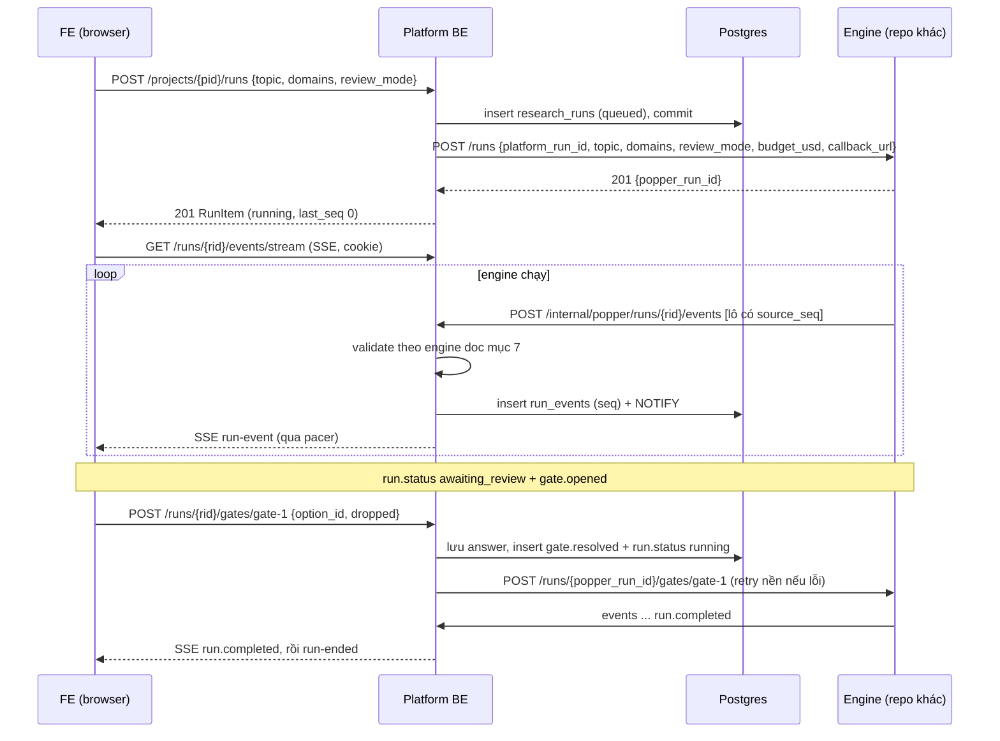

# Platform BE handoff: research run từ topic tới hypothesis (pipeline stage 1–8)

Trạng thái: **DRAFT**. Ngày: 2026-10-06.

Tài liệu này dành cho team **Platform BE** (`ai-research-platform-be`). Platform BE vẫn là API duy nhất mà FE gọi. Lõi chạy pipeline, gọi là **engine**, nằm ở một repo khác: engine nhận lệnh từ Platform BE và đẩy event về. Platform BE dựng lại API cho FE từ các event đó.

- **Tài liệu cặp đôi:** [Engine handoff](engine-handoff-topic-to-hypothesis.md) mô tả API của engine, cách engine gửi event, và **danh mục event chi tiết theo từng stage** (mục 7 bên đó). Platform BE validate theo đúng danh mục đó.
- **Phạm vi:** người dùng nhập topic, engine chạy stage 1–8 theo [hướng dẫn pipeline](../ai-research-platform-fe/docs/pipeline_stage_1_to_8_guide.md), và run **kết thúc khi PI chọn xong bộ hypothesis**. Không có dataset, Experiment hay Paper. Các phần đó vẫn có trong [contract tổng](research-run-event-stream.md) nhưng FE đang tắt.
- **Nguồn sự thật về kiểu dữ liệu:** [`contract.ts`](../ai-research-platform-fe/src/lib/run-stream/contract.ts).
- **Bản mẫu:** [`mock-run.ts`](../ai-research-platform-fe/src/lib/run-stream/mock/mock-run.ts). FE hiện chạy trọn luồng bằng mock này.

---

## 1. Tóm tắt

1. FE dựng **toàn bộ** màn hình từ một chuỗi event có thứ tự. Không có API "lấy màn hình stage X".
2. Platform BE cần làm 8 việc:
   - **(a)** đổi `POST /runs` sang nhận `topic` và `domains`;
   - **(b)** thêm bảng `run_events` (append-only) và `run_gates`;
   - **(c)** thêm endpoint nội bộ nhận event từ engine: validate, cấp `seq`, lưu;
   - **(d)** thêm API đọc lại event và SSE cho FE;
   - **(e)** thêm API trả lời gate, pause và resume;
   - **(f)** sửa `PopperClient` theo API mới của engine;
   - **(g)** thêm pacer giãn nhịp hiển thị;
   - **(h)** giữ `sync` và `abandon`, chỉnh cho hợp luồng mới.
3. Run có 6 stage: `scope` → `search` → `screen` → `read` → `synthesize` → `r1-hypothesize`. Chỉ dừng chờ người dùng ở gate `screen`.
4. Run kết thúc bằng `run.completed {}`, không có `paper_title`.

---

## 2. Luồng tổng



Nguyên tắc:

- **Event được ghi bền trước khi gửi.** SSE chỉ đọc từ `run_events`; callback không gửi thẳng cho FE.
- **`seq` do Platform BE cấp**, tăng nghiêm ngặt theo từng run, bắt đầu từ 1, không có lỗ hổng. Engine có `source_seq` riêng để chống trùng.
- **FE bỏ qua event có `seq` ≤ seq đã áp dụng.** Không được phát lại cùng nội dung với `seq` mới, vì FE sẽ thêm hai lần.

---

## 3. API cho FE

Theo đúng quy ước hiện có của Platform BE:

- Envelope `ok()` / `paginated()` khi thành công, `APIError` khi lỗi.
- Session cookie; `require_active_principal` cho GET, `require_active_csrf` cho POST.
- Quyền qua `require_project_access` (`contribute=True` cho thao tác ghi).
- Mã lỗi viết HOA. FE hiện `message` trong toast và rẽ nhánh theo `error.code`.

Prefix chung: `/api/v1/projects/{project_id}/runs`.

### 3.1 `POST …/runs`: bắt đầu run (sửa `create_run`)

**Request** (`RunCreate` mới)

```json
{
  "topic": "Does getting more sleep go with higher exam scores in our undergraduates, and what explains it?",
  "domains": ["Sleep science", "Educational psychology"],
  "review_mode": "copilot",
  "budget_usd": "5.00"
}
```

| Field | Kiểu | Bắt buộc | Validate (Pydantic) |
|---|---|---|---|
| `topic` | str | có | `strip`, dài 12–1000 ký tự, không chỉ gồm khoảng trắng hoặc ký tự điều khiển |
| `domains` | list[str] | không, mặc định `[]` | Tối đa 6 phần tử. Mỗi phần tử `strip` xong dài 2–60. Không trùng (không phân biệt hoa thường). |
| `review_mode` | `Literal["auto","light","copilot","full"]` | không, mặc định `"copilot"` | FE hiện luôn gửi `copilot` |
| `budget_usd` | Decimal | không | Giữ quy tắc hiện có (`BUDGET_OUT_OF_RANGE`) |

Thay đổi so với hiện tại:

- **Bỏ `dataset_version_id` và `research_context_version`** khỏi luồng này. Nếu cần giữ tương thích, cho cả hai thành tuỳ chọn: có `topic` thì đi luồng mới và bỏ qua chúng.
- Bỏ kiểm tra `RESEARCH_CONTEXT_REQUIRED` và `_unknown_columns`.
- `auto_review` thay bằng `review_mode`. Có thể giữ cột cũ, đặt `auto_review = (review_mode == "auto")`.
- `popper.start_run(...)` gọi API mới của engine (mục 7).

Các bước còn lại giữ như `create_run` hiện tại:

- `lock_project_scope` và `require_project_access(contribute=True, lock=True)`.
- `ensure_writable_project` và kiểm tra `PROJECT_COMPLETED`.
- Kiểm tra `RUN_ACTIVE`.
- Lưu run `queued` và **commit trước khi gọi engine**.
- Xử lý `PopperUncertain` thành 202 và `PopperUnavailable` thành 502 kèm run `failed`.
- `record_audit("run.created")`, thêm `topic`, `domains`, `review_mode` vào `details`.

**Response 201** (`RunItem` mới)

```json
{
  "success": true,
  "message": "Run started",
  "data": {
    "id": "6f1c…",
    "project_id": "…",
    "label": "RUN-6F1C",
    "topic": "Does getting more sleep …",
    "domains": ["Sleep science", "Educational psychology"],
    "review_mode": "copilot",
    "status": "running",
    "last_seq": 0,
    "created_by_user_id": "…",
    "budget_usd": "5.00",
    "cost_usd": "0.00",
    "failure_message": null,
    "created_at": "2026-10-06T07:45:58Z",
    "started_at": "2026-10-06T07:45:59Z",
    "finished_at": null,
    "updated_at": "2026-10-06T07:45:59Z"
  },
  "meta": { "request_id": "…" }
}
```

- `label`: `RUN-` cộng 4 ký tự đầu của id, viết hoa. FE đang tự tạo label kiểu này.
- `last_seq`: seq lớn nhất đã ghi.
- Các field dataset và research context là `null` trong luồng này, nếu vẫn giữ trong `RunItem`.

**Response 202:** engine chưa xác nhận kịp, run ở `queued`, giữ nguyên hành vi hiện tại. FE vẫn mở stream; event sẽ tới khi engine bắt đầu.

**Lỗi**

| HTTP | `error.code` | Khi nào | FE làm gì |
|---|---|---|---|
| 422 | `VALIDATION_ERROR` | Topic hoặc domains sai; `details[].field` là `body.topic`, `body.domains.2`, … | Toast, giữ dialog |
| 422 | `BUDGET_OUT_OF_RANGE` | Như hiện tại | Toast |
| 422 | `POPPER_REJECTED` | Engine từ chối input | Toast |
| 403 | `FORBIDDEN` (code hiện có) | Không phải Project Manager hoặc Researcher | Toast |
| 404 | `NOT_FOUND` | Project không có hoặc không được xem | Toast |
| 409 | `RUN_ACTIVE` | Project đang có run | Toast, mở run đang chạy |
| 409 | `PROJECT_ARCHIVED`, `PROJECT_COMPLETED` | Như hiện tại | Toast |
| 502 | `POPPER_UNAVAILABLE` | Không gọi được engine; run thành `failed` | Toast |
| 503 | `POPPER_NOT_CONFIGURED` | Như hiện tại | Toast |

### 3.2 `GET …/runs/{run_id}` và `GET …/runs`

Giữ nguyên, thêm các field mới của `RunItem`. Thêm `paused` vào `RunStatus`, `ACTIVE_RUN_STATUSES` và CHECK constraint của bảng.

### 3.3 `GET …/runs/{run_id}/events`: đọc lại event (JSON)

Dùng khi mở lại workspace, để FE dựng lại state trước khi nối SSE.

- **Query:** `after` (int ≥ 0, mặc định 0), `limit` (1–1000, mặc định 500).
- **Response:** `paginated(events, total, limit, offset=0)`. `data` là danh sách event có `seq > after`, sắp theo `seq` tăng dần.
- FE gọi lặp với `after` bằng seq cuối, cho tới khi `data` rỗng.
- **Lỗi:** 404 `NOT_FOUND`, 422 `VALIDATION_ERROR`.

### 3.4 `GET …/runs/{run_id}/events/stream`: SSE

Làm theo đúng mẫu `GET /notifications/stream`:

- Xác thực bằng session ngắn hạn (`get_principal`), không giữ transaction mở suốt stream.
- Kiểm tra `Origin` nếu có.
- Kiểm tra lại session mỗi lần keep-alive; session hết hạn thì gửi `event: session-ended`.

**Request:** query `after` (tuỳ chọn) và header `Last-Event-ID` (tuỳ chọn). Có cả hai thì lấy header, vì `EventSource` tự gửi header này khi tự nối lại. Không có cả hai thì gửi từ `seq = 1`.

**Response:** `200 text/event-stream`, header `Cache-Control: no-cache` và `X-Accel-Buffering: no`.

```text
retry: 3000

event: run-event
id: 42
data: {"seq":42,"run_id":"6f1c…","ts":"2026-10-06T07:47:12.413Z","type":"search.query","stage_key":"search","actor":"librarian","payload":{"query":{"id":"q2","strategy_id":"S1","text":"college students sleep grades"}}}

: keep-alive

event: run-ended
data: {"status":"completed"}
```

1. Gửi ngay mọi event đã lưu có `seq > after`, **không qua pacer**. Đây là lịch sử.
2. Sau đó gửi event mới qua pacer (mục 9).
3. `: keep-alive` mỗi 15 giây, kèm kiểm tra lại session. Session hết hạn thì gửi `event: session-ended` với `data: {"code":"…"}` rồi đóng, như notification stream.
4. Run đã kết thúc (`run.completed`, hoặc `run.status` là `failed`) và đã gửi hết event thì gửi `event: run-ended` rồi đóng.
5. Không gửi event nào chưa commit.

Phân phối giữa các process: dùng `pg_notify('run_events', '<run_id>:<seq>')` sau commit, theo cùng mẫu `NotificationHub` (một listener mỗi process, hàng đợi có giới hạn cho mỗi kết nối). Stream nhận tín hiệu rồi tự đọc từ DB. Thêm một vòng poll dự phòng mỗi 5 giây.

**Lỗi trước khi stream:** 401, 404 `NOT_FOUND`, 503 `RUN_STREAM_UNAVAILABLE` khi hub không khởi động được.

### 3.5 `POST …/runs/{run_id}/gates/{gate_id}`: trả lời gate

**Request** (`GateAnswer`)

```json
{ "option_id": "approve", "dropped": ["walker2006"], "note": "Walker is a review of mechanisms, not outcomes." }
```

| Field | Validate |
|---|---|
| `option_id` | Thuộc `gate.options[].id` của gate đang mở, và option đó không bị `disabled` |
| `dropped` | Chỉ cho phép khi gate có `droppable` (gate `screen`). Mỗi id nằm trong `droppable`, không trùng. **Không bỏ hết** (`len(dropped) < len(droppable)`). |
| `note` | Tuỳ chọn, `strip`, tối đa 2000 ký tự |

FE gửi `{option_id: "approve"}` khi duyệt nguyên shortlist, và `{option_id: "approve", dropped: [...]}` khi đã bỏ bài. BE cũng chấp nhận `{option_id: "drop", dropped: [...]}`. Hãy coi `dropped` là nguồn sự thật.

Xử lý trong một transaction:

1. `lock_project_scope`, `require_project_access(contribute=True)`, `ensure_writable_project`.
2. Khoá dòng `run_gates` (`FOR UPDATE`).
3. Validate.
4. Lưu answer, `answered_by_user_id` và `answered_at`.
5. Ghi hai event: `gate.resolved` (mục 8.2) và `run.status {status: "running"}`, hoặc `paused` nếu run đang pause. Cập nhật `research_runs.status`.
6. `record_audit("run.gate_answered")`, commit.

Sau commit, gọi `engine.answer_gate(...)`. Engine không trả lời thì **không** báo lỗi cho người dùng: retry nền với backoff, vì answer đã được lưu.

**Response 200:** `ok({"gate_id": "gate-1", "resolved_seq": 214}, "Answer recorded")`.

**Idempotency:** cùng answer cho gate đã đóng thì trả 200 với `resolved_seq` cũ. Answer khác thì trả 409.

**Lỗi**

| HTTP | `error.code` | Khi nào |
|---|---|---|
| 404 | `NOT_FOUND` | Run hoặc gate không có |
| 409 | `GATE_NOT_OPEN` | Gate chưa mở, hoặc run không chờ gate |
| 409 | `GATE_ALREADY_RESOLVED` | Đã trả lời bằng answer khác |
| 409 | `RUN_FINISHED` | Run đã kết thúc |
| 422 | `INVALID_GATE_OPTION` | `option_id` sai hoặc bị `disabled` |
| 422 | `INVALID_DROP` | `dropped` có id ngoài `droppable`, bị trùng, hoặc gate không cho bỏ |
| 422 | `DROP_ALL_NOT_ALLOWED` | Bỏ hết. FE đã chặn trước bằng toast "Keep at least one paper." |

### 3.6 `POST …/runs/{run_id}/pause` và `POST …/runs/{run_id}/resume`

FE dùng cho nút Pause và cho "Pause each step". Với tuỳ chọn này, FE tự gọi `pause` khi nhận `step.completed`.

- **pause:**
  - Ghi `run.status {status: "paused"}` và đặt `research_runs.status = paused`, **ngay**.
  - Pacer ngừng phát; event engine gửi tới vẫn được lưu nhưng giữ lại.
  - Sau commit, gọi `engine.pause(...)`, retry nền nếu lỗi.
- **resume:**
  - Ghi `run.status {status: "running"}`, hoặc `awaiting_review` nếu có gate mở.
  - Pacer phát tiếp phần đang giữ.
  - Gọi `engine.resume(...)`.
- Cả hai idempotent: pause khi đã pause thì vẫn 200, không ghi event.
- **Lỗi:** 409 `RUN_FINISHED`, 409 `RUN_DISPATCHING` khi run còn `queued` (dùng `_ensure_not_dispatching` có sẵn).
- `record_audit("run.paused")` và `record_audit("run.resumed")`.

### 3.7 `POST …/sync` và `POST …/abandon` (giữ, chỉnh)

- **sync:** ngoài phần hiện tại, nếu `engine.get_run(...).last_source_seq` lớn hơn `research_runs.last_source_seq` thì gọi `GET /runs/{id}/events?after_source_seq=` của engine để kéo phần event bị lỡ rồi ingest như callback (mục 6).
- **abandon:** ngoài phần hiện tại, ghi `run.status {status: "failed", reason: "Abandoned by a project manager"}` để workspace đang mở cập nhật ngay, và gọi `engine.cancel(...)`. Mọi callback sau đó nhận 409 `RUN_FINISHED`.

---

## 4. Event gửi cho FE

```ts
interface RunEvent {
  seq: number;          // Platform BE cấp, tăng nghiêm ngặt theo run, bắt đầu từ 1, không có lỗ hổng
  run_id: string;       // research_runs.id
  ts: string;           // ISO 8601 UTC, lúc Platform BE ghi event, có mili giây
  type: string;         // engine doc mục 6–8, cộng các event ở mục 5 bên dưới
  stage_key?: string;   // bắt buộc với mọi event nội dung; xem bảng dưới
  actor?: AgentRole;    // "strategist" | "librarian" | "theorist" | "methodologist" | "skeptic" | "pi" | "code"
  payload: object;
}
```

| Nhóm event | `stage_key` | `actor` |
|---|---|---|
| `run.started`, `run.plan`, `run.completed` | không có | không có |
| `run.status` | stage đang chạy, nếu có | không có |
| `stage.*`, `step.*`, `skills.loaded`, nội dung, `gate.*`, `rule.checked` | key của stage chứa nó | agent đang làm, xem engine doc mục 7 |
| `agent.message` | key của stage | agent đang nói, bắt buộc có |

**Quan trọng:** reducer của FE tìm nội dung theo `stage_key`. Event nội dung mang `stage_key` sai, hoặc tới trước `stage.started` của stage đó, sẽ **bị bỏ qua mà không báo lỗi**.

Giới hạn kích thước: mỗi event tối đa 64 KB JSON. `screen.scored` gửi theo lô 20–50 điểm.

Event từ engine được chuyển nguyên `type`, `stage_key`, `actor` và `payload`. Platform BE chỉ thêm `seq`, `run_id` và `ts`; `source_seq` **không** gửi cho FE.


---

## 5. Vòng đời và event do Platform BE tự ghi

```text
queued ──run.started (engine)──▶ running ⇄ paused (Platform BE)
                                  │  ▲
         gate.opened (engine) ────┘  └──── gate.resolved (Platform BE)
                         awaiting_review
running ──run.completed (engine)──▶ completed
bất kỳ ──run.status failed (engine, hoặc Platform BE khi abandon hay hết budget)──▶ failed
```

Platform BE tự ghi các event sau, không có `source_seq`:

| Khi | Event |
|---|---|
| Người dùng trả lời gate | `gate.resolved`, rồi `run.status running` hoặc `paused` |
| Pause hoặc resume | `run.status paused`, hoặc `running` / `awaiting_review` |
| Abandon | `run.status failed`, reason "Abandoned by a project manager" |
| `budget_exceeded` (từ báo cáo trạng thái cũ) | `run.status failed`, reason "Budget of X USD reached" |

Ánh xạ `research_runs.status`:

- `run.started` → `running`, và đặt `started_at`.
- `run.status` → giá trị tương ứng.
- `run.completed` → `completed`, và đặt `finished_at`.
- `run.status failed` → `failed`, kèm `failure_message = reason`.
- Mọi thay đổi đi qua `apply_run_status` có sẵn, để `refresh_project_status` và notification vẫn chạy.

---

## 6. Nhận event từ engine

### `POST /api/v1/internal/popper/runs/{run_id}/events`

Đặt trong router `/internal/popper` hiện có, xác thực bằng `require_popper_service` (`X-Service-Key` = `popper_callback_key`).

**Request:** `{ "events": [ { "source_seq", "type", "stage_key?", "actor?", "payload" }, … ] }`, gồm 1–200 event và tối đa 1 MB. Format chi tiết ở engine doc mục 4–5.

Xử lý trong một transaction:

1. `lock_project_scope` rồi `get_run(..., lock=True)`.
2. Run đã `completed` hoặc `failed`: 409 `RUN_FINISHED`, theo chính sách "báo cáo muộn bị từ chối" hiện có.
3. Bỏ các event có `source_seq ≤ research_runs.last_source_seq`, tính là `skipped`. Phần còn lại phải liên tục từ `last_source_seq + 1`; có lỗ hổng thì trả 422 `EVENT_GAP` để engine gửi lại từ đúng chỗ.
4. **Validate cả lô** theo engine doc mục 6 (thứ tự, khung stage) và mục 7 (từng `type`), dựa trên state hiện tại của run. State này dựng từ `run_events` đã có, hoặc từ các cột tóm tắt nếu cần tối ưu (mục 11). Validator nên nằm trong module riêng (`services/run_events.py`), có model Pydantic cho từng `type`.
5. Sai một event: trả 422 `EVENT_INVALID` cho cả lô, `details` dạng `[{field: "events[3].payload.sub_question.covers[0]", message: "Phrase is not in the topic"}]`. Không ghi gì.
6. Hợp lệ:
   - Gán `seq = last_seq + 1, …`, insert `run_events`.
   - Cập nhật `last_seq`, `last_source_seq`, `cost_usd` (nếu engine kèm) và trạng thái (mục 5).
   - Nếu lô có `gate.opened` thì insert `run_gates`.
7. Commit, rồi `pg_notify`.

**Response 200:** `ok({"accepted": 2, "skipped": 0, "last_source_seq": 38})`.

**Lỗi:** 401 `SERVICE_KEY_INVALID`, 404 `NOT_FOUND`, 409 `RUN_FINISHED`, 413 `REQUEST_BODY_TOO_LARGE` (middleware hiện có), 422 `EVENT_GAP` hoặc `EVENT_INVALID`.

Endpoint báo trạng thái cũ (`POST /internal/popper/runs/{run_id}`) vẫn giữ cho luồng cũ. Với luồng topic, trạng thái đi qua event `run.status` và `run.completed`.

---

## 7. Gọi engine (`PopperClient`)

API của engine ở engine doc mục 3. Sửa `PopperClient` và `HttpPopperClient`:

| Method | Gọi | Ghi chú |
|---|---|---|
| `start_run(platform_run_id, topic, domains, review_mode, budget_usd, callback_url)` | `POST /runs` (JSON, không còn multipart) | Engine idempotent theo `platform_run_id`, nên retry an toàn |
| `get_run(popper_run_id)` | `GET /runs/{id}` | Response thêm `last_source_seq` |
| `find_run(platform_run_id)` | `GET /runs?platform_run_id=` | Giữ nguyên |
| `fetch_events(popper_run_id, after_source_seq)` | `GET /runs/{id}/events` | Dùng trong `sync` |
| `answer_gate(popper_run_id, gate_id, answer)` | `POST /runs/{id}/gates/{gate_id}` | Thay `submit_review` cho luồng này |
| `pause`, `resume`, `cancel` | `POST /runs/{id}/pause` … | Idempotent |

`callback_url` = `{public_base_url}{api_prefix}/internal/popper/runs/{run_id}`; engine sẽ gọi `…/events`.

Lệnh gửi sau khi đã commit (answer, pause, resume, cancel) nên đi qua một hàng đợi nhỏ có retry, ví dụ bảng `engine_commands` với `attempts` và `next_attempt_at`. Như vậy khởi động lại Platform BE cũng không mất lệnh.

---

## 8. Gate ở Platform BE

### 8.1 Trình tự người dùng thấy

```text
step.started {screen-gate}                ← engine
agent.message (pi) … done                 ← engine
run.status awaiting_review                ← engine
gate.opened {gate}                        ← engine → Platform BE insert run_gates
        … FE hiện bảng duyệt; không có event nội dung nào …
gate.resolved {gate_id, answer, summary}  ← Platform BE (POST …/gates/{id})
run.status running                        ← Platform BE
step.completed {screen-gate}              ← engine, sau khi nhận answer
stage.completed …                         ← engine
```

Payload `gate.opened`: xem engine doc mục 8.2. Platform BE kiểm tra:

- `id` duy nhất trong run.
- Đúng một option `recommended`.
- `droppable` ⊆ id của `screen.kept`.
- Không có gate nào khác đang mở.

### 8.2 Payload `gate.resolved`

```json
{ "gate_id": "gate-1",
  "answer": { "option_id": "approve", "dropped": ["walker2006"], "note": "…" },
  "summary": "Approved the shortlist without 1 paper." }
```

- `stage_key` là `"screen"`, `actor` để trống. FE hiện dòng này là quyết định của "You".
- `summary` do Platform BE viết: `"Approved all 11 papers."` hoặc `"Approved the shortlist without N paper(s)."`. Với gate `scope` thì là `"Confirmed the scope."`.

---

## 9. Pacer: nhịp gửi để UI mượt

FE **không tự giãn nhịp**: nhận event nào là vẽ ngay. Mỗi item có animation riêng: gõ chữ, bay, đếm số, vẽ đường. Engine chạy nhanh và gửi theo lô, nên nếu chuyển thẳng cho FE thì mọi animation chạy cùng lúc. Vì vậy Platform BE có một **pacer cho mỗi kết nối SSE**, đứng giữa DB và SSE.

### 9.1 Quy tắc

1. **Không tách, không gộp.** Engine đã chia mỗi item thành một event (engine doc mục 9). Pacer chỉ quyết định **khi nào** gửi từng event.
2. **Giãn nhịp khi phát trực tiếp.** Pacer giữ khoảng cách tối thiểu giữa hai event theo bảng 8.2. Khoảng cách này chỉ áp lên việc **phát qua SSE**: event vẫn được ghi DB ngay, `ts` là lúc ghi.
3. **Không giãn khi phát lại.** Lịch sử (`seq ≤ last_seq` lúc client kết nối) gửi liền một mạch.
4. **Không để tụt hậu.** Nếu hàng đợi của pacer dài hơn 30 giây theo bảng nhịp, nén mọi khoảng cách về 60 ms cho tới khi bắt kịp. Engine chậm thì cứ để chậm: pacer không bao giờ thêm chờ đợi khi hàng đợi rỗng.
5. **Pause** dừng pacer (mục 3.6). **Gate mở** thì pacer phát hết phần còn lại tới `gate.opened` rồi dừng.
6. **Lời nói đã được engine chia thành delta** khoảng 2 từ. Pacer giãn mỗi delta khoảng 45 ms để FE có hiệu ứng gõ chữ.

### 9.2 Khoảng cách tối thiểu trước mỗi event (ms, ở tốc độ 1×, lấy từ mock)

| Event | ms | Event | ms |
|---|---|---|---|
| `stage.started` → step đầu | 700 | `step.completed` → step kế | 700 |
| `stage.completed` → stage kế | 1200 | `agent.message` (mỗi delta) | 45 |
| `scope.profile` | 500 | `scope.goal` | 750 |
| `scope.estimate` | 500 | `scope.adjusted` | 900 |
| `scope.approved` | 900 | `problem.subquestion` | 800 |
| `problem.risk` | 450 | `topic.evaluated` | 700, rồi chờ 1600 |
| `search.strategy` | 600 | `search.query` | 520 |
| `search.sources` | 400 | `literature.request` → `batch` | 330 |
| `literature.merged` | 800 | `literature.collected` | 700 |
| `screen.criteria` → lô đầu | 700 | `screen.scored` (mỗi lô 24 điểm) | 380 |
| `screen.rejected` | 900 | `screen.kept` | 520 |
| `card.extracted` | 1100 | `estimate.checked` | 1000 |
| `synthesis.cluster` | 1100 | `synthesis.overview` | 600, rồi chờ 1800 |
| `synthesis.tension` | 900 | `synthesis.gap` | 1300 |
| `synthesis.ranked` | 800, rồi chờ 1600 | `debate.turn` | 700 + 9 × số ký tự của `text` |
| `hypothesis.drafted` | 1500 | `hypothesis.checked` | 1100 |
| `hypothesis.selected` | 800 | `idea.set_aside` | 600 |

Với dữ liệu mẫu, toàn bộ run mất khoảng 4–5 phút ở 1× nếu mọi bước trả kết quả tức thì. Engine thật chậm hơn nhiều, vì phải gọi LLM và API học thuật, nên pacer chủ yếu tác dụng khi một lô lớn về cùng lúc.

Nút 1×/2×/4× trên FE hiện chỉ dành cho mock. Bản thật **không cần** API đổi tốc độ, trừ khi team muốn cho phép "xem nhanh" lúc phát lại.


---

## 10. Happy case và unhappy case (phía người dùng)

### 10.1 Happy case (Copilot, bỏ một bài ở shortlist)

| Bước | Hành động | HTTP | Event chính |
|---|---|---|---|
| H1 | Nhập topic, giữ 2 field, Start | `POST /runs` → 201 | |
| H2 | FE mở SSE `after=0` | 200 stream | `run.started`, `run.plan` |
| H3 | Scope | | `scope.approved`, 4 × `problem.subquestion`, `topic.evaluated` 8.3 |
| H4 | Search | | 3 strategy, 8 query, 24 request/batch, 3 merged, `collected` |
| H5 | Screen tới gate | | 214 điểm, 3 rejected, 11 kept, `awaiting_review`, `gate.opened` |
| H6 | Bỏ "Walker & Stickgold, 2006", Approve 10 | `POST /gates/gate-1` → 200 | `gate.resolved`, `run.status running` |
| H7 | Read | | 10 × `card.extracted`, 2 × `estimate.checked` |
| H8 | Synthesize | | 4 cluster, overview, tension, 3 gap, ranked |
| H9 | Hypothesize | | 12 turn, 4 drafted, 4 checked, 4 selected, 2 set aside |
| H10 | Kết thúc | | `run.completed {}`, SSE `run-ended` |
| H11 | Mở lại trang | `GET /runs/{id}`, `GET /events?after=0` × n | FE dựng lại y hệt |

### 10.2 Unhappy case

| # | Tình huống | Platform BE làm gì | Người dùng thấy |
|---|---|---|---|
| U1 | Topic dưới 12 ký tự, domain trùng | 422 `VALIDATION_ERROR` | Toast. Nút Start vốn đã khoá dưới 12 ký tự. |
| U2 | Project đang có run | 409 `RUN_ACTIVE` | Toast, mở run đang chạy |
| U3 | Không gọi được engine khi start | Run `failed`, 502 `POPPER_UNAVAILABLE`. Engine chậm thì trả 202 và run `queued`. | Toast, hoặc chờ `run.started` |
| U4 | Topic dưới ngưỡng | Engine phát `topic.evaluated` rồi `run.status failed` (engine doc E3). Platform BE chỉ lưu và phát. | Badge "Below the bar: rethink", run Failed |
| U5 | Engine lỗi giữa stage | Engine phát `run.status failed`. Engine im lặng quá lâu thì người dùng bấm `sync` hoặc `abandon`. | Stage dở dừng ở "In progress", run Failed |
| U6 | Callback lỗi, engine retry | Validate và ghi như bình thường, `source_seq` chống trùng | Không thấy gì |
| U7 | Lô sai (`EVENT_INVALID`) | Không ghi gì. Engine sinh lại (engine doc E6). | Run đứng lâu hơn một chút, không bao giờ thấy dữ liệu sai |
| U8 | Bỏ hết shortlist | 422 `DROP_ALL_NOT_ALLOWED` | FE đã chặn bằng toast "Keep at least one paper." |
| U9 | Trả lời gate hai lần hoặc từ hai tab | Cùng answer: 200. Khác answer: 409 `GATE_ALREADY_RESOLVED` | Tab thứ hai nhận toast, state tự cập nhật qua SSE |
| U10 | Engine không nhận answer (đang tắt) | Answer đã lưu, `gate.resolved` đã phát; lệnh nằm trong `engine_commands` và được retry | Run "running" nhưng chưa có gì mới cho tới khi engine nhận |
| U11 | Mất mạng, đóng tab | Không làm gì | Khi quay lại: tự nối với `Last-Event-ID`, hoặc `GET /events?after=` rồi SSE. Không mất event. |
| U12 | Session hết hạn khi đang xem | SSE gửi `session-ended`. POST trả 401. | Về trang đăng nhập |
| U13 | Project Manager abandon | `run.status failed`, gọi `engine.cancel`, callback sau đó bị 409 | Run Failed |
| U14 | Pause khi gate đang mở | Status `paused`, gate vẫn trả lời được, sau đó vẫn `paused` | Nút Resume, gate vẫn mở |
| U15 | Callback tới khi run đang pause | Vẫn ghi DB, pacer giữ lại, chưa phát | UI đứng yên cho tới khi resume |

---

## 11. Lưu trữ (Alembic migration)

### 11.1 Bảng `run_events` (append-only)

```sql
CREATE TABLE run_events (
  run_id      uuid        NOT NULL REFERENCES research_runs(id) ON DELETE CASCADE,
  seq         integer     NOT NULL CHECK (seq >= 1),
  source_seq  integer,                                   -- null với event Platform BE tự ghi
  type        varchar(48) NOT NULL,
  stage_key   varchar(32),
  actor       varchar(16),
  payload     jsonb       NOT NULL,
  created_at  timestamptz NOT NULL DEFAULT now(),        -- = ts trong envelope
  PRIMARY KEY (run_id, seq)
);
CREATE UNIQUE INDEX run_events_source_seq ON run_events (run_id, source_seq) WHERE source_seq IS NOT NULL;
```

Không UPDATE và không DELETE. Thêm test vào `tests/test_postgres_invariants.py` theo cách các bảng append-only hiện có đang làm.

### 11.2 Cột thêm vào `research_runs`

`topic text`, `domains jsonb default '[]'`, `review_mode varchar(8)`, `last_seq integer default 0`, `last_source_seq integer default 0`.

- Thêm `paused` vào CHECK của `status` và vào `ACTIVE_RUN_STATUSES` (và `_ACTIVE_RUN`).
- `dataset_version_id` và `research_context_id` thành nullable.
- Thêm CHECK: phải có `topic`, hoặc có cả `dataset_version_id` và `research_context_id`.

### 11.3 Bảng `run_gates`

`id`, `run_id`, `gate_key` (`gate-1`), `kind`, `spec jsonb` (payload `gate.opened`), `opened_seq`, `answer jsonb`, `answered_by_user_id`, `answered_at`, `resolved_seq`. Unique partial index cho `(run_id) WHERE answer IS NULL`, để mỗi run chỉ có một gate mở. `frame_reviews` giữ cho luồng cũ.

### 11.4 Bảng `engine_commands` (tuỳ chọn, xem mục 7)

`id`, `run_id`, `kind` (`answer_gate` | `pause` | `resume` | `cancel`), `body jsonb`, `attempts`, `next_attempt_at`, `done_at`, `last_error`.

### 11.5 Audit

Dùng `record_audit` cho `run.created` (thêm `topic`, `domains`, `review_mode`), `run.gate_answered`, `run.paused`, `run.resumed` và `run.abandoned` (đã có).

---

## 12. Kiểm thử và nghiệm thu

1. **Fake engine** trong `tests/fakes.py`: phát lại chuỗi event của `mock-run.ts` qua endpoint callback. Không cần engine thật để test toàn bộ API, SSE và pacer.
2. **Unit test:**
   - Validator cho từng `type` (đúng và sai), chạy trên các mẫu trong engine doc mục 7.
   - `seq` liên tục khi có callback đồng thời.
   - `source_seq` trùng và có lỗ hổng.
   - Gate: idempotent, bỏ hết, option sai, hai tab.
   - Pause và resume giữ hoặc nhả event.
   - `after` và `Last-Event-ID`.
   - Pacer không trễ khi phát lại và nén khi tụt hậu.
3. **Kiểm thử contract với FE:** xuất `GET /events` của một run thành JSON, chạy qua `replayRunEvents` của FE (`reducer.test.ts`). State phải có:
   - 6 stage, gate chỉ `screen`;
   - `scope.approved` tới trước sub-question;
   - mọi bản ghi được giữ có DOI;
   - ranking đủ mọi gap;
   - hypothesis được chọn;
   - `liveStageKey` là `r1-hypothesize`.
4. **Test tay:**

   ```bash
   curl -N -b cookies.txt "http://localhost:8000/api/v1/projects/$P/runs/$R/events/stream?after=0"
   curl -b cookies.txt -H "X-CSRF-Token: $T" -H "Content-Type: application/json" \
        -d '{"option_id":"approve","dropped":["walker2006"]}' \
        "http://localhost:8000/api/v1/projects/$P/runs/$R/gates/gate-1"
   ```

Checklist:

- [ ] `POST /runs` nhận `topic` và `domains`, trả `label` và `last_seq`; migration cho các cột và bảng mới.
- [ ] `GET /events` (JSON) và `GET /events/stream` (SSE, `after`, `Last-Event-ID`, keep-alive, `session-ended`, `run-ended`).
- [ ] `POST /gates/{id}`, `pause`, `resume`, đủ validate, idempotent, có audit.
- [ ] `POST /internal/popper/runs/{id}/events` với validator theo engine doc mục 6–7, `source_seq`, `EVENT_GAP`.
- [ ] `PopperClient` mới và hàng đợi lệnh có retry.
- [ ] `sync` kéo event bị lỡ; `abandon` ghi `run.status` và gọi `cancel`.
- [ ] Pacer theo mục 9.
- [ ] Chạy trọn happy case 10.1 với FE thật, nhìn giống bản mock.
- [ ] Đã thử U3, U5, U7, U9, U10, U11, U13 và U15.

---

## 13. Phía FE: đã nối sẵn, chờ Platform BE

FE đã viết sẵn client theo tài liệu này. Bật bằng `NEXT_PUBLIC_RUN_STREAM_SOURCE=api`; mặc định vẫn là `mock` cho tới khi Platform BE xong.

**Đã làm**

- [`fetch-runs.ts`](../ai-research-platform-fe/src/lib/api/services/fetch-runs.ts): `POST /runs` với `topic`, `domains`, `review_mode`; `GET /events?after=&limit=`; `POST /gates/{gate_id}`; `POST /pause`, `POST /resume`. `RunItem` có thêm `label`, `topic`, `domains`, `review_mode`, `last_seq`; `RunStatus` có thêm `paused`.
- [`run-events.ts`](../ai-research-platform-fe/src/lib/realtime/run-events.ts): đọc hết event đã lưu qua `GET /events` (trang 500), rồi mở `EventSource(".../events/stream?after=<seq cuối>", { withCredentials: true })`.
  - Mất kết nối: đóng stream, lấy bù bằng `GET /events?after=`, rồi nối lại sau 1, 2, 5, 10, 30 giây.
  - `run-ended`: đóng. `session-ended` hoặc 401: về trang đăng nhập. 403 hoặc 404: dừng và hiện toast.
  - Chỉ kiểm tra envelope (`seq`, `run_id`, `ts`, `type`, `payload`). `stage_key` hoặc `actor` là `null` đều được chấp nhận.
- [`api-run.ts`](../ai-research-platform-fe/src/lib/run-stream/api-run.ts) và [`run-store.ts`](../ai-research-platform-fe/src/lib/run-stream/run-store.ts): tạo run, lấy `id` và `label` từ BE. Gặp `RUN_ACTIVE` thì hiện toast rồi mở run đang chạy. Lỗi API hiện bằng toast với `message` của BE.
- **Mở lại sau khi reload:** FE gọi `GET /runs?limit=1` và dùng run mới nhất có `topic`. Nếu run còn active thì đọc lại event rồi nối SSE; nếu đã xong thì chỉ đọc lại. Vì vậy `GET /runs` phải sắp mới nhất trước và trả `topic`, `label`, `status`.
- Run cũ có `topic` trong "Past runs" mở thẳng trong workspace và dựng lại từ event.
- **UI:** trạng thái chờ khi bấm Start và khi trả lời gate; màn chờ khi run chưa có stage nào; run Failed hiện `reason` của `run.status`. Ô topic giới hạn 1000 ký tự; tối đa 6 field, mỗi field 2–60 ký tự. Nút 1×/2×/4× chỉ có khi chạy mock.
- Experiment, Interpret, Report và Write hiện trên UI nhưng bị khoá, với nhãn "Coming soon".

**Đã thử:** chạy trọn luồng trên FE thật với một BE giả theo đúng các endpoint 3.1–3.6 (SSE thật, có giãn nhịp), gồm happy case, pause và resume, reload giữa chừng (nối lại từ `after` đúng chỗ, không lặp event), trả lời gate sau reload, run fail giữa chừng (U4, U5), và mở lại run đã xong (H11). Không có lỗi console.

**Còn lại sau khi Platform BE xong**

- Đặt `NEXT_PUBLIC_RUN_STREAM_SOURCE=api` và chạy lại mục 10 với BE thật.
- Đạt rồi mới bỏ mock của topic → hypothesis (`discovery.ts` và stage 1–8 trong `mock-run.ts`). Lưu ý: mock của experiment và paper đang chạy tiếp từ chính stage 1–8 và bộ hypothesis H1–H4 của mock, nên phải tách ra trước.
- Các màn hình cũ vẫn giả định run có dataset: tổng quan của Project Manager (`fetch-manager.ts` lấy context và dataset của run mới nhất), researcher overview và trang chi tiết run. Với run đi từ topic, các trường đó là `null`, nên cần sửa khi bật `api`.
