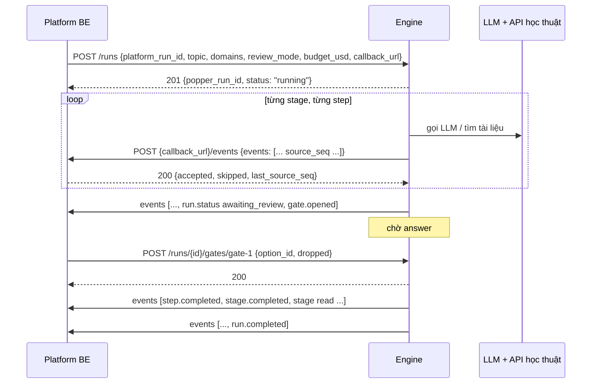

# Engine handoff: research run từ topic tới hypothesis (pipeline stage 1–8)

Trạng thái: **DRAFT**. Ngày: 2026-10-06.

Tài liệu này dành cho team làm **engine**, tức repo lõi chạy pipeline AutoResearchClaw stage 1–8. Engine không nói chuyện với FE. Nó nhận lệnh từ **Platform BE** (`ai-research-platform-be`) và đẩy event về Platform BE. Platform BE lo phần còn lại: người dùng, project, quyền, lưu trữ, SSE và nhịp hiển thị.

- **Tài liệu cặp đôi:** [Platform BE handoff](be-handoff-topic-to-hypothesis.md) mô tả phía Platform BE ↔ FE.
- **Phạm vi:** người dùng nhập topic, engine chạy stage 1–8 theo [hướng dẫn pipeline](../ai-research-platform-fe/docs/pipeline_stage_1_to_8_guide.md), và run **kết thúc khi PI chọn xong bộ hypothesis**. Không có dataset, Experiment hay Paper.
- **Nguồn sự thật về kiểu dữ liệu:** [`contract.ts`](../ai-research-platform-fe/src/lib/run-stream/contract.ts). Engine phát đúng các `type` và `payload` trong file đó.
- **Bản mẫu:** [`mock-run.ts`](../ai-research-platform-fe/src/lib/run-stream/mock/mock-run.ts) phát chính xác chuỗi event engine cần phát; dữ liệu mẫu ở [`discovery.ts`](../ai-research-platform-fe/src/lib/run-stream/mock/discovery.ts). Khi phân vân, chạy mock trên FE rồi so.
- **Xác thực:** giai đoạn này chưa cần. Hai bên chỉ gửi kèm header `X-Service-Key`, vì `PopperClient` của Platform BE đã làm vậy, và engine chỉ cần so khớp nếu muốn.

"Popper" là tên đội agent mà người dùng thấy trên UI. Trong code Platform BE, engine vẫn được gọi qua `PopperClient` và `/internal/popper/...`; tài liệu giữ các tên đó để đỡ phải đổi.

---

## 1. Ranh giới trách nhiệm

| Việc | Engine | Platform BE |
|---|---|---|
| Chạy stage 1–8, gọi LLM, gọi OpenAlex / Semantic Scholar / arXiv | ✔ | |
| Sinh event đúng `contract.ts`, **chia nhỏ từng item**, đúng thứ tự | ✔ | |
| Đánh số `source_seq` và chống trùng khi chạy lại | ✔ | |
| Mở gate (`gate.opened`), chờ answer, chạy tiếp theo answer | ✔ | |
| Dừng ở điểm an toàn khi pause hoặc cancel | ✔ | |
| Người dùng, project, quyền, cookie, CSRF | | ✔ |
| Validate lại event, cấp `seq`, lưu `run_events`, SSE cho FE | | ✔ |
| Giãn nhịp hiển thị (pacer) | | ✔ |
| Ghi `gate.resolved`, `run.status` do pause, resume hoặc abandon | | ✔ |

Engine **không** gửi `seq`, `run_id` hay `ts`, và **không** phát `gate.resolved`. Engine cũng không phát `run.status` do pause hay resume: những event đó do Platform BE ghi.

---

## 2. Luồng tổng



---

## 3. API engine cung cấp cho Platform BE

- Base URL do Platform BE cấu hình (`popper_base_url`).
- Mọi request có header `X-Service-Key`.
- Body và response là JSON.
- Lỗi trả `{ "message": "…", "code": "…" }` với HTTP status phù hợp. `PopperClient` đọc `message`; status ≥ 500 bị coi là "chưa chắc", nên Platform BE sẽ hỏi lại sau.

### 3.1 `POST /runs`: bắt đầu run

**Request**

```json
{
  "platform_run_id": "6f1c2a…",
  "topic": "Does getting more sleep go with higher exam scores in our undergraduates, and what explains it?",
  "domains": ["Sleep science", "Educational psychology"],
  "review_mode": "copilot",
  "budget_usd": "5.00",
  "callback_url": "http://platform-be:8000/api/v1/internal/popper/runs/6f1c2a…"
}
```

| Field | Validate |
|---|---|
| `platform_run_id` | uuid, bắt buộc. **Khoá idempotency**: gọi lại với cùng id thì trả lại run đã có (200), không tạo run mới. |
| `topic` | Trim xong dài 12–1000 ký tự. Platform BE đã validate, engine kiểm tra lại. |
| `domains` | 0–6 chuỗi, mỗi chuỗi 2–60 ký tự. Rỗng thì engine tự nhận diện lĩnh vực (stage 1). |
| `review_mode` | `auto`, `light`, `copilot` hoặc `full`. Gate trong phạm vi này: `copilot` có `screen`; `full` có `scope` và `screen`; `auto` và `light` không có. |
| `budget_usd` | Decimal > 0. Trần chi phí gọi LLM và API. |
| `callback_url` | URL tuyệt đối. Engine gửi event tới `{callback_url}/events`. |

**Response 201** (hoặc 200 nếu đã có): `{ "popper_run_id": "eng-81f2…", "status": "running", "cost_usd": "0.00", "message": null }`.

Engine nhận job, trả về ngay rồi chạy nền. **Không** chạy pipeline trong request: `PopperClient` chỉ chờ tối đa `popper_timeout_seconds`, mặc định 30 giây.

**Lỗi:** 422 `{code: "INVALID_INPUT", message}` khi input sai; 503 khi không nhận job được.

### 3.2 `GET /runs/{popper_run_id}` và `GET /runs?platform_run_id=…`

Trả `{ popper_run_id, status, cost_usd, message, last_source_seq }`:

- `status` là một trong `running`, `paused`, `awaiting_review`, `completed`, `failed`.
- `message` là lý do khi `failed`.
- Run không tồn tại: 404.

Platform BE gọi hai endpoint này trong `sync` khi nghi một run bị kẹt.

### 3.3 `GET /runs/{popper_run_id}/events?after_source_seq=N&limit=500`

Trả `{ "events": [...] }` gồm các event có `source_seq > N`, cùng format với mục 4. Platform BE dùng endpoint này để **tự lấy lại** event bị lỡ khi callback lỗi lâu. Vì vậy engine phải **lưu lại mọi event đã phát**, không chỉ gửi rồi bỏ.

### 3.4 `POST /runs/{popper_run_id}/gates/{gate_id}`: answer của người dùng

**Request**

```json
{ "option_id": "approve", "dropped": ["walker2006"], "note": "…" }
```

- Platform BE đã validate theo gate: option có tồn tại, `dropped` ⊆ `droppable`, không bỏ hết.
- **Idempotent:** gửi lại cùng answer thì trả 200. Answer khác cho gate đã đóng thì trả 409 `GATE_ALREADY_RESOLVED`.
- Gate không đang mở: 409 `GATE_NOT_OPEN`.
- Nhận answer xong, engine chạy tiếp (mục 8) và trả 200 ngay, không chờ chạy xong.

### 3.5 `POST /runs/{popper_run_id}/pause`, `/resume`, `/cancel`

- **pause:** dừng ở **điểm an toàn kế tiếp**, tức giữa hai event hoặc giữa hai lần gọi LLM. Không cắt ngang một lời gọi đang chạy. Event đã sinh trước điểm đó vẫn gửi bình thường. Trả 200 ngay.
- **resume:** chạy tiếp. Nếu đang có gate mở thì vẫn chờ answer.
- **cancel:** dừng hẳn, giải phóng tài nguyên, không gửi event nội dung nào nữa. Platform BE tự ghi `run.status failed`.
- Cả ba đều idempotent: pause khi đã pause thì vẫn 200. Gọi lên run đã kết thúc thì trả 409 `RUN_FINISHED`.

---

## 4. Engine gửi event về Platform BE

### 4.1 `POST {callback_url}/events`

Tức `POST /api/v1/internal/popper/runs/{platform_run_id}/events` trên Platform BE.

```json
{
  "events": [
    { "source_seq": 37, "type": "problem.subquestion", "stage_key": "scope", "actor": "strategist",
      "payload": { "sub_question": { "id": "SQ1", "text": "…", "tests": "…", "priority": 1, "covers": ["…"] } } },
    { "source_seq": 38, "type": "problem.risk", "stage_key": "scope", "actor": "strategist",
      "payload": { "risk": { "id": "R1", "sq_id": "SQ1", "text": "…", "level": "medium" } } }
  ]
}
```

- `source_seq`: số nguyên tăng dần theo run, bắt đầu từ 1, **không bỏ số**. Engine lưu nó cùng event (mục 3.3).
- Một lô có 1–200 event, tổng tối đa 1 MB. Mỗi event tối đa 64 KB.
- Gửi **tuần tự** theo từng run: chờ lô trước trả 2xx rồi mới gửi lô sau. Không gửi song song.
- Khi nào gửi lô: mỗi khi có event mới. Nếu có nhiều event cùng lúc, gom tối đa khoảng 200 ms rồi gửi. Không giữ event lâu: Platform BE tự lo giãn nhịp.

**Response 200:** `{ "accepted": 2, "skipped": 0, "last_source_seq": 38 }`. Event có `source_seq ≤ last_source_seq` đã nhận trước đó thì bị bỏ qua và tính vào `skipped`.

### 4.2 Retry

| Platform BE trả | Engine làm |
|---|---|
| 2xx | Gửi lô kế |
| Lỗi mạng, timeout, 5xx | Retry cùng lô với backoff 1 s, 2 s, 4 s, … tối đa 60 s, không giới hạn số lần trong 30 phút. Quá 30 phút thì dừng gửi và để Platform BE tự kéo qua mục 3.3. |
| 409 `RUN_FINISHED` | Platform BE đã đóng run, ví dụ do abandon. Dừng run, không gửi nữa. |
| 422 `EVENT_INVALID` | Có event sai: xem `details`. **Không** gửi lại y nguyên. Xem mục 10, E6. |
| 401 `SERVICE_KEY_INVALID` | Cấu hình sai. Dừng gửi, báo lỗi vận hành. |

### 4.3 Platform BE kiểm tra gì

Platform BE kiểm tra lại toàn bộ quy tắc ở mục 7 cùng thứ tự ở mục 6. **Sai một event thì cả lô bị từ chối.** Vì vậy engine nên chạy cùng bộ validator trước khi gửi. Khuyến nghị: dùng chung một JSON Schema hoặc model Pydantic sinh từ `contract.ts`.

---

## 5. Envelope engine gửi và ai phát event nào

```ts
{
  source_seq: number;     // engine cấp
  type: string;           // mục 6–8
  stage_key?: string;     // "scope" | "search" | "screen" | "read" | "synthesize" | "r1-hypothesize"
  actor?: "strategist" | "librarian" | "theorist" | "methodologist" | "skeptic" | "pi";
  payload: object;
}
```

| Nhóm event | `stage_key` | `actor` | Ai phát |
|---|---|---|---|
| `run.started`, `run.plan`, `run.completed` | không có | không có | engine |
| `run.status` `awaiting_review` (ngay trước `gate.opened`), `running` (ngay khi bắt đầu), `failed` (lỗi của engine) | stage đang chạy | không có | engine |
| `run.status` `paused`, `running` sau resume hoặc sau gate, `failed` do abandon | | | **Platform BE** |
| `gate.resolved` | | | **Platform BE** |
| `stage.*`, `step.*`, `skills.loaded`, nội dung, `gate.opened`, `rule.checked` | key của stage | agent đang làm | engine |
| `agent.message` | key của stage | agent đang nói, bắt buộc có | engine |

**Quan trọng:** FE tìm nội dung theo `stage_key`. Event nội dung mang `stage_key` sai, hoặc tới trước `stage.started` của stage đó, sẽ bị bỏ qua mà không ai biết. Platform BE sẽ từ chối các event như vậy.

---

## 6. Kế hoạch run và khung của mỗi stage

### 6.1 Hai event mở đầu

```json
{ "source_seq": 1, "type": "run.started", "payload": {
  "mode": "copilot",
  "topic": "Does getting more sleep go with higher exam scores in our undergraduates, and what explains it?",
  "domains": ["Sleep science", "Educational psychology"]
} }
```

`dataset` **không gửi** trong luồng này, vì đó là trường tuỳ chọn.

```json
{ "source_seq": 2, "type": "run.plan", "payload": { "stages": [
  { "key": "scope",          "stage": "scope",       "title": "Scope the question",    "has_gate": false, "pipeline": [1, 2] },
  { "key": "search",         "stage": "search",      "title": "Search the literature", "has_gate": false, "pipeline": [3, 4] },
  { "key": "screen",         "stage": "screen",      "title": "Screen the papers",     "has_gate": true,  "pipeline": [5] },
  { "key": "read",           "stage": "read",        "title": "Read and extract",      "has_gate": false, "pipeline": [6] },
  { "key": "synthesize",     "stage": "synthesize",  "title": "Find the gaps",         "has_gate": false, "pipeline": [7] },
  { "key": "r1-hypothesize", "stage": "hypothesize", "title": "Hypothesize",           "has_gate": false, "pipeline": [8] }
] } }
```

- `has_gate` phụ thuộc `review_mode`: `copilot` chỉ có `screen`, `full` có `scope` và `screen`, `auto` không có gate nào.
- Stage hypothesize **không có** `round` hay `round_kind` trong luồng này. Key vẫn là `r1-hypothesize`.
- `run.plan` chỉ cần gửi một lần ở đầu run.


Engine phát `run.started` rồi `run.plan` ngay khi bắt đầu, sau đó tới `stage.started` của `scope`.

### 6.2 Khung của mỗi stage (giống hệt nhau cho cả 6 stage)

```text
stage.started {plan: StagePlan}
skills.loaded {skills}                  ← FE lưu nhưng không hiện; gửi hay không đều được
  step.started {step_id}
    …event nội dung của step…
    agent.message × n (cùng message_id, cái cuối có done: true)
  step.completed {step_id}
  … lặp cho từng step trong plan.steps, đúng thứ tự …
stage.completed {summary}
```

- `plan.steps` phải liệt kê **mọi** step sẽ chạy, kể cả step gate, ngay trong `stage.started`. FE vẽ danh sách step và dải "Builds on → Writes" từ đây.
- `step.started` và `step.completed` phải khớp `steps[].id`, đi theo đúng thứ tự, không lồng nhau.
- Lời tường thuật (`agent.message`) của step thường đi **sau** nội dung, ngay trước `step.completed`. Riêng step gate thì lời nói đi **trước** `gate.opened`.
- `summary` là một câu ngắn, ví dụ `"359 hits · 214 unique papers · 145 duplicates merged"`.

`StagePlan` đầy đủ:

```ts
{
  key, stage, title, has_gate, pipeline: number[],
  purpose: string,              // 1–2 câu cho người dùng đọc
  reads?: string[],             // tên thân thiện của thứ stage dựa vào
  cast: AgentRole[],            // các agent tham gia, theo thứ tự hiện avatar
  steps: {
    id: string, title: string, actor: AgentRole,
    explain: string,            // 1–2 câu
    gate?: "scope" | "screen",
    pipeline_stage?: number,    // 1..8
    artifact?: string           // tên thân thiện của thứ step viết ra, KHÔNG phải đường dẫn file
  }[]
}
```

**Không đưa đường dẫn file (`stage-01/goal.md`, `.json`, `.jsonl`, `.yaml`) hay tên cột kỹ thuật vào bất kỳ chữ nào người dùng đọc.** Đó là yêu cầu của sản phẩm: dùng "Research goal", "Shortlist", "Gap map".


---

## 7. Từng stage: event, payload, validate

Mỗi stage dưới đây có: plan (steps), các event theo thứ tự, ví dụ payload, quy tắc validate, và artifact của pipeline mà event lấy dữ liệu từ đó. Payload ví dụ lấy từ mock.

### 7.0 Quy tắc validate chung (áp dụng cho mọi event)

Engine tự kiểm tra mọi event trước khi gửi. Platform BE kiểm tra lại đúng các quy tắc này; sai một event thì cả lô bị từ chối (mục 4.2 và E6).

- Đúng schema Pydantic của `type`: thiếu field bắt buộc, thừa field, hoặc sai kiểu đều bị từ chối. Thừa field thì có thể bỏ đi thay vì từ chối, nhưng phải ghi log.
- Chuỗi người dùng đọc phải trim, không rỗng, không có Markdown hay HTML. FE hiện chuỗi nguyên văn.
- Id trong một run là duy nhất theo loại: `SQ1`, `R1`, `S1`, `q1`, paper id, card id, `C1`, `G1`, `t1`, `H1`. Gửi lại cùng id thì phải là **cập nhật hợp lệ** (chỉ `scope.goal` cho phép), nếu không thì từ chối.
- Thứ tự: không event nội dung nào được tới trước `stage.started` của stage đó, hoặc sau `stage.completed` của nó.
- Không event nội dung nào được phát khi đang có gate mở.
- Số nằm trong miền cho phép: điểm 0–1 hoặc 0–10 như từng mục ghi; số đếm là số nguyên ≥ 0.

### 7.1 Stage `scope`: pipeline 1 TOPIC_INIT và 2 PROBLEM_DECOMPOSE

**Plan**

| step id | title | actor | pipeline_stage | artifact |
|---|---|---|---|---|
| `profile` | Check the field and the machine | strategist | 1 | Compute profile |
| `goal` | Set the goal | strategist | 1 | Research goal |
| `decompose` | Split it into sub-questions | strategist | 2 | Sub-question tree |
| `evaluate` | Rate the topic | pi | 2 | Topic score |
| `scope-gate` *(chỉ khi `full`)* | Your check: the scope | pi | | |

`reads: ["Your topic", "Your fields", "This machine"]`, `cast: ["strategist", "pi"]`.

**Event theo thứ tự**

| # | type | actor | payload ví dụ | Validate |
|---|---|---|---|---|
| 1 | `scope.profile` | strategist | `{"domains":["Sleep science","Educational psychology"],"compute":{"label":"CPU sandbox · 4 cores · 16 GB · no GPU","detail":"Regression, mediation and bootstraps finish in minutes. Nothing in this question needs a GPU."}}` | `domains` 1–6 phần tử. Nếu người dùng đã gửi domains thì phải là chúng hoặc một tập con. `compute.label` tối đa 80 ký tự. |
| 2 | `scope.goal` × 5 | strategist | `{"field":"title","label":"Working title","value":"Sleep, Stress and Study Time: …"}` | `field` gồm đủ 5 giá trị `title`, `problem`, `objective`, `scope`, `success`, theo đúng thứ tự đó. `title` tối đa 14 từ. Gửi lại cùng `field` thì giá trị được thay. |
| 2a | `scope.estimate` × n | strategist | `{"estimate":{"id":"E1","text":"Sleep accounts for roughly a quarter of the variation in grades."}}` | Gửi ngay sau `scope.goal` field `problem`. `id` có dạng `E1`, `E2`, …. Đây là con số agent nhớ ra (luật 6). |
| 3 | `scope.adjusted` | strategist | `{"field":"scope","from":"Everything that could explain the link, including caffeine, exam timing and diet.","to":"Sleep, stress, study time and screen time in undergraduates. …","reason":"Each of those is a literature of its own …"}` | Tuỳ chọn, tối đa một lần cho mỗi field. `from` phải bằng giá trị hiện tại của field đó. |
| 4 | `scope.approved` | pi | `{"at":"2026-10-06T07:46:03Z","note":"Specific, measurable and doable on this machine."}` | **Bắt buộc**, sau cả 5 goal và trước `problem.subquestion` đầu tiên. Ứng với `stage-01/decision.json` = APPROVED. |
| 5 | `problem.subquestion` × 2–6 | strategist | `{"sub_question":{"id":"SQ1","text":"Do students who sleep 7 h or more score higher, once study, stress and screen time are held equal?","tests":"Exam score, 7 h or more vs less, others held equal","priority":1,"covers":["more sleep go with higher exam scores","our undergraduates"]}}` | Xem ghi chú bên dưới. |
| 5a | `problem.risk` | strategist | `{"risk":{"id":"R1","sq_id":"SQ1","text":"Strong students may simply sleep more","level":"medium"}}` | Gửi ngay sau sub-question của nó. `sq_id` phải tồn tại. `level` là `low`, `medium` hoặc `high`. |
| 6 | `topic.evaluated` | pi | `{"scores":{"novelty":7,"specificity":9,"feasibility":9},"overall":8.3,"threshold":5,"advice":"Clear, and doable on a CPU. …"}` | Sau mọi sub-question. Mỗi điểm 0–10, `overall` 0–10 với tối đa 1 chữ số thập phân, `threshold` là 5. Nếu `overall < threshold` thì xem mục 10, E3. |

Ghi chú cho `problem.subquestion`:

- `priority` là 1..n, không trùng nhau.
- `tests` viết bằng lời thường, tối đa 90 ký tự, **không dùng tên cột**.
- `covers[]` là các cụm từ **trích nguyên văn** từ `topic`. FE tìm chuỗi này trong topic để tô đánh dấu, nên sai một ký tự là FE không tô. Engine phải kiểm tra `phrase in topic` trước khi gửi.
- Hợp của mọi `covers` nên phủ các ý chính của topic. Đây là yêu cầu MECE; chỉ cần ghi log cảnh báo, không cần chặn.

**Lấy từ artifact:**

- `hardware_profile.json` → `scope.profile.compute`.
- `goal.md` → 5 event `scope.goal`, cộng `scope.estimate` cho phần disclaimer "ước tính tạm thời", cộng `scope.adjusted` nếu agent thu hẹp scope.
- `decision.json` → `scope.approved`.
- `problem_tree.md` → `problem.subquestion` và `problem.risk`.
- `topic_evaluation.json` → `topic.evaluated`.

### 7.2 Stage `search`: pipeline 3 SEARCH_STRATEGY và 4 LITERATURE_COLLECT

**Plan:** `strategy` "Plan the searches" (librarian, 3, artifact "Search plan"), `collect` "Collect candidates" (librarian, 4, artifact "Candidate list"). `reads: ["Sub-question tree"]`, `cast: ["librarian"]`.

| # | type | payload ví dụ | Validate |
|---|---|---|---|
| 1 | `search.strategy` | `{"strategy":{"id":"S1","title":"The link itself","why":"Studies of sleep and grades in college students."}}` | Ít nhất 3 strategy. FE hiện "angle n of 3". |
| 1a | `search.query` × 2–5 cho mỗi strategy | `{"query":{"id":"q1","strategy_id":"S1","text":"sleep duration academic performance"}}` | Gửi ngay sau strategy của nó. `text` dài 3–6 từ: ngoài khoảng này FE tô vàng; quá 10 từ thì từ chối. Tổng số query ≥ 8. |
| 2 | `search.sources` | `{"sources":[{"id":"openalex","name":"OpenAlex"},{"id":"s2","name":"Semantic Scholar"},{"id":"arxiv","name":"arXiv"}],"delay_ms":1500}` | Đúng một lần, sau mọi query. `delay_ms` là khoảng cách thật giữa các request (`inter_query_delay_sec`). |
| 3 | `literature.request` | `{"query_id":"q1","source_id":"openalex"}` | Mỗi cặp (query, source) **đúng một lần**, tổng bằng số query × số source. FE vẽ ô đang chờ. |
| 3a | `literature.batch` | `{"query_id":"q1","source_id":"openalex","hits":41}` | Theo sau `request` của cùng cặp. `hits` ≥ 0. Request lỗi thì xem mục 10, E4. |
| 4 | `literature.merged` × 1–5 | `{"title":"The memory function of sleep","records":[{"source":"OpenAlex","record_id":"W2103…","citations":4870,"has_doi":true},{"source":"Semantic Scholar","record_id":"…","citations":4790,"has_doi":true},{"source":"arXiv","record_id":"…","citations":0,"has_doi":false}],"kept":"OpenAlex"}` | Ví dụ minh hoạ, chọn vài bài trùng tiêu biểu, không cần gửi hết. `records` ≥ 2. `kept` phải là một `records[].source`, và phải theo đúng quy tắc: có DOI trước, rồi tới nhiều citation nhất. |
| 5 | `literature.collected` | `{"raw":359,"unique":214,"duplicates":145,"files":[{"name":"Candidate list","detail":"214 papers with abstract, source and citation count"},{"name":"Reference list","detail":"214 citations, ready for the write-up"},{"name":"Search log","detail":"hits per query and per source"}],"collected_at":"2026-10-06T07:48:12Z"}` | `raw` = tổng mọi `hits`. `unique` + `duplicates` = `raw`. `files[].name` là tên thân thiện, không phải tên file. |

**Lấy từ artifact:**

- `search_plan.yaml` và `queries.json` → strategy và query.
- `sources.json` → `search.sources`.
- Mỗi lần gọi API nguồn → một `request` và một `batch`.
- Bước dedup → `merged` và `collected`.
- `search_meta.json` và `references.bib` → `files`.

### 7.3 Stage `screen`: pipeline 5 LITERATURE_SCREEN (HITL)

**Plan:**

| step id | title | actor | artifact |
|---|---|---|---|
| `score` | Score every paper | librarian | |
| `reject` | Reject wrong-field matches | librarian | |
| `shortlist` | Keep the shortlist | librarian | Shortlist |
| `screen-gate` | Your check: the shortlist | pi | (`gate: "screen"`, chỉ khi mode có gate này) |

Tất cả có `pipeline_stage` 5. `reads: ["Candidate list", "Sub-question tree"]`.

| # | type | payload ví dụ | Validate |
|---|---|---|---|
| 1 | `screen.criteria` | `{"rules":["Domain match","Method relevance","Cross-domain rejection","Recency preference","Seminal papers","Quality floor"],"relevance_min":0.7,"quality_min":0.5}` | Đúng một lần, đầu stage. Ngưỡng nằm trong 0–1. |
| 2 | `screen.scored` × k | `{"points":[{"id":"okano2019","relevance":0.95,"quality":0.86},{"id":"p12","relevance":0.41,"quality":0.63}]}` | Mỗi lô 20–50 điểm. Tổng số điểm bằng `unique` của stage 4. `id` không trùng. **Mọi bài được giữ và bị loại ở các bước sau phải có điểm ở đây, cùng id**, vì FE vẽ chấm rồi cho chấm "bay" sang shortlist. Điểm làm tròn 2 chữ số. |
| 3 | `screen.rejected` × n | `{"paper":{"id":"rx1","title":"Adaptive sleep scheduling for energy-efficient wireless sensor networks","venue":"IEEE Sensors Journal","false_friend":"sleep","reason":"About radios switching to sleep mode, not people."}}` | `false_friend` phải xuất hiện trong `title` (không phân biệt hoa thường), vì FE tô từ này. Bài bị loại có thể nằm trong vùng giữ: đó chính là ý nghĩa của bước này. |
| 4 | `screen.kept` × n | `{"paper":{"id":"okano2019","citation":"Okano et al., 2019","title":"Sleep quality, duration, and consistency …","venue":"npj Science of Learning","year":2019,"relevance":0.95,"quality":0.86,"reason":"Same population and outcome, with measured sleep.","doi":"10.1038/s41539-019-0055-z","source":"OpenAlex","citations":412}}` | Xem ghi chú bên dưới. |
| 5 | gate | | Mục 8 |

Ghi chú cho `screen.kept`:

- Phải có `relevance ≥ relevance_min` và `quality ≥ quality_min`, trừ bài có `seminal: true`.
- Gửi theo thứ tự relevance giảm dần.
- `citation` có dạng "Họ et al., năm".
- `doi` chỉ gửi khi chắc chắn đúng, vì FE biến nó thành link `https://doi.org/…`.
- `source` và `citations` lấy từ bản ghi được giữ ở stage 4.
- Shortlist nên có 5–30 bài. 0 bài thì xem mục 10, E5.

**Lấy từ artifact:** `shortlist.jsonl` cung cấp các bài giữ lại cùng `keep_reason`. Điểm của mọi ứng viên lấy từ kết quả chấm, còn bài loại vì khác lĩnh vực lấy từ bước semantic disambiguation.

### 7.4 Stage `read`: pipeline 6 KNOWLEDGE_EXTRACT

**Plan:** `extract` "Extract a card per paper" (librarian, 6, artifact "Knowledge cards"), `verify` "Check the recalled numbers" (librarian, 6). `reads: ["Shortlist"]`.

| # | type | payload ví dụ | Validate |
|---|---|---|---|
| 1 | `card.extracted` × n | `{"card":{"id":"okano2019","paper_id":"okano2019","citation":"Okano et al., 2019","problem":"Does everyday sleep predict grades in a real course?","method":"Fitness trackers over a semester, linked to exam results.","data":"88 students in one chemistry course.","metrics":"Sleep duration, quality, consistency; exam scores.","findings":"Sleep measures explained nearly 25% of the variance in grades.","limitations":"Study time wasn't measured, so sleep can't be told apart from study habits."}}` | Đúng **một thẻ cho mỗi bài trong shortlist trừ bài người dùng đã bỏ ở gate**. `paper_id` phải là id trong shortlist. 6 trường chữ đều bắt buộc, mỗi trường 1 câu và tối đa 200 ký tự. Gửi đúng thứ tự shortlist. |
| 2 | `estimate.checked` × n | `{"check":{"estimate_id":"E2","status":"unsupported","note":"No shortlisted paper reports a gap this size on a 0–100 exam. Dropped; the run will measure it instead."}}` hoặc `{"check":{"estimate_id":"E1","status":"verified","source":"Okano et al., 2019","note":"…"}}` | Mỗi `scope.estimate` có **đúng một** check. `verified` thì bắt buộc có `source`, và `source` phải là `citation` của một thẻ. |
| 3 | `rule.checked` | `{"rule":6,"state":"pass"}` | Sau check cuối cùng. |

**Lấy từ artifact:** `cards/*.json` → `card.extracted`. Phần đối chiếu ước tính lấy từ bước kiểm chứng SOTA (luật 6).

### 7.5 Stage `synthesize`: pipeline 7 SYNTHESIS

**Plan:**

| step id | title | actor | artifact |
|---|---|---|---|
| `cluster` | Group into schools of thought | theorist | |
| `overview` | Sum up the field | theorist | |
| `tension` | Find where they disagree | theorist | |
| `gaps` | Name the gaps | theorist | |
| `rank` | Rank the opportunities | theorist | Gap map |

Tất cả có `pipeline_stage` 7. `reads: ["Knowledge cards", "Sub-question tree"]`.

| # | type | payload ví dụ | Validate |
|---|---|---|---|
| 1 | `synthesis.cluster` × 2–6 | `{"cluster":{"id":"C1","title":"Sleep and grades","claim":"More and better sleep goes with better grades, from school to college.","card_ids":["okano2019","gilbert2010","curcio2006","dewald2010","wolfson1998"]}}` | `card_ids` là id thẻ đã extract. **Mỗi thẻ thuộc đúng một cluster**, và hết các cluster thì mọi thẻ đều đã có chỗ. FE cho thẻ bay từ khay sang cluster, nên thẻ thiếu sẽ nằm lại khay mãi. |
| 2 | `synthesis.overview` | `{"text":"Most of the evidence links more and better sleep to better grades, but in school-age samples or without study time measured. …"}` | Một đoạn văn 2–5 câu, tối đa 800 ký tự. Đúng một lần, sau mọi cluster. |
| 3 | `synthesis.tension` | `{"tension":{"between":["C1","C3"],"text":"C1 reads sleep as the cause of better grades. C3 shows stress and workload shape sleep itself, …"}}` | Ít nhất một. Hai id cluster khác nhau và đều tồn tại. FE hiện tension đầu tiên. |
| 4 | `synthesis.gap` × ≥ 2 | `{"gap":{"id":"G1","text":"Few papers separate study time from sleep.","from":["okano2019","gilbert2010","hershner2014"]}}` | `from` gồm 1 id thẻ trở lên. Đó là các thẻ có limitation dẫn tới gap này, và FE sẽ tô sáng các thẻ đó. |
| 5 | `synthesis.ranked` | `{"ranking":[{"gap_id":"G1","priority":1,"text":"Hold study time fixed while testing sleep. Answers SQ1 and SQ3 at once."},{"gap_id":"G2","priority":2,"text":"…"},{"gap_id":"G3","priority":3,"text":"…"}]}` | Đúng một lần. Gồm **mọi** gap, mỗi gap một lần. `priority` là 1..n, không trùng. FE sắp xếp lại danh sách gap có animation. |

**Lấy từ artifact:** `synthesis.md`. Các phần Cluster Overview, Cluster 1..N, Gap 1..N và Prioritized Opportunities lần lượt thành `overview`, `cluster`, `gap` và `ranked`. Đoạn nói về hai trường phái đối nghịch thành `tension`.

### 7.6 Stage `r1-hypothesize`: pipeline 8 HYPOTHESIS_GEN

**Plan:**

| step id | title | actor | artifact |
|---|---|---|---|
| `debate` | Debate the gaps | theorist | Debate record |
| `write` | Write each hypothesis | theorist | Hypotheses |
| `check` | Check novelty and feasibility | librarian | Novelty check |
| `select` | Pick the set | pi | |

Tất cả có `pipeline_stage` 8. `reads: ["Gap map", "Shortlist", "Compute profile"]`, `cast: ["theorist", "methodologist", "skeptic", "librarian", "pi"]`. Không có gate: trong luồng này PI tự chọn.

| # | type | actor | payload ví dụ | Validate |
|---|---|---|---|---|
| 1 | `debate.turn` × n | = `turn.actor` | `{"turn":{"id":"t3","actor":"skeptic","stance":"challenge","about":"H1","reply_to":"t1","text":"Strong students may simply sleep more. Make the test strict: if the range touches zero, H1 fails."}}` | Xem ghi chú bên dưới. |
| 2 | `hypothesis.drafted` × ≥ 2 | theorist | xem ví dụ dưới bảng | Mỗi hypothesis có một thread debate (`about = id`). Đủ 4 phần là `statement`, `novelty`, `rationale`, `falsify`. `sub_question` là id SQ đã có. `gap` là id gap đã có. `falsify.zone` có ít nhất một đầu khác null; nếu cả hai đầu khác null thì `lo ≤ hi`. |
| 2a | `rule.checked` | | `{"rule":5,"state":"pass"}` | Sau hypothesis cuối cùng. |
| 3 | `hypothesis.checked` × n | librarian | `{"hypothesis_id":"H1","novelty":{"novel":true,"closest":"Okano et al., 2019","similarity":0.62},"feasibility":{"ok":true,"note":"Needs sleep hours, exam scores and 3 controls · seconds on a CPU"}}` | Mỗi hypothesis đúng một lần. `closest` là `citation` của một bài trong shortlist. `similarity` nằm trong 0–1. `feasibility.note` viết bằng lời thường, không dùng tên cột. |
| 4 | `hypothesis.selected` × ≥ 1 | pi | `{"hypothesis_id":"H4","override_note":"Kept anyway: a clear answer either way is useful. The Skeptic's objection stays on record."}` | Chỉ cho hypothesis đã `checked`. Chọn hypothesis có `novel: false` hoặc `ok: false` thì **bắt buộc** có `override_note`. |
| 5 | `idea.set_aside` × n | pi | `{"idea_id":"C5","statement":"Caffeine changes the sleep effect.","reason":"Caffeine isn't measured in a typical student survey"}` | Xem ghi chú bên dưới. |

Ghi chú cho `debate.turn`:

- Có đủ 3 vai trò: theorist, methodologist (vai Experimentalist trong guide) và skeptic.
- `stance` là một trong `propose`, `test`, `challenge`, `refine`, `concede`.
- `reply_to` là id của một turn **đã gửi trước đó**.
- `about` là id hypothesis tương lai (`H1`…) hoặc id ý tưởng bị gác lại (`C5`…). FE gom các turn thành thread theo `about`.
- Turn đầu tiên của mỗi thread nên là `propose`.
- `text` tối đa 300 ký tự.

Ghi chú cho `idea.set_aside`:

- `idea_id` nên bằng `about` của thread đã nêu ý tưởng đó.
- Nếu một thread sinh ra nhiều ý tưởng bị gác lại, dùng id cùng chữ cái đầu với thread, ví dụ `C5` và `C6` từ thread `C5`. FE gắn chúng vào thread theo chữ cái đầu.
- `reason` viết bằng lời thường.

Ví dụ `hypothesis.drafted`:

```json
{ "hypothesis": {
  "id": "H1",
  "statement": "Students who sleep 7 h or more score higher.",
  "short": "Sleep ≥ 7 h",
  "prediction": "> 0",
  "outcome": "exam score",
  "exposure": "sleep ≥ 7 h vs < 7 h",
  "estimand": "Adjusted difference",
  "method": "Regression with controls",
  "report_key": "h1_sleep7_diff",
  "sub_question": "SQ1",
  "gap": "G1",
  "novelty": "Prior work rarely holds study time, stress and screens equal while testing a 7-hour cut-off in one faculty.",
  "rationale": "Sleep consolidates what was learned that day, and lost sleep slows performance on tests.",
  "falsify": { "text": "Wrong if the 95% range of the adjusted difference touches or falls below 0 points.", "zone": [null, 0], "unit": "points" }
} }
```

- `prediction` là một trong `> 0`, `< 0`, `≠ 0`.
- `zone` là vùng mà khoảng tin cậy 95% của kết quả không được chạm vào. `null` là đầu mở. Hai đầu bằng nhau nghĩa là một điểm, ví dụ `[0, 0]`.
- FE vẽ trục từ −4 tới +9 theo `unit`. Nếu đơn vị khác hẳn thang này thì báo FE.

**Kết thúc run (thay cho gate hypotheses):**

```text
… idea.set_aside (cuối)
agent.message (pi) … done
step.completed {step_id: "select"}
stage.completed {summary: "4 hypotheses to test, each with a way to be wrong"}
run.completed {}                      ← không stage_key, không paper_title
run.status {status: "completed"}      ← tuỳ chọn; FE đã tự hiểu từ run.completed
```

Sau `run.completed`, engine không gửi thêm event nào cho run này.

**Lấy từ artifact:**

- `perspectives/` → `debate.turn`.
- `hypotheses.md` → `hypothesis.drafted`.
- `novelty_report.json` cộng đối chiếu `hardware_profile.json` → `hypothesis.checked`.
- Quyết định chọn của PI → `selected` và `set_aside`.


---

## 8. Gate

### 8.1 Trình tự

```text
step.started {step_id: "screen-gate"}                         ← engine
agent.message (pi) "This is what we'll read and build on. Anything you'd leave out?" … done   ← engine
run.status {status: "awaiting_review"}                        ← engine
gate.opened {gate}                                            ← engine
        … engine dừng, không gửi event nào cho tới khi có answer …
gate.resolved {gate_id, answer, summary}                      ← Platform BE, khi người dùng trả lời
run.status {status: "running"}                                ← Platform BE
        … Platform BE gọi POST /runs/{id}/gates/gate-1 trên engine …
step.completed {step_id: "screen-gate"}                       ← engine
stage.completed {summary: "214 scored · 10 kept · 3 wrong-field matches rejected · you removed 1"}  ← engine
```

Khi nhận answer, engine phải:

- Ghi nhớ `dropped`. Bài bị bỏ **không được** có thẻ ở stage 6, và không được xuất hiện trong `card_ids` của cluster, `from` của gap, hay `closest` của novelty.
- Đưa bài bị bỏ ra khỏi `summary` của stage, ví dụ `"… · you removed 1"`.
- Nếu là gate `scope` có `note`, đưa note vào prompt của Librarian trước khi lập search plan.

### 8.2 Payload `gate.opened`

```json
{ "gate": {
  "id": "gate-1",
  "kind": "screen",
  "title": "Approve the shortlist",
  "why": "In Copilot mode you check the reading list, because every gap and hypothesis is built on it.",
  "summary": [
    "11 of 214 papers kept, each with a reason",
    "3 wrong-field matches rejected",
    "3 seminal papers kept despite their age"
  ],
  "options": [
    { "id": "approve", "label": "Read all 11", "description": "Approve the shortlist as screened.",
      "leads_to": "Each paper becomes a knowledge card", "confirm_label": "Approve the shortlist", "recommended": true },
    { "id": "drop", "label": "Remove some first", "description": "Click papers in the shortlist to leave them out.",
      "leads_to": "Removed papers are not read or cited", "confirm_label": "Choose what to remove" }
  ],
  "stop_index": 1,
  "stop_total": 1,
  "droppable": ["okano2019", "gilbert2010", "hershner2014", "…"]
} }
```

Validate:

- `id` duy nhất trong run.
- `stop_index` từ 1 trở lên, `stop_total ≥ stop_index`.
- Đúng một option có `recommended: true`.
- `droppable` ⊆ id của `screen.kept`.


### 8.3 Mode `full`: thêm gate `scope`

Gate này nằm ở step `scope-gate`, sau `topic.evaluated`, với `kind: "scope"`. Options là `ok` ("Yes, this is my question") và `note` ("Continue, with a note"). Không có `droppable`. `note` được chuyển cho Librarian đọc trước khi lập search plan.


---

## 9. Chia nhỏ, thứ tự và tốc độ

Platform BE giãn nhịp hiển thị, nhưng **không** tách hay gộp event. Vì vậy engine phải:

1. **Một item, một event.** Mỗi sub-question, query, request, batch, paper, thẻ, cluster, gap, turn hay hypothesis là một event riêng, theo đúng thứ tự ở mục 7. Chỉ `screen.scored` gửi theo lô 20–50 điểm, còn `synthesis.ranked` gửi cả bảng một lần.
2. **Không phát cả artifact rồi mới tách ở nơi khác.** Nếu một bước LLM trả về nguyên `problem_tree`, engine tự tách thành các event `problem.subquestion` và `problem.risk` rồi phát lần lượt.
3. **Stage 3–4 phát theo thời gian thật**: `literature.request` khi gửi request, `literature.batch` khi có kết quả. Như vậy UI thấy được nhịp thật của rate limit `delay_ms`.
4. **Stream lời agent.** Mỗi step có một `agent.message`, chia thành delta khoảng 2 từ, cùng `message_id` (duy nhất trong run, ví dụ `m17`), delta cuối có `done: true`. Lời nói nằm sau nội dung của step và trước `step.completed`; riêng step gate thì lời nói đi trước `gate.opened`.
5. **Không cần tự `sleep` cho đẹp.** Engine chạy nhanh nhất có thể; Platform BE lo phần giãn nhịp.

---

## 10. Lỗi và phục hồi

| # | Tình huống | Engine làm |
|---|---|---|
| E1 | Engine crash hoặc khởi động lại giữa run | Nhận lại job và chạy tiếp từ step dở. Step đã phát event một phần thì **không phát lại** phần đó: đánh `source_seq` theo nội dung (khoá idempotency như `scope:problem.subquestion:SQ1`) hoặc lưu checkpoint theo step. Lỡ gửi lại thì Platform BE sẽ bỏ qua theo `source_seq`, nhưng chỉ khi số đó giữ nguyên. |
| E2 | LLM lỗi hoặc timeout | Retry với backoff, tối đa 3 lần cho mỗi lời gọi. Hết lượt thì phát `run.status {status: "failed", reason: "The language model kept failing at <step title>."}` rồi dừng. |
| E3 | Topic dưới ngưỡng (`overall < threshold`) | Phát `topic.evaluated` và lời PI giải thích, rồi `step.completed` và `stage.completed` với summary `"Topic scored 4.2 of 10, below the bar of 5"`, rồi `run.status {status: "failed", reason: "Topic scored below the bar of 5. Narrow it and start again."}`. Không chạy stage 3. |
| E4 | Một nguồn tìm kiếm lỗi hoặc rate limit (429) | Retry theo `Retry-After`, tối đa 3 lần. Hết lượt thì phát `literature.batch` với `hits: 0` cho cặp đó, cộng một `agent.message` của librarian, ví dụ "arXiv didn't answer; the other two sources cover it.". **Mọi** nguồn đều lỗi thì xử lý như E2. |
| E5 | Không bài nào qua ngưỡng screen | Phát `screen.criteria`, `scored` và `rejected`, không có `kept`, rồi `run.status failed` với reason "No paper cleared both bars. Broaden the topic." Không mở gate. |
| E6 | Platform BE trả 422 `EVENT_INVALID` | Event do LLM sinh ra bị sai, ví dụ `covers` không có trong topic hoặc cluster thiếu thẻ. Sinh lại step đó, tối đa 2 lần, giữ `source_seq` của phần đã được nhận. Vẫn sai thì phát `run.status failed` với reason "Popper produced inconsistent results at <step title>.". Đây là lý do engine nên tự validate trước khi gửi. |
| E7 | Hết budget | Dừng ở điểm an toàn, phát `run.status {status: "failed", reason: "Budget of 5.00 USD reached"}`. |
| E8 | Không nhận diện được lĩnh vực | Không phải lỗi. `scope.profile.domains` có thể chỉ có một mục chung như "General science". |
| E9 | Nhận pause khi gate đang mở | Vẫn chờ answer. Có answer mà vẫn đang pause thì đứng ở điểm an toàn kế tiếp cho tới khi resume. |
| E10 | Nhận cancel | Dừng ở điểm an toàn, không phát thêm event nội dung. Có thể phát `run.status failed` với reason "Cancelled"; Platform BE sẽ bỏ qua nếu đã tự ghi. |

---

## 11. Kiểm thử và nghiệm thu

1. **Replay mock.** Viết một chế độ "replay" cho engine, phát đúng chuỗi trong `mock-run.ts` mà không gọi LLM. Dùng chế độ này để test API, callback và retry với Platform BE trước khi pipeline thật sẵn sàng.
2. **Validator dùng chung.** Test từng quy tắc ở mục 7 với một event đúng và vài event sai.
3. **Idempotency.**
   - `POST /runs` hai lần với cùng `platform_run_id` thì chỉ có một run.
   - Gửi lại lô cũ thì bị `skipped`.
   - Trả lời gate hai lần thì vẫn 200.
   - Kill engine giữa stage 4 rồi khởi động lại: không có event trùng hay thiếu, `source_seq` liên tục.
4. **So với FE.** Lấy event từ `GET /runs/{id}/events`, thêm `seq` tăng dần, rồi chạy qua `replayRunEvents` của FE (`reducer.test.ts`). State phải có:
   - plan đủ 6 stage, gate chỉ `screen`;
   - `scope.approved` tới trước sub-question;
   - mọi bản ghi được giữ đều có DOI;
   - ranking đủ mọi gap;
   - ít nhất 2 hypothesis được chọn.

Checklist:

- [ ] `POST /runs` (idempotent), `GET /runs/{id}`, `GET /runs?platform_run_id=`, `GET /runs/{id}/events`.
- [ ] `POST /runs/{id}/gates/{gate_id}`, `pause`, `resume`, `cancel`, tất cả idempotent.
- [ ] Callback `…/events` gửi tuần tự, có retry theo mục 4.2, `source_seq` liên tục và được lưu lại.
- [ ] Đủ event của 6 stage theo mục 7, đúng thứ tự, mỗi item một event.
- [ ] Validator dùng chung với Platform BE; tự kiểm tra trước khi gửi.
- [ ] Đã thử E1–E7.
- [ ] Không chữ nào người dùng đọc chứa đường dẫn file, đuôi `.md` / `.json` / `.jsonl` / `.yaml`, hay tên cột kỹ thuật.
